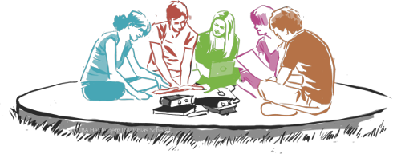

<button class="delete"></button>
    Am <strong>10. Juli</strong> findet am Zimmermodell ein <strong>Infoabend zum Thema
    Direktkredite</strong> statt. Weitere Veranstaltungen an dem Modell werden unter <a
    href="https://collegiumacademicum.de/aktuelles">Aktuelles</a>
    gelistet. 
	Aktuell kann unser Zimmermodell am <a
    href="https://www.openstreetmap.org/node/5576336951">Fensterplatz</a>
    besucht werden. Das Co-Working Café Fensterplatz befindet sich auf
    dem ehemaligen Gelände von Heidelberg Druckmaschienen, 300m
    entfernt vom Hauptbahnhof an der Kurfürstenanlage. 

    

        Seit 2013 arbeiten wir als 20-köpfige ehrenamtliche Projektgruppe daran, ein selbstverwaltetes Wohnheim zu schaffen, das 220 jungen Menschen Raum zum Leben ermöglichen soll. Aufbauend auf dem Grundgedanken des bis in die 1970er Jahre in Heidelberg existierenden Wohnheims Collegium Academicum wollen wir einen Ort schaffen, der günstiges und selbstbestimmtes Leben für Studierende und Auszubildende in Heidelberg ermöglicht, Demokratie erlebbar macht und dabei den kulturellen und sozialen Austausch in einem Bildungskontext fördert. Die ersten Bewohner*innen sollen Ende 2019 in das auf der Konversionsfläche „US-Hospital“ in Heidelberg-Rohrbach entstehende Wohnheim einziehen. <a href="https://collegiumacademicum.de/direktkredite/">Wie Sie das Projekt unterstützen können, erfahren Sie hier.</a>
    

    <iframe src="https://player.vimeo.com/video/191458892?color=38A9A1&title=0&byline=0&portrait=0" style="position: absolute; top: 0; left: 0; width: 100%; height: 100%;" webkitallowfullscreen mozallowfullscreen allowfullscreen></iframe>
 

    
    

        
<h2><a href="https://collegiumacademicum.de/wohnen" >Wohnen</a></h2>

        Innovativer Holzbau und kreative Umnutzung: Auf ehemals militärisch genutzten Flächen entsteht das neue Collegium Academicum – bezahlbarer Wohnraum für über 200 junge Menschen und Räume für kreative Ideen und lebhaften Austausch. <a class="mehr" href="https://collegiumacademicum.de/wohnen" >Mehr...</a>
    

    
    

        
<h2><a href="https://collegiumacademicum.de/bildung" >Bildung</a></h2>

        Interdisziplinäres Studienprogramm, Orintierungsjahr und Projektorientiertes Lernen – das ganzheitliche und interdisziplinäre Bildungskonzept des CA bietet Orientierung, regt zur kritischen Auseinandersetzung an und schafft Raum für Initiativen. <a class="mehr" href="https://collegiumacademicum.de/bildung" >Mehr...</a>
    

    
    

        
<h2><a href="https://collegiumacademicum.de/nachhaltigkeit" >Nachhaltigkeit</a></h2>

        Nachhaltig gedacht – von Anfang an! Ein bewusster Umgang mit Ressourcen steht nicht nur in Hinblick auf den künftigen Betrieb sondern bereits in der Baukonstruktion im Vordergrund. Im Zusammenleben ist Suffizienz das Schlüsselwort zu unserem Nachhaltigkeitskonzept: sich auf die wesentlichen Dinge und Gegenstände konzentrieren sowie einen verantwortungsvollen Umgang mit der Umwelt finden. <a class="mehr" href="https://collegiumacademicum.de/nachhaltigkeit" >Mehr...</a>
    

    
    

        
<h2><a href="https://collegiumacademicum.de/selbstverwaltung" >Selbstverwaltung</a></h2>

        Selbstentfaltung durch Selbstbestimmung! Unabhängig, gemeinschaftlich und offen – das ist das CA durch konsensorientierte und transparente Strukturen in einer demokratisch organisierten Selbstverwaltung. <a class="mehr" href="https://collegiumacademicum.de/selbstverwaltung" >Mehr...</a>
    


