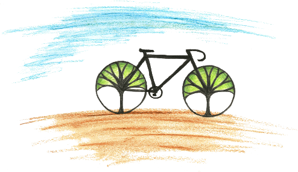

<button class="delete"></button>
    „Man ist nicht als Frau geboren, man wird es.“ <cite>Simone de Beauvoir (1949)</cite>
    
Jahrzehnte nach der Veröffentlichung des Werks „Das andere Geschlecht“ von Simone de Beauvoir wird Gesellschaft immer noch durch die geschlechtsspezifische Erziehung von Menschen in den Kategorien Mann und Frau strukturiert. 
    Wir wollen heute Abend mit euch Ausschnitte aus diesem Werk lesen, um anschließend in entspannter Runde über ihre Relevanz und Bedeutung für den heutigen feministischen Diskurs zu reden. 
    Wo: Uniplatz 
    Wann: <i class="fas fa-calendar"></i>  13. Mai, 21:00
    

Seit 2013 arbeiten wir als 20-köpfige ehrenamtliche Projektgruppe daran, ein selbstverwaltetes Wohnheim für Heidelberg zu schaffen, das 220 jungen Menschen Raum zum Leben ermöglichen soll. Aufbauend auf dem Grundgedanken des bis in die 1970er Jahre in Heidelberg existierenden Wohnheims Collegium Academicum wollen wir einen Ort schaffen, der günstiges und selbstbestimmtes Leben für Studierende und Auszubildende in Heidelberg ermöglicht, Demokratie erlebbar macht und dabei den kulturellen und sozialen Austausch in einem Bildungskontext fördert.

<!-- 

    <iframe src="https://player.vimeo.com/video/191458892?color=38A9A1&title=0&byline=0&portrait=0" style="position: absolute; top: 0; left: 0; width: 100%; height: 100%;" webkitallowfullscreen mozallowfullscreen allowfullscreen></iframe>
 
 -->

    
    

        
<h2><a href="https://collegiumacademicum.de/wohnen" >Wohnen</a></h2>

        Innovativer Holzbau und kreative Umnutzung: Auf ehemals militärisch genutzten Flächen entsteht das neue Collegium Academicum – bezahlbarer Wohnraum für über 200 junge Menschen und Räume für kreative Ideen und lebhaften Austausch. <a class="mehr" href="https://collegiumacademicum.de/wohnen" >Mehr...</a>
    

    
    

        
<h2><a href="https://collegiumacademicum.de/bildung" >Bildung</a></h2>

        Studium Generale, Propädeutikum und Projektorientiertes Lernen – das ganzheitliche und interdisziplinäre Bildungskonzept des CA bietet Orientierung, regt zur kritischen Auseinandersetzung an und schafft Raum für Initiativen. <a class="mehr" href="https://collegiumacademicum.de/bildung" >Mehr...</a>
    

    
    

        
<h2><a href="https://collegiumacademicum.de/nachhaltigkeit" >Nachhaltigkeit</a></h2>

        Nachhaltig gedacht – von Anfang an! Ein bewusster Umgang mit Ressourcen steht nicht nur in Hinblick auf den künftigen Betrieb sondern bereits in der Baukonstruktion im Vordergrund. Im Zusammenleben ist Suffizienz das Schlüsselwort zu unserem Nachhaltigkeitskonzept: sich auf die wesentlichen Dinge und Gegenstände konzentrieren sowie einen verantwortungsvollen Umgang mit der Umwelt finden. <a class="mehr" href="https://collegiumacademicum.de/nachhaltigkeit" >Mehr...</a>
    

    
    

        
<h2><a href="https://collegiumacademicum.de/selbstverwaltung" >Selbstverwaltung</a></h2>

        Selbstentfaltung durch Selbstbestimmung! Unabhängig, gemeinschaftlich und offen – das ist das CA durch konsensorientierte und transparente Strukturen in einer demokratisch organisierten Selbstverwaltung. <a class="mehr" href="https://collegiumacademicum.de/selbstverwaltung" >Mehr...</a>
    

