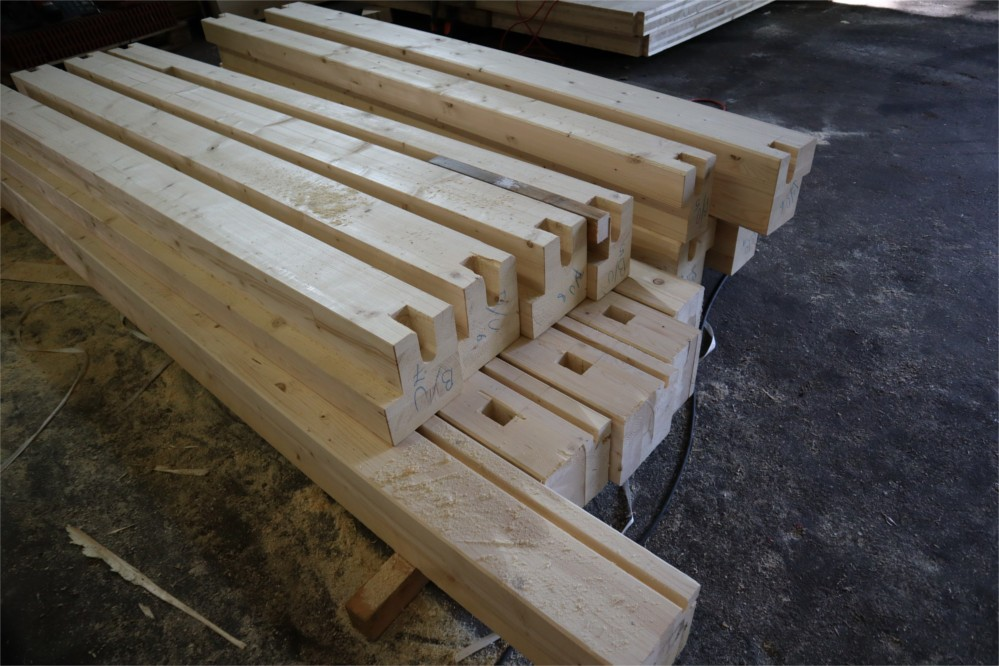
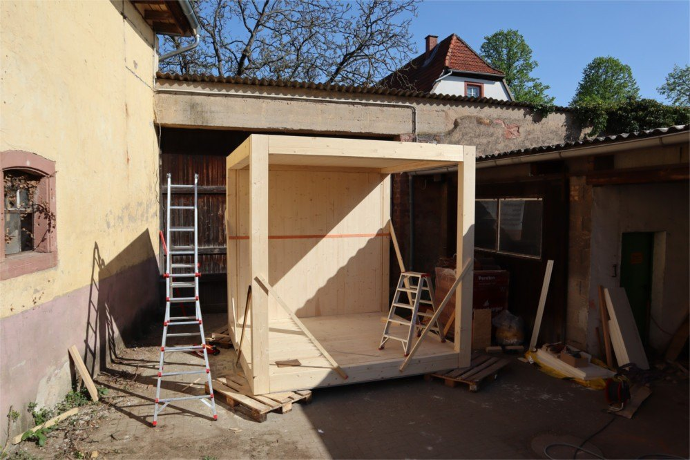
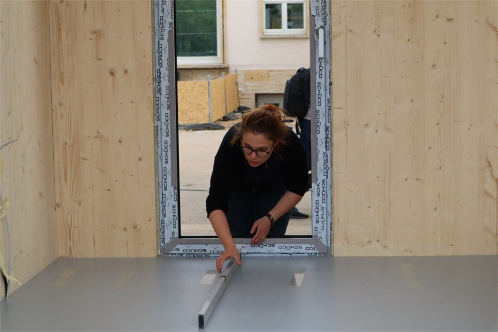
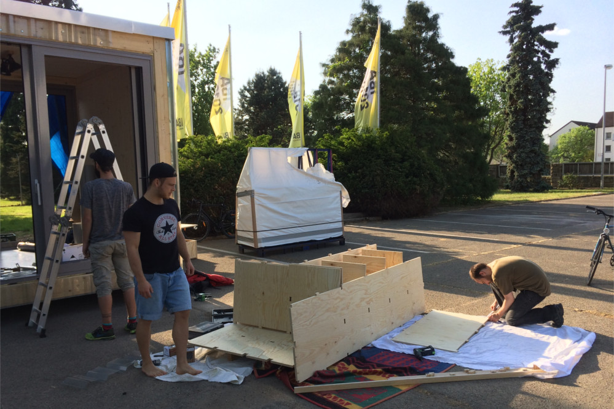

Wir haben mit dem Bau begonnen! Zugegeben - noch ist es erst eine
kleine Baustelle: Zunächst sind wir mit unserem Zimmermodell
gestartet, mit dem Gebäudeneubau soll es im Herbst losgehen. Doch für
uns ist auch der Zimmer-Demonstrator ein großer Schritt: Das erste Mal
können wir unsere Ideen in Realgröße ausprobieren und der
Öffentlichkeit zeigen.

<figure>
<table>
 <tr>
  <td></td><td></td>
 </tr>
 <tr>
  <td></td><td></td>
 </tr>
</table>
<figcaption><cite>Kleine Einblicke beim Bau des Demonstrators</cite></figcaption>
</figure>

Wir haben viel selbst mitgebaut und kennen jetzt jedes Detail. So
konnten wir uns schon ein paar Verbesserungen notieren. In den
nächsten Wochen werden wir einige Tests der geplanten Trennwände am
Prototyp durchführen. Insgesamt sind wir sehr glücklich über das
Resultat - beispielsweise die Holzkonstruktion und die selbst
gebauten Möbel gefallen uns sehr.

Von Samstag, den 12.05.2018 bis Freitag, den 18.05.2018 sind wir mit
dem Zimmermodell auf dem Uniplatz. Auf unserer Website und Facebook
folgen in den nächsten Tagen Details zu Programm und weiteren
Orten. Wenn ihr euch selbst ein Bild davon machen wollt, dann kommt
doch einfach mal vorbei!