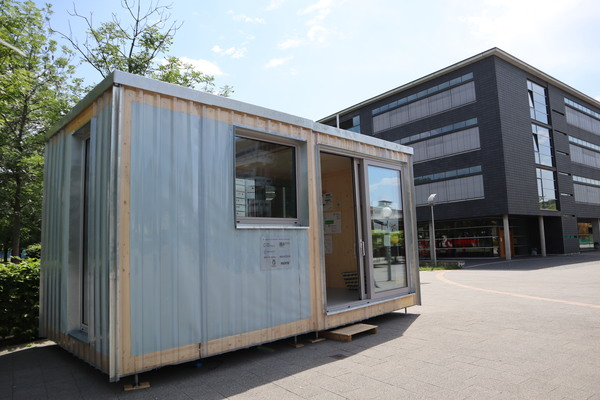
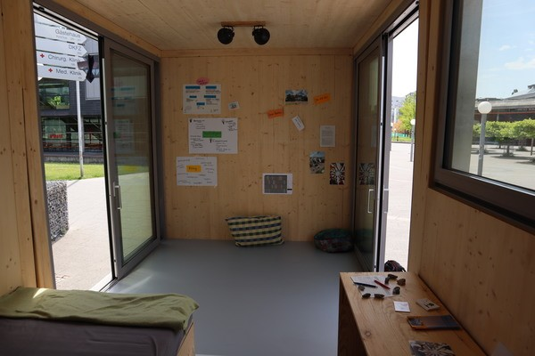

Kurzes Update: Unser Zimmermodell steht nun am  [Fensterplatz](https://www.openstreetmap.org/node/5576336951). Der Fensterplatz ist ein Co-Working-Café im ehemaligen Pförtnerhaus des Geländes von Heidelberg Druckmaschinen, Zugang von der Kurfürstenanlage aus, 300m vom Hauptbahnhof entfernt.

<figure>
<table>
 <tr>
  <td></td><td></td>
 </tr>
</table>
</figure>

Wir planen momentan weitere Veranstaltungen und Öffnungszeiten während denen das Zimmermodell besichtigt werden kann. Die Programmpunkte werden wir in Kürze hier veröffentlichen:

| Was? | Wann? | Wo? | |
| --- | --- | --- | --- |
| [Schmuck aus Müll](https://www.facebook.com/events/861188190735337/) | 16:00 - 18:00 **22.06** | [Fensterplatz](https://www.openstreetmap.org/node/5576336951) | Kommt vorbei, bringt euren „eingentlich-viel-zu-schade-zum Wegschmeißen-Müll“ mit und bastelt mit uns! Aus alt mach neu! |
| [Fensterlunch am Fensterplatz](https://www.fensterplatz-heidelberg.de/#Termine) | 12:30 - 14:00 **13.06.** | [Fensterplatz](https://www.openstreetmap.org/node/5576336951) | Lunch mit Foodtrucks und einem darstellendem Künstler |
| Cornern | 17:00 **07.06.** | Neuenheimer Feld (Zentralmensa) | Kommt vorbei und enspannt mit uns! |
| Küche für Alle (Küfa) | 12:30 **07.06.** | Neuenheimer Feld (Zentralmensa) | Hat es euch beim letzten Mal geschmeckt? Besucht uns gerne wieder und haut rein. |
| Kaffee und Kuchen | 13:30 **06.06.** | Neuenheimer Feld (Zentralmensa) | Erhol dich vom Unistress bei einem Kaffee und einem leckeren Stück Kuchen. |
| Küche für Alle (Küfa) | 12-14 **29.05.** | Neuenheimer Feld (Zentralmensa) | Möchtest du mal etwas anderes als Mensa? Appel un'Ei und das CA kochen für euch gegen Spende. Wir freuen uns euch zu sehen. |
| Jonglier-Workshop | 17:30 **28.05.** | Neuenheimer Feld (Zentralmensa) | Hast du Lust etwas über die Kunst des Jonglierens zu lernen? Komm vorbei |
