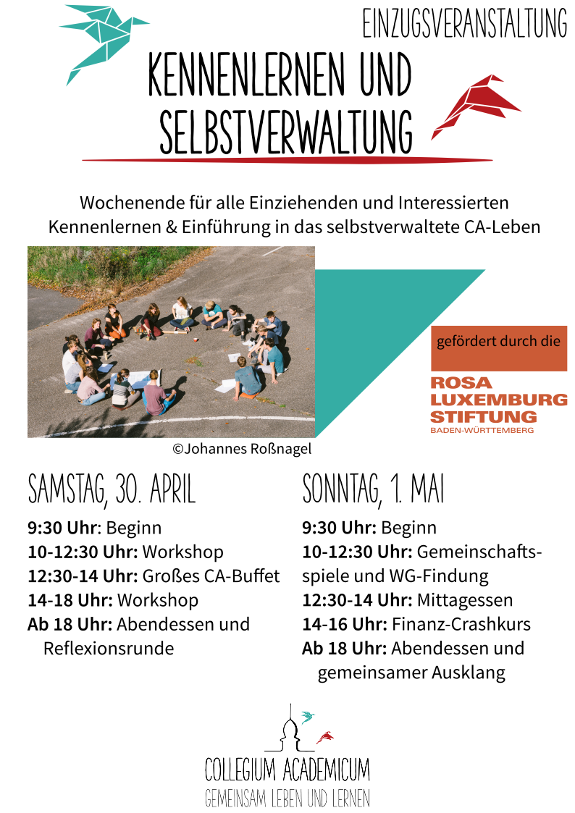
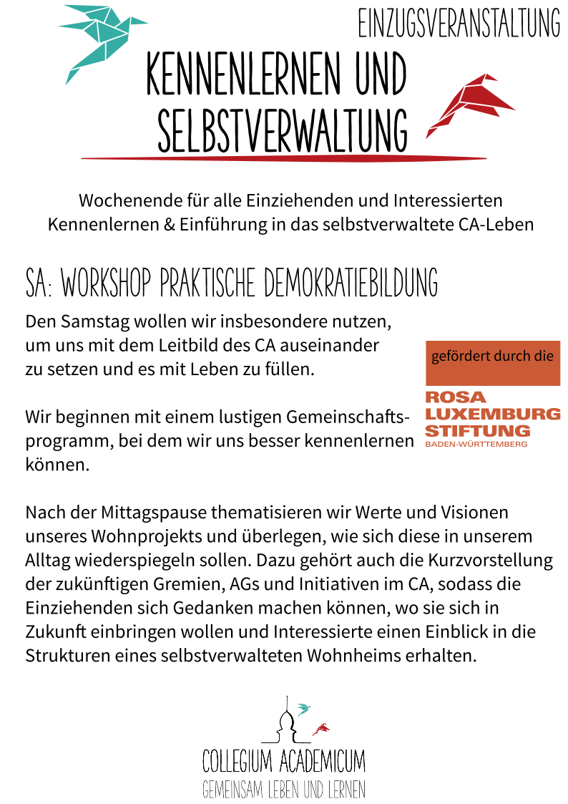

#### Gemeinschaftsbildung, Selbstverwaltung und Wissensvermittlung: Wir starten mit den Einzugsveranstaltungen

In den letzten zwei Monaten haben wir uns intensiv der Planung von Veranstaltungen rund um den Einzug gewidmet. 
Die bevorstehende Eröffnung des CA in diesem Sommer ist etwas ganz Besonderes.

Das Zusammenleben in einer so großen Gemeinschaft sehen wir als Lernprozess, der Zeit und auch aktive Anstrengungen
braucht. Deshalb wollen wir diesen Prozess schon vor dem Einzug anstoßen und die Menschen mit Workshops, Vorträgen und 
Gruppenaktivitäten auf das selbstverwaltete Wohnen vorbereiten. Dazu gehören Beiträge/Skillshares für ein gutes 
soziales Miteinander, z.B. Konsensfindung, Moderation und Vermeidung von Diskriminierung. Auch theoretisches Wissen 
über unserer eigenes Wohnprojekt und dessen Geschichte, Suffizienzpraktiken und zur sozialökologischen 
Transformation wollen wir vermitteln. Bei der Programmgestaltung arbeiten wir eng mit anderen Initiativen/Organisationen
in Heidelberg und Umgebung zusammen.

Die Veranstaltungen ermöglichen es den zukünftigen Bewohner\*innen, schon vor Einzug im Projekt anzukommen und als Gruppe
zusammenzuwachsen. 

In unserem ersten Veranstaltungswochenende geht es um den Einstieg in die Selbstverwaltung und um die Werte, die uns im CA 
verbinden. Dazu haben wir am Samstag, dem 30. April, die angehenden Wohnprojektberater\*innen Magnus Pagendarm 
(https://www.gemeinschaftlich-leben.vision/) und Afra Höck zu Gast, die einen Tagesworkshop zur praktischen 
Demokratiebildung geben. Der Workshop wird gefördert durch die [Rosa Luxemburg Stiftung Baden-Württemberg](https://bw.rosalux.de/).

    

        <figure>
            
            <figcaption style="text-align:center;">
                
Der Zeitplan für das Wochenende vom 30. April und 1. Mai

            </figcaption>
        </figure>    

    

        <figure>
            
            <figcaption style="text-align:center;">
                
Unser Workshop zum Einstieg in die Selbstverwaltung

            </figcaption>
        </figure>
    

