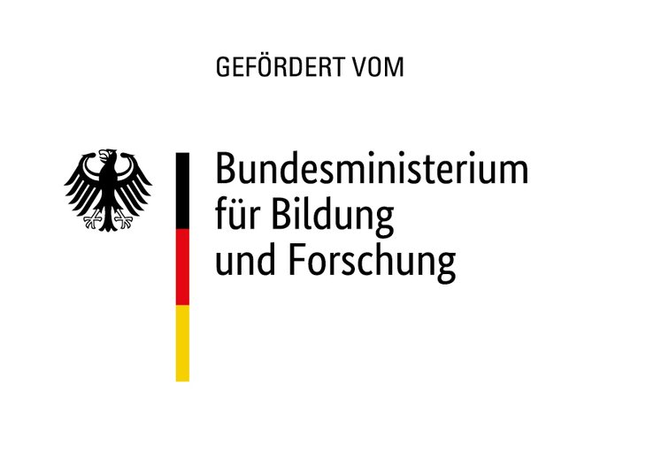

**SuPraStadt - Lebensqualität, Teilhabe und Ressourcenschonung durch soziale Diffusion von Suffizienzpraktiken in Stadtquartiere.**

Zum Abschluss des transdisziplinären Verbund-Forschungsprojekts [SuPraStadt](https://www.ifeu.de/projekt/suprastadt/)
fand am Mittwoch und Donnerstag, 18. und 19. Mai 2022, ein spannendes Veranstaltungsprogramm statt, gefüllt mit wissenschaftlichen Vorträgen und praktischen Workshops.
SuPraStadt besteht aus mehreren Teilprojekten und hat neben den Forschungspartnern (FH Dortmund, Institut für sozial-ökologische Forschung Frankfurt)
viele Projekt- und Praxispartner.

Im ersten Teil gaben Akteur*innen aus der Kommunalpolitik und der Quartierplanung 
wertvolle Einblicke in die Umsetzung von Suffizienzpraktiken. Hier waren Gäste aus Dortmund, Flensburg und Kelsterbach vertreten.
Zudem zeigten die Heidelberger Wohnprojekte, wie sie in ihren gemeinschaftlichen Strukturen Impulse für mehr Lebensqualität,
Klima- und Ressourcenschutz setzen (nachzulesen in [dieser brandneuen Broschüre](https://www.ifeu.de/fileadmin/uploads/Leitf%C3%A4den_und_Brosch%C3%BCren/220510_ifeu_Broschuere_WohnprojekteHD_SuPrastadt.pdf)).

Nach der Mittagspause wurden die ökologischen und sozialen Wirkungen von Suffizienzpraktiken erläutert und diskutiert.
Mit Suffizienzpraktiken sind Verhaltensweisen gemeint, die ein ressourcenschonendes Zusammenleben ermöglichen, gleichzeitig
aber hohe Lebensqualität bieten und ohne das Gefühl von Verzicht oder Mangel auskommen.

Der gesamte erste Programmteil, der in dem [CHAPEL Raum für Stadtkultur](https://chapel-heidelberg.de/) stattfand, wurde live
 [auf YouTube](https://www.youtube.com/watch?v=lbG406lO4nM) gestreamt: 

<iframe width="33%" height="50%" src="https://www.youtube-nocookie.com/embed/lbG406lO4nM?start=410" title="YouTube video player" frameborder="0" allow="accelerometer; autoplay; clipboard-write; encrypted-media; gyroscope; picture-in-picture" allowfullscreen></iframe>

Am Nachmittag machten sich die Teilnehmenden bei der Begehung des CA auf die Spuren der Suffizienz. In unserem Wohnprojekt
haben wir Ressourcenschonung an allen Ecken und Enden mitgedacht: Beim Baustoff, bei der Größe und Aufteilung der Wohnfläche,
bei unseren Gemeinschaftsräumen, bei unseren Eigenleistungsarbeiten und bei unseren vielfältigen Arbeitsgruppen, wie der
AG Werkstatt oder der AG Gemeinschaftsgarten. 
Ganz praktisch haben wir das am Mittwoch in einem Workshop mit unserer großen Holzfräse demonstriert.

Der Höhepunkt des Tages war schließlich der öffentliche Abendvortrag von Prof. Angelika Zahrnt "Wie gelangt die Suffizienz vom Quartier in 
die Gesellschaft?" mit anschließender Gesprächsrunde.

<figure>

<figcaption style="text-align:center;">

 Prof. Angelika Zahnrt spricht über Suffizienz. (&#169; CA)

</figcaption>
</figure>

 

Das Projekt wird im Rahmen der Fördermaßnahme „Zukunftsstadt“
im Förderschwerpunkt „Sozialökologische Forschung“ des [Bundesministeriums für Bildung und Forschung](https://www.bmbf.de/) auch weiterhin gefördert. Dadurch haben wir die Möglichkeit, weitere Ressourcen und Angebote für unseren
Permakultur-Garten und unsere offene Werkstatt zur Verfügung zu stellen.

    

    
    

    

        

