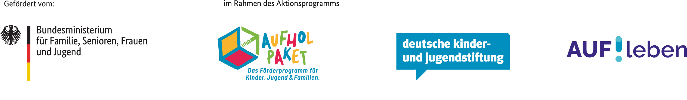

Am Sonntag, dem 19.6., startet unsere partizipative Baustelle mit den ersten von vier Blöcken.
Wir sind in der letzten heißen Phase der Fertigstellung unseres vierstöckigen [Holz-Neubaus](../neubau), der im August 2022 einzugsbereit sein soll.
Im Sinne der Selbstverwaltung und um die Baukosten niedrig zu halten, machen wir einen Teil der Arbeit in Eigenleistung.
Konkret bauen wir zwei Drittel der Möbel selbst, sowie die Zwischenwände und Schiebewände in den WGs.
Dazu haben wir uns eine Werkstatt eingerichtet, mit Akkuschraubern, Stichsägen und vielem mehr. 
Das Highlight ist unsere große CNC-Holzfräse, mit der wir die Möbelbauteile vorfertigen.

Parallel gibt es in unserem großen [Altbau](../altbauten) viele Abbrucharbeiten zu erledigen, bevor im Herbst die Sanierung startet.
Ab Oktober 2023 soll dort ein Orientierungsjahr für junge Menschen zwischen Schule und weiterem Ausbildungsschritt stattfinden ([Bildung](../bildung)).

Der geschätzte Gesamtaufwand für die Eigenleistung liegt bei etwa 15.000 Arbeitsstunden, von denen einige in den kommenden 
zwei Monaten noch vor uns liegen.

Das alles schaffen wir nur in Teamarbeit. Wir freuen uns über Mithilfe von allen Seiten.
Wenn du Lust hast dich handwerklich zu betätigen, das CA kennenzulernen und einen wertvollen Beitrag zu unserem
Wohnprojekt zu leisten, dann melde dich unter [diesem Link](https://erhebung.de/zu/3OEdX0kAZ/Workcamps_im_Sommer_2022/) für unsere partizipativen Baustellen an. 

<object data="Ankuendigung_Sommerworkcamps_2022_aufleben_small.pdf" type="application/pdf" width="100%" height="100%"> This browser does not support PDFs. Please download the PDF to view it: <a href="Ankuendigung_Sommerworkcamps_2022_aufleben_small.pdf">Download PDF</a></object>

Die Teilnahme ist kostenlos und beinhaltet Verpflegung (Frühstück, Mittagessen und Abendessen) und ein umfangreiches Rahmenprogramm mit Workshops, Ausflügen und Lagerfeuer.
Unsere Partizipative Baustelle ist vergleichbar mit einem Ferienlager und du kannst dich auf eine tolle Atmosphäre in einer Gruppe von offenen, wertschätzenden und gut gelaunten Menschen freuen.

Mit euren Fragen und Anliegen könnt ihr euch an <a href="mailto:workcamps@collegiumacademicum.de">workcamps@collegiumacademicum.de</a> wenden.

Eindrücke von vergangenen Workcamps findet ihr [hier](../summerschool).

#### Förderung

Wir nehmen mit unseren vier partizipativen Baustellen an dem Programm *AUF!leben* teil. 

*AUF!leben – Zukunft ist jetzt.* ist ein Programm der Deutschen Kinder- und Jugendstiftung, gefördert
vom Bundesministerium für Familie, Senioren, Frauen und Jugend. Das Programm ist Teil des Aktionsprogramms Aufholen nach Corona der Bundesregierung.

 

