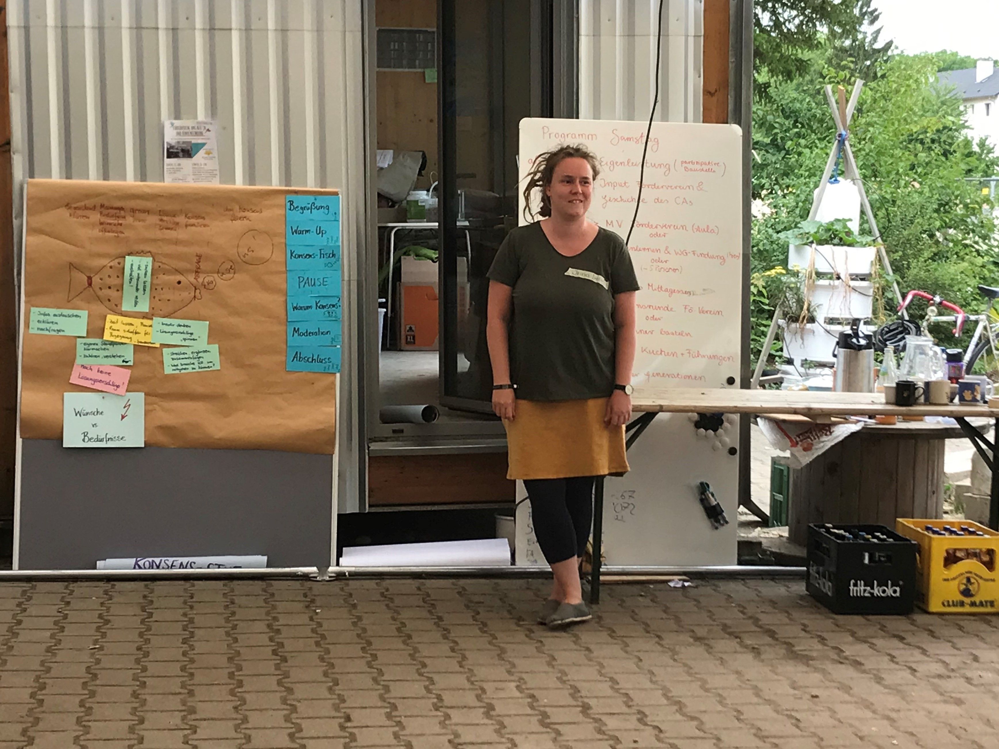

#### Abwechslungsreicher Auftakt unserer Veranstaltungsreihe rund um den Aufbau einer nachhaltigen Selbstverwaltung

Letztes Wochenende (25 und 26.6.) fanden zwei aufregende Veranstaltungstage für die zukünftigen Bewohner:innen des Collegium Academicum (CA) statt mit drei thematischen Blöcken: a) Kennenlernen und WG-Findung, b) Geschichte des CA und Austausch mit "Alt-Kollegiaten" und c) Entscheiden im Konsens.

**a) Kennenlernen und WG-Findung**

Noch sind nicht alle Zimmer gefunden und gerade Menschen, die erst kürzlich ihre Zusage erhalten haben, benötigen Möglichkeiten zum Austausch mit Anderen. Dazu haben wir am Samstag einige Kennenlernspiele gemacht, bei denen es insbesondere um zentrale WG-Themen ging. Beispielsweise wurden die zukünftigen Bewohner:innen in zufällige Kleingruppen eingeteilt und sollten sich über fiktive Situationen des Zusammenlebens austauschen und in einer kreativen Challenge gegeneinander antreten. So konnten sich anhand von Gemeinsamkeiten und Sympathien wieder einige neue WGs zusammenfinden.
Parallel haben sich einige Bewohner*innen zusammengetan und neue Banner für das CA gebastelt.

<figure>

<figcaption style="text-align:center;">

 Unser neues CA Banner. (&#169; CA)

</figcaption>
</figure>

 

**b) Geschichte des CA und Austausch mit Alt-Kollegiaten**

Das CA hat eine lange und bewegte [Geschichte](../geschichte). Das "alte CA" befand sich von 1945 bis 1978 im Carolinum in der Seminarstraße, wo heute die Uni-Verwaltung ist - ebenfalls selbstverwaltet aber verortet in einer anderen Zeit. In einem "Dialog der Generationen" tauschten sich zwei Bewohner:innen des alten CA, eine der Gründer:innen des neuen CA und eine zukünftige Bewohnerin über verschiedene Aspekte aus: Die Größe der Zimmer, Gender und Sexualität, die zentralen politischen Themen, die Kochkultur und vieles mehr. Da blieben auch die Lacher nicht aus und der Abend war für Jung und Alt eine große Bereicherung.

    

        <figure>
            

            <figcaption style="text-align:center;">
                
 Das Podium bei unserem "Dialog der Generation. v.l.n.r.: Hanka, Jojo, Franzi, Achim. (&#169; CA)

            </figcaption>
        </figure>

    

        <figure>
            
            <figcaption style="text-align:center;">
                
 Unsere Gäste (jung und alt) beim Mittagessen. (&#169; CA)

            </figcaption>
        </figure>
    

**c) Entscheiden im Konsens**

Am Samstag leitete Irina mit uns einen Workshop zum Thema Konsens. Im CA werden in der Gruppe Entscheidungen getroffen, indem ein Konsens gefunden wird. Im Workshop ging es um die Ausgestaltung des Konsens-Prozesses, die Konsens-Stufen und wieso wir eigentlich im Konsens entscheiden wollen. Ganz zentral war auch der respektvolle Umgang miteinander in dem Prozess.

    

        <figure>
            
            <figcaption style="text-align:center;">
                
 Konsens-Workshop mit Irina. (&#169; CA)

            </figcaption>
        </figure>
    

    

        <figure>
            
            <figcaption style="text-align:center;">
                
 Warum Konsens? (&#169; CA)

            </figcaption>
        </figure>
    

Unser Dank gilt der [Bürgerstiftung Heidelberg](http://www.buergerstiftung-heidelberg.de/), die diese Veranstaltungsreihe fördert.
Die Bürgerstiftung unterstützt Projekte, die dem sozialen, kulturellen und ökologischen Wohl der Stadt Heidelberg dienen. 

