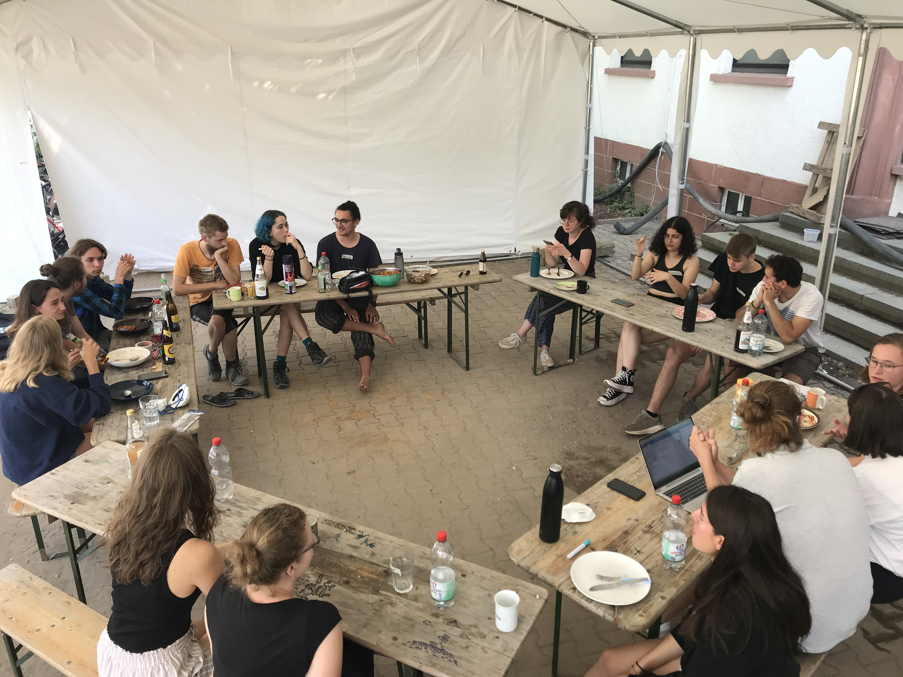
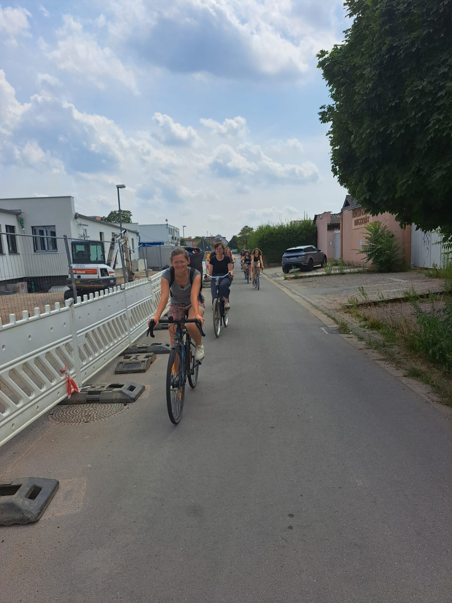
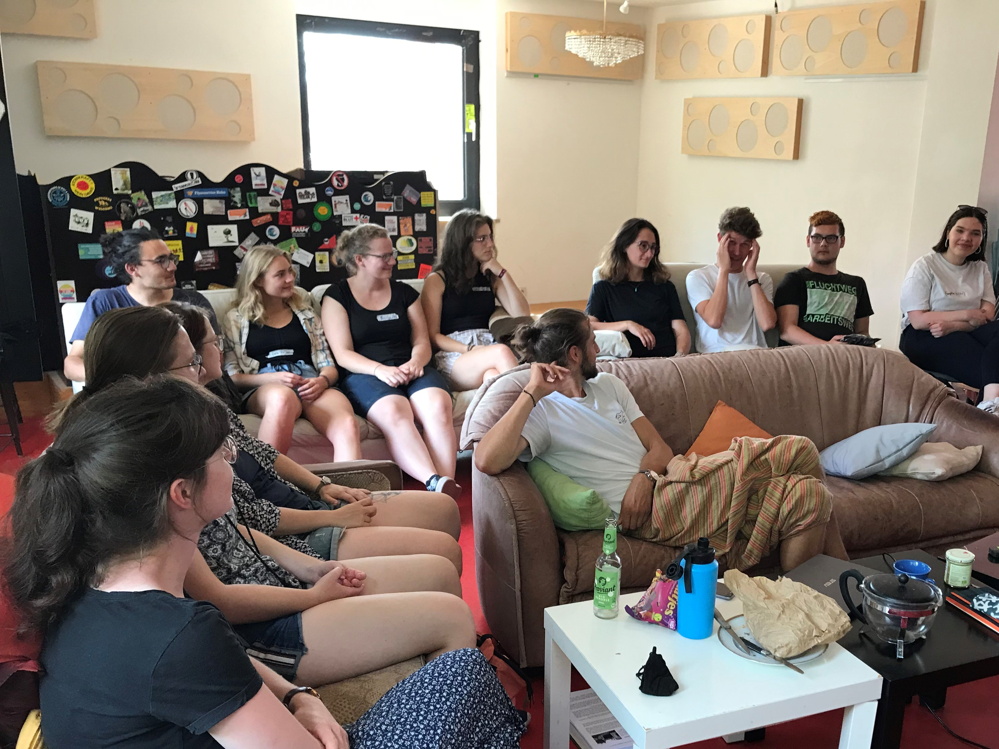
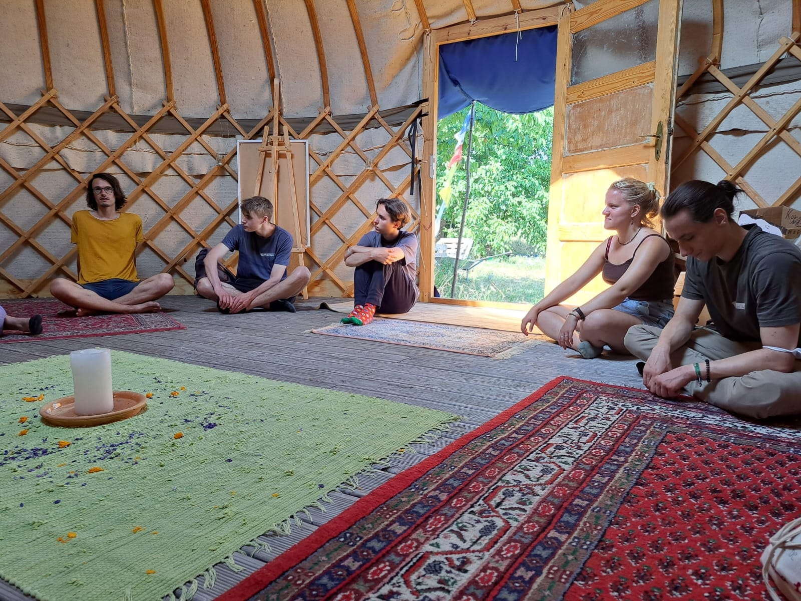
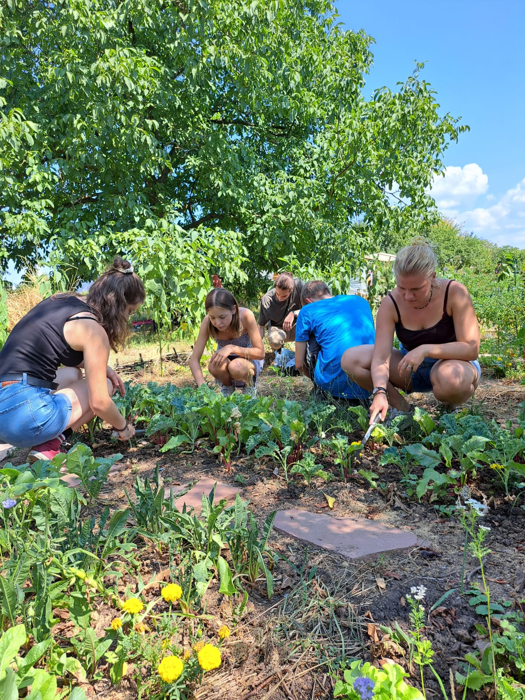
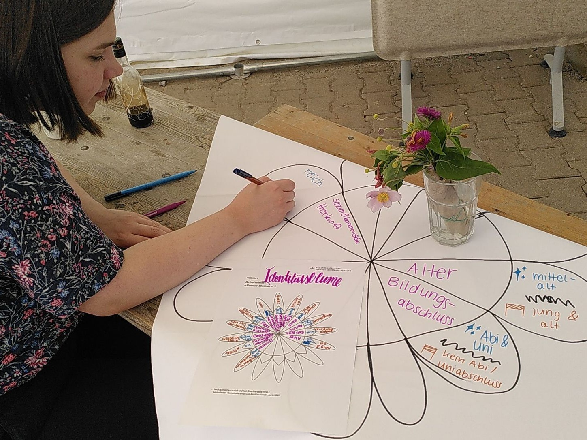

Am Wochenende kamen die zukünftigen Bewohner*innen wieder zusammen, um ihr Wohnprojekt besser kennenzulernen und enger zusammenzuwachsen. 

<figure>

<figcaption style="text-align:center;">

Das Programm unserer Juli-Einzugsveranstaltung

</figcaption>
</figure>

 

#### Samstag

Nach einem üppigen gemeinsamen Frühstück widmeten wir uns am Samstagmorgen dem [Orientierungsjahr](https://collegiumacademicum.de/bildung/),
das im Herbst 2023 in unserem [Altbau](https://collegiumacademicum.de/altbauten/) starten soll.
Lisa aus der Projektgruppe gab uns wertvolle Einblicke in die Recherche und Konzipierung des einjährigen, fachübergreifenden Bildungsprogramms.
Durch Vernetzung mit anderen vergleichbaren Projektgruppen haben Lisa und Franzi die Schwerpunkte des Orientierungsjahres gesetzt, die Komponenten festgelegt (z.B. Seminare, persönliches Projekt, Gruppenzeiten) und einen Jahres- und Wochenplan entworfen.
Auch zum Namensvorschlag und Logo wurden einige neue Meinungen eingeholt.

Nach dem gemeinsamen Mittagessen radelten wir ins [Rabatz](https://hagebutze.de/rabatz/), den Veranstaltungsraum der Hagebutze,
und verfolgten online einen Teil der Mitgliederversammlung des [Mietshäuser Syndikat](https://www.syndikat.org/).
Dort stellten sich neue Projekte vor und die Versammlung stimmte im Konsens über die Aufnahme der Projekte in den Projektverbund ab.

Zurück auf der Baustelle unseres eigenen Wohnprojekts gab Felix eine Führung durch den großen Altbau. Dort starten in wenigen Wochen die
ersten Firmen mit der Sanierung. Schon seit mehr als einem Jahr bereitet die Projektgruppe das Bestandsgebäude auf die Sanierung vor, insbesondere durch Abbruchmaßnahmen.
Auch in Zukunft werden viele Arbeiten im Altbau von uns in Eigenleistung gemacht.

    

        <figure>
            

            <figcaption style="text-align:center;">
                
Mittagsrunde (&#169; CA)

            </figcaption>
        </figure>

    

        <figure>
            

            <figcaption style="text-align:center;">
                
Mit dem Fahrrad zum Rabatz (&#169; CA)

            </figcaption>
        </figure>
    

        <figure>
            
            <figcaption style="text-align:center;">
                
Mitgliederversammlung schauen im Rabatz (&#169; CA)

            </figcaption>
        </figure>
    

#### Sonntag

Am Sonntag haben wir uns in zwei Gruppen aufgeteilt.
Die eine Gruppe unternahm einen Ausflug zum [Wandelgarten](https://www.wandelgarten-heidelberg.org/) in Heidelberg-Kirchheim.
Ein Teil der aktiven Gärtner*innen stellte uns ihren Gemeinschaftsgarten vor. Danach ging es ans Praktische: Wir haben
die Beete gemulcht, also den offenen Boden mit Grasschnitt bedeckt, damit der Boden kühler bleibt und bei Hitze weniger Feuchtigkeit verliert. 
Im Anschluss haben wir im angenehmen Schatten der Bäume ein Picknick gemacht mit mitgebrachten Brötchen, Aufstrichen und selbstgemachten Falafeln. 
Wir halten die Vernetzung mit anderen Projekten in unserer Umgebung für essenziell und freuen uns über den weiteren Austausch mit dem Wandelgarten, 
wenn unser eigener Gemeinschaftsgarten in Entstehung ist.

Die zweite Gruppe nahm auf der Fläche an einem Antidiskriminierungsworkshop teil, den Halszka von [Mosaik-Deutschland e.V.](https://mosaik-deutschland.de/) leitete.
Wir setzten uns mit Diskriminierung, Vorurteilen und Intersektionalität auseinander. Als gemeinsame Übung zeichneten wir in Gruppen
eine "Power Flower" (Machtblume), die zu verschiedenen Kategorien die bei uns gesellschaftlich privilegierten und deprivilegierten Merkmale aufzeigt.
Das gab uns die Möglichkeit, die vorherrschenden Machtverhältnisse und unsere eigene Position in der Gesellschaft zu reflektieren.
Besonders wertvoll waren die Diskussionen in der Gruppe und die ersten Überlegungen dazu, welche Strukturen wir im CA gegen Diskriminierung schaffen wollen.

Am Nachmittag haben die beiden Gruppen von ihren Erfahrungen berichtet und sich ausgetauscht. Für Neuere im Projekt
haben wir noch eine Führung durch den Neubau gemacht und die ersten fast-fertigen Zimmer besichtigt.
Den Abend ließen wir bei einem gemeinsamen Abendessen mit einem großem, vielfältigen Buffet ausklingen.

Wir freuen uns, dass die [Bürgerstiftung Heidelberg](http://www.buergerstiftung-heidelberg.de/) unsere Veranstaltungsreihe vor dem Einzug unterstützt und dadurch auch dieses
schöne Wochenende möglich gemacht hat.

    

        <figure>
            

            <figcaption style="text-align:center;">
                
Im tollen Gartenhaus des Wandelgartens (&#169; CA)

            </figcaption>
        </figure>

    

        <figure>
            

            <figcaption style="text-align:center;">
                
Vor dem Mulchen lockern wir den Boden auf (&#169; CA)

            </figcaption>
        </figure>
    

        <figure>
            
            <figcaption style="text-align:center;">
                
Die Erstellung einer Identitätsblume (Power Flower) (&#169; CA)

            </figcaption>
        </figure>
    

