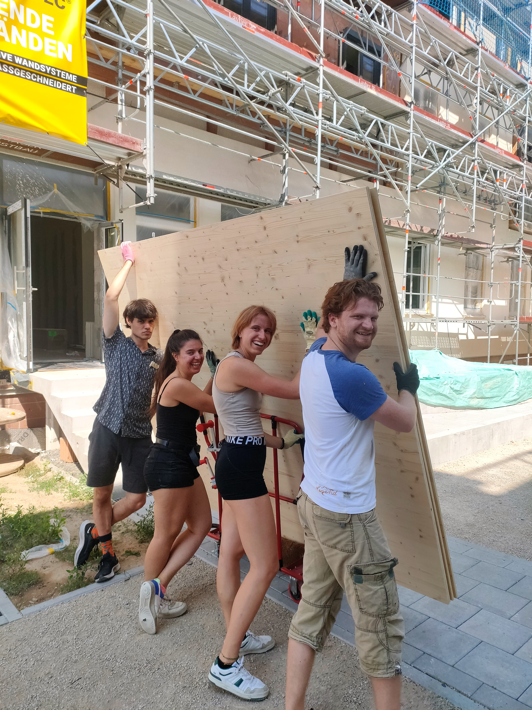

---
title: "Wochenendeinsätze 2023 - Gemeinsam für günstigen Wohnraum!"
date: 2023-10-07
---

        <figure>
    
    <figcaption style="text-align:center">
     
Holzplatten tragen beim HammerCAmp (&#169; CA)

    </figcaption>
        </figure>

  Der nächste Meilenstein unsere Projekts, die Fertigstellung unseres Altbaus, steht bevor und wie gewohnt packen wir dabei selbst mit an.
    
  Wir laden herzlich ein, an unseren Wochenendeinsätzen im Collegium Academicum teilzunehmen und gemeinsam unseren Altbau in ein lebendiges Wohnprojekt für sozialen Wohnungsbau, freie Wohnungen und das Orientierungsjahr <a href="https://faltr.de/home">falt*r</a> zu verwandeln?
    
  Es ist keine besondere Erfahrung erforderlich! Jeder ist willkommen, unabhängig von Alter oder Fähigkeiten.
  Komm einfach vorbei, wir stellen alle Materialien und Werkzeuge bereit.
    
  <b>Wann?</b> Jeden Samstag und Sonntag von 9:30 Uhr bis 18:00 Uhr.  
  <b>Wo?</b> Mendelejewplatz 1 (zwischen Neu- und Altbau), 69126 Heidelberg

  

  

<h3>Was erwartet dich?</h3>

- Streichen des Altbaus
- Fußboden entfernen
- Baureinigung (Aufräumen und Putzen)
- sowie kleinere bzw. spontanere Aufgaben
- Gemeinsames Mittag- und Abendessen

  

<h3>Was solltest du mitbringen?</h3>

- Bequeme Arbeitskleidung und Schuhe, die schmutzig werden können.
- Spaß und Motivation
- und natürlich gegenseitigen Respekt
  

### Warum solltest du mitmachen?

- **Gemeinschaft erleben**: Lerne Menschen mit ähnlichen Interessen kennen und baue dauerhafte Freundschaften auf.
- **Sinnvolle Arbeit**: Dein Einsatz trägt dazu bei, bezahlbaren Wohnraum zu schaffen und Menschen in Not zu unterstützen.
- **Spaß und Belohnung**: Eine entspannte Atmosphäre, leckeres Essen und coole Gemeinschaftsaktionen nach der Arbeit!

### Anmeldung

Kontaktiere uns per Mail oder Telefon, um dich anzumelden oder weitere Informationen zu erhalten.
- +49 (0)6221 652236
- kontakt@collegiumacademicum.de
