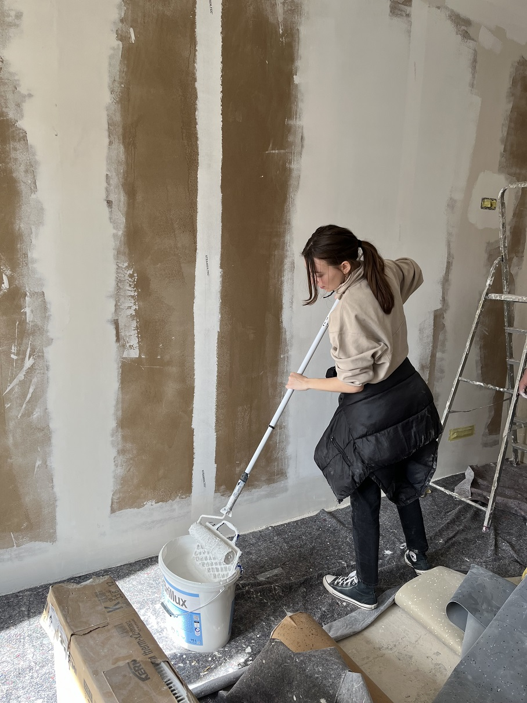

Endspurt vor Ostern und vor dem nächsten Einzug! 
Hier findet ihr die nächsten Eigenleistungstermine in unserem Altbau:

- Di, &emsp;&nbsp;&nbsp; 19.03. &emsp; 18 Uhr️ - open end
- Do, &emsp;&nbsp; 21.03. &emsp; 9-14 Uhr und 16 Uhr - open end
- Fr, &emsp;&nbsp;&nbsp; 22.03. &emsp; 10-15 Uhr und 16 Uhr - open end

Daraufhin machen wir von <strong>Sa, 23.03. bis Fr, 29.03.2024</strong> nochmal eine <strong>Workcamp-Woche</strong>. Gearbeitet wird täglich von <strong>10 bis 18 Uhr</strong>, wie immer gibt es ein super leckeres gemeinsames Mittagessen.

Schwerpunkt liegt auf den letzten Streicharbeiten, dem Anbringen von Fußleisten und der Endreinigung der fertigen Wohnungen. 
  
Wir treffen uns am Mendelejewplatz 1 (zwischen Neu- und Altbau), 69126 Heidelberg-Rohrbach. Um dich anzumelden, schicke uns einfach eine formlose Mail an <a href="mailto:kontakt@collegiumacademicum.de">kontakt@collegiumacademicum.de</a> oder ruf kurz an unter +49 (0)6221 652236.
  
Du kannst mal für ein paar Stunden, an einzelnen Tage oder für ganze Woche lang mithelfen. Wir können auch Schlafplätze organisieren.

<figure>

<figcaption style="text-align:left;">

 Grundieren und Streichen im Altbau (&#169; CA)

</figcaption>
</figure>

