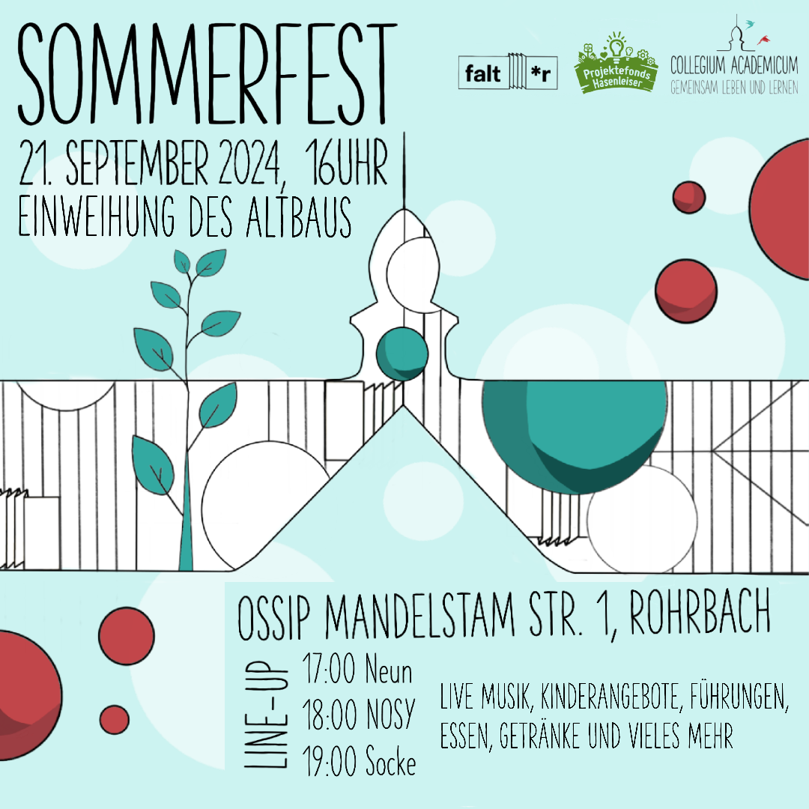

Anlässlich der Eröffnung unseres Altbaus wollen wir gemeinsam mit euch, dem Stadtteil und allen Interessierten am 
**Samstag, den 21. September** ein kleines **Sommerfest auf der Fläche des Collegium Academicum** (Ossip-Mandelstam-Straße 1) im und um den Altbau feiern!
 
 
Ab **16 Uhr** bieten wir ein vielfältiges Programm an. Neben Führungen und einer Fotoausstellung über den Altbau und dessen Entwicklung 
in den letzten Jahren wird es auch ein Angebot an Essen und Getränken und Möglichkeiten zum Verweilen 
und Beisammensein geben. Der Nachmittag wird von Live Musik begleitet und bietet auch Angebote für Kinder. 
 
 
Unser Sommerfest ist **offen für alle**: Kommt mit euren Freunden und Bekannten! Das Fest wird bis 20 Uhr andauern.
 
 
Wir freuen uns auf einen schönen und fröhlichen Nachmittag mit euch!

<figure>

<figcaption style="text-align:center;">

 &#169; CA

</figcaption>
</figure>