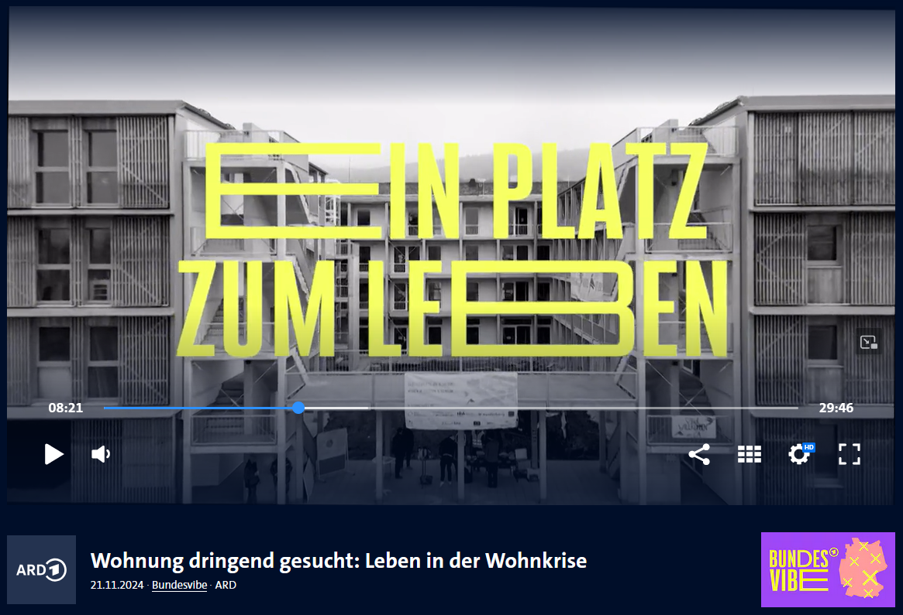

Die neueste Folge der Reportagesendung "Bundesvibe" beschäftigt sich mit der Wohnkrise in Deutschland.
Sie begleitet Menschen, die eine Wohnung suchen, die selbst eine Wohnung anzubieten haben und solche, die sich selbst ein Zuhause bauen. Neben Berlin, Tangerhütte und Saarlouis, zog es die Reporter deshalb auch nach Heidelberg zu uns ins CA.
Unter den Schlagworten "Ein Platz zum Leben" und "Gemeinsam in die Zukunft" berichten sie über unser einzigartiges Wohnprojekt.
Bewohner\*innen des Azubi- und Studiwohnheim und der Sozialwohnungen erklären, was das CA so besonders macht, warum sie so gerne hier wohnen und welche Wirkung es als nicht nur als bezahlbarer Wohnraum, sondern auch als Ort der Gemeinschaft, Selbstverwaltung und Kultur hat.

Die ganze Folge findet ihr [in der ARD-Mediathek](https://www.ardmediathek.de/video/bundesvibe/wohnung-dringend-gesucht-leben-in-der-wohnkrise/ard/Y3JpZDovL3dkci5kZS9CZWl0cmFnLXNvcGhvcmEtYzM5MzUwZGQtNTMxMi00YzU5LWEzNGMtOGQwYWNkNWVjNTQx). 
Speziell über das Collegium Academicum berichtete auch [SWR Aktuell](https://www.swr.de/swraktuell/baden-wuerttemberg/mannheim/bundesvibe-collegium-academicum-in-heidelberg-trotzt-der-wohnkrise-100.html). 

<figure>

<figcaption style="text-align:center;">
</figcaption>
</figure>