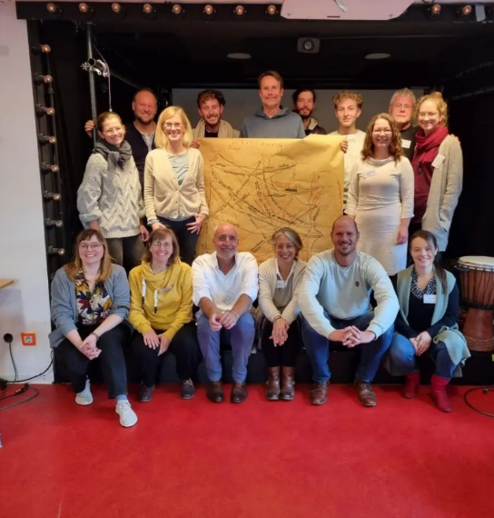

## Liebe Unterstützer\*innen,

In der Zeit „zwischen den Jahren“ ist auch für uns der Moment gekommen, um innezuhalten und das vergangene Jahre Revue passieren zu lassen. Für ein Projekt wie das CA, mit einer Vielzahl unterschiedlicher Aspekte und Teilprojekte, ist es dabei gar nicht so leicht, den Überblick zu behalten. In den Medien und auch in unserem Newsletter stehen dabei aktuell vor allem der Baufortschritt unseres Neubaus und die vorbereitenden Arbeiten an unserem großen Altbau im Fokus.

Daher möchten wir diesen Newsletter nutzen, um mit Ihnen gemeinsam auf die Fortschritte bei der Konzeption unseres Orientierungsjahres zurückzuschauen! Dank einer Großspende haben wir seit Mitte 2021 die zeitlichen und finanziellen Ressourcen, um dafür ein umfassendes pädagogisches und organisatorisches Konzept zu entwickeln.

## Ein neuer Name für das Orientierungsjahr

Eine besondere Herausforderung war dabei die Entwicklung eines neuen Namens und Logos für das Orientierungsjahr. Nach vielen Monaten voller kreativer Workshops und langen Diskussionen in der Projektgruppe freuen wir uns nun Ihnen das Ergebnis zu zeigen:

<figure>
            
            <figcaption style="text-align:center">
            
Die erste Broschüre zum falt*r – dem Orientierungsjahr im CA (&#169; Johannes Roßnagel)

            </figcaption>
        </figure>

Mit dieser ersten Broschüre, die pünktlich zu Weihnachten aus dem Druck kam, möchten wir in den nächsten Monaten insbesondere Spender\*innen ansprechen, die den falt\*r durch ihre Spenden möglich machen. Neben einem Grußwort von Rafik Schami, der selbst im alten CA in der Seminarstraße lebte, erläutern wir in der Broschüre das pädagogische Konzept, die Komponenten des Programms, den Jahresablauf und natürlich den finanziellen Bedarf.

## Wir brauchen Ihre Unterstützung

Für jeden Durchgang des falt\*r werden etwa 100.000 Euro Spenden benötigt. Diese decken, gemeinsam mit Zuwendungen von Stiftungen, staatlichen Fördermitteln und einem kleinen Teilnahmebeitrag, alle Kosten für das pädagogische Programm, insbesondere die angemessene Bezahlung des mehrköpfigen pädagogischen und administrativen Teams, die die jungen Menschen begleiten und ihnen mit Rat und Tat zur Seite stehen. 

Unser Ziel ist es, bis Ende März 100.000 Euro für den ersten Jahrgang zu sammeln, der bereits im Oktober 2023 starten wird.

Wenn auch Sie die Realisierung des falt\*r unterstützen wollen, dann freuen wir uns über Ihre Spende! Wenn Sie Interesse an der Broschüre für Spendeninteressierte haben, dann schreiben Sie uns gerne ein E-Mail an [faltr@collegiumacademicum.de](mailto:faltr@collegiumacademicum.de) mit ihrer Postadresse und der gewünschten Anzahl an Broschüren. 

Gerne können Sie Ihre Spende auch direkt überweisen:    
|||
|--------------------------|------------------------------------------------------------------------|
|**Kontoinhaber:**| Förderverein Collegium Academicum Heidelberg e.V.|
|**IBAN:**| DE92 4306 0967 6036 6733 00|
|**Bank:** |GLS Gemeinschaftsbank eG|
|**Verwendungszweck:**| Spende faltr, Ihr Name, Ihre Email / Ihre Anschrift|

## Finanzierung bis Ende September 2023 erfolgreich eingeworben

Einen großen Erfolg konnten wir Ende November feiern: Die Finanzierung der Vorbereitungsphase des falt\*r, von Januar bis September 2023, ist durch eine erneute Großspende gesichert. Wir sind sehr dankbar für diese Unterstützung, die es uns ermöglicht den ersten Jahrgang gut vorzubereiten und das Konzept von der Theorie in die Praxis zu bringen.

## Kooperationen für ein vielfältiges Angebot

Neben der Ansprache von Spender\*innen, dem Erstellen des Finanzplans, sowie der Vernetzung mit anderen Anbietern von Orientierungszeiten (wie im vergangenen Newsletter berichtet) haben wir in den letzten Monaten Kooperationspartner\*innen gesucht – und gefunden. Ein inhaltlicher Schwerpunkt im falt\*r ist die sozial-ökologische Transformation. Wir freuen uns sehr, dass das Institut für Energie- und Umweltwissenschaften (ifeu) in Heidelberg uns hierbei mit Seminaren unterstützen wird. Mit dem ifeu verbindet uns eine langjährige Partnerschaft, die im Orientierungsjahr weiter vertieft wird.

Die Themen politische Teilhabe und Demokratie lernen sind uns ebenfalls eine Herzensangelegenheit. Im Zusammenleben werden die Teilnehmenden ganz praktische Erfahrungen damit sammeln. Außerdem wird die Landeszentrale für politische Bildung Baden-Württemberg einen festen Programmbestandteil als Kooperationspartnerin erhalten, die anhand von Planspielen und Workshops das Thema Demokratie greifbar machen wird. 

 
Ein Orientierungsjahr ohne Kooperation mit der Universität Heidelberg können wir uns nicht vorstellen, daher haben wir uns seit Anfang des Jahres mit vielen Vetreter*innen unterschiedlicher Abteilungen getroffen und gemeinsam überlegt, wie eine gute Zusammenarbeit aussehen kann. Kurz vor Weihnachten wurden wir dafür zu einem Gespräch in der Universitätsverwaltung – im Carolinum in der Seminarstr. 2 – eingeladen, ein Gebäude, welches für alle CAler*innen eine ganz besondere Bedeutung hat.

 
        <figure>
            
            <figcaption style="text-align:center">
            
Auf dem Weg in das Carolinum (&#169; CA)

            </figcaption>
        </figure>

Wir hoffen, dass Sie ebenso begeistert von der Vorstellung sind, dass 50 junge Menschen ein Jahr gemeinsam leben und lernen und danach Verantwortung für sich selbst und die Gesellschaft übernehmen, wie wir.   
Herzliche Grüße und einen guten Rutsch in das neue Jahr wünscht die Projektgruppe des CA!  
P.s. Die nächsten Führung über das Gelände des CA findet am 15.01. um 14 Uhr statt. Wir bitten um eine kurze Anmeldung per Mail an <a href="mailto:exkursion@collegiumacademicum.de">exkursion@collegiumacademicum.de</a> und freuen uns auf Ihren Besuch!

