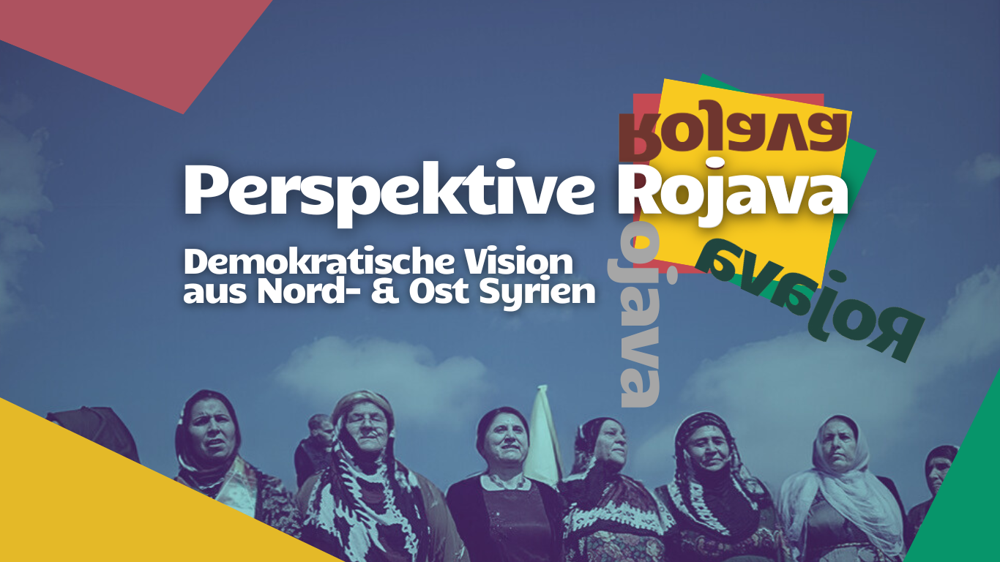
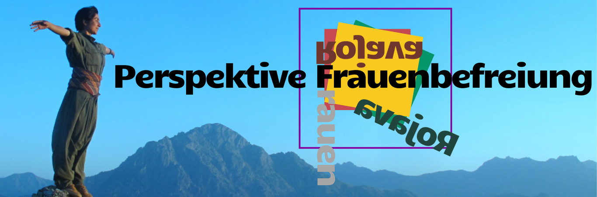
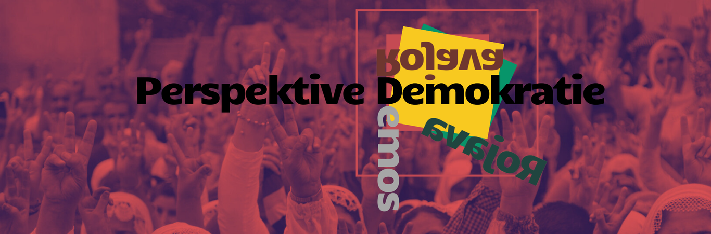
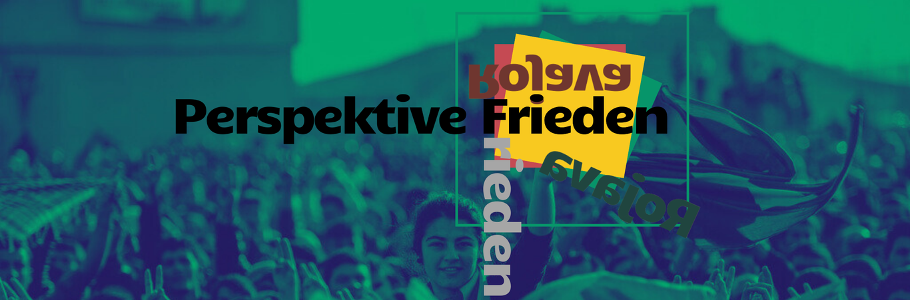
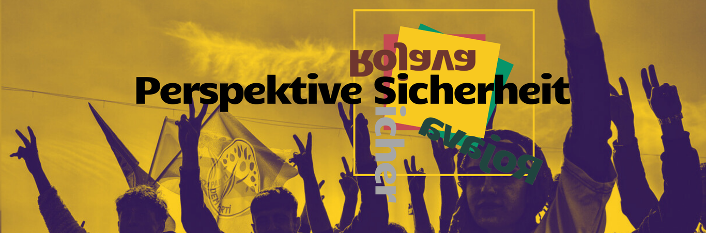
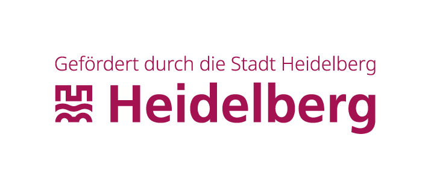
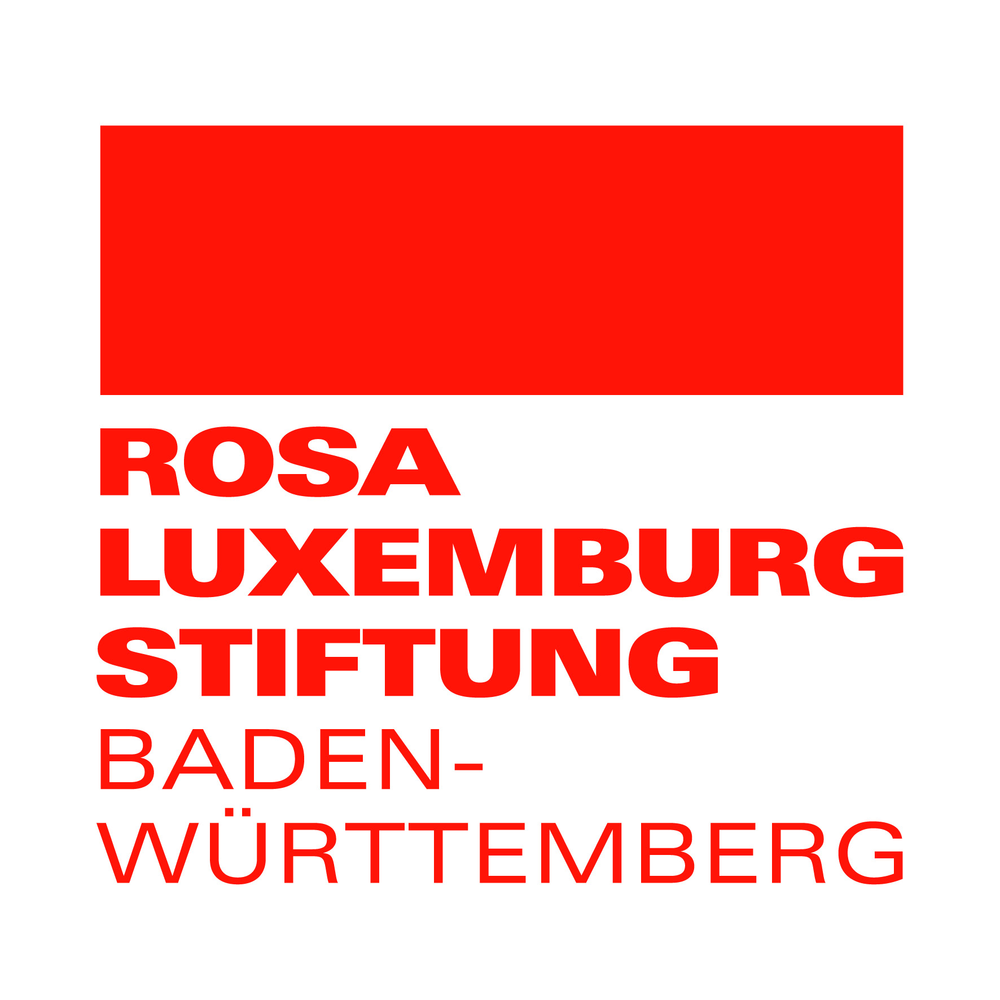
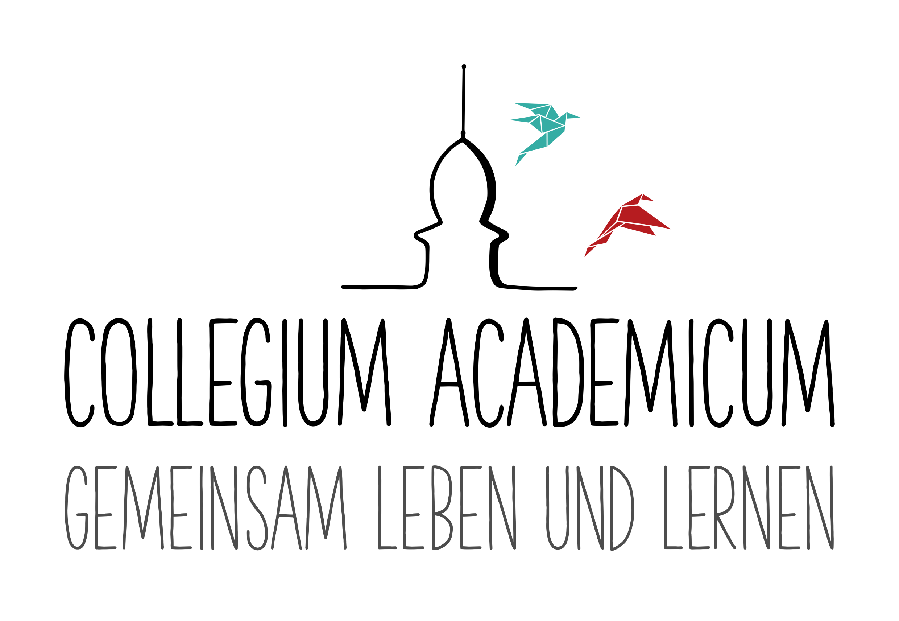

<figure>

</figure>

<h2>Demokratische Vision aus Nord- und Ostsyrien</h2>
 
    

Aktuell sieht sich die Selbstverwaltung Nord- und Ost-Syrien mit der stärksten Bedrohung seit 2019 konfrontiert. Türkische Luftangriffe und das Vorrücken der pro-türkischen Milizen der SNA haben bereits viele Menschen zur Flucht gezwungen. Hunderttausende Menschen sind auf humanitäre Hilfe angewiesen. 
Wir bitten um Unterstützung für die humanitäre Arbeit vor Ort. Wir empfehlen dabei die <a href="https://www.medico.de/spenden">Hilfsorganisation Medico International</a>, die mit dem Kurdischen Roten Halbmond eng zusammenarbeitet.
    

In einer Zeit, in der Populismus und Rechtsextremismus weltweit auf dem Vormarsch sind, unsere Demokratie an ihre Grenzen stößt, die Kriege in der Welt und auch in der Region Rojavas immer weiter eskalieren und die Zeit zur Bekämpfung des Klimawandels drängt, braucht es mehr denn je neue Ideen, Impulse und Visionen. 

Im Nordosten Syriens (auf kurdisch "Rojava") entwickelt sich seit über 12 Jahren ein inspirierendes Experiment auf der Basis von Selbstbestimmung, Frauenbefreiung, Rätedemokratie sowie multiethnischem und multireligiösem Zusammenleben. Feminismus, Solidarität und Gerechtigkeit werden hier auf einzigartige Weise gelebt. 

Dieses gelebte Experiment, samt seiner Chancen und Herausforderungen, wollen wir im Rahmen einer anderthalbtägigen Konferenz näher betrachten und diskutieren. 
<b>Diese Tagung haben wir vor dem Sturz des Assad-Regimes vorbereitet. Auch wir sind überrascht und bewegt von den aktuellen Entwicklungen in Syrien. Wir denken jedoch, dass jetzt mehr denn je Zeit ist, über Nord- und Ost-Syrien und die dortigen Selbstverwaltungsstrukturen zu sprechen. Wir werden demnach auch die aktuellen Entwicklungen näher beleuchten und besprechen.</b>

<!--<blockquote>-->
<cite>Lasst uns also gemeinsam demokratische Zukunftsvisionen und Perspektiven für Frieden und Gerechtigkeit entwickeln!</cite>
<!--</blockquote>-->

Die Tagung findet <b>vom 25. bis zum 26. Januar</b> statt! Ein voller Samstag und ein Sonntagvormittag. 
Es wird <b>Vorträge, Workshops & Diskussionen</b> geben. Außerdem wird es am Samstag einen gemeinsamen <b>Bar-Abend mit Livemusik</b> zum Austauschen und Tanzen. Wir werden außerdem für diejenigen, die weiter anreisen, eine <b>Bettenbörse</b> organisieren. Auch gemeinsames Essen wird nicht fehlen  – es ist also für alles gesorgt!  

 
<a class="button is-rojava is-mobile-fullwidth" href="https://cloud.collegiumacademicum.de/apps/forms/s/BDm8f99ebi8yLKFptBsqXNzy">Hier geht es zum Anmeldebogen!
</a>

 

Wenn du Probleme mit der Anmeldung hast, melde dich auch gerne einfach per E-Mail an bildung@collegiumacademicum.de.

<h2>Das Programm</h2>

Samstag, 25.01.2025

 
 
 

<b>09:30 Uhr</b>: Auftakt & Begrüßung
 

<b>10:00 Uhr</b>: Einstieg: Politischer Lagebericht

- Ein Rückblick auf 12 Jahre Selbstverwaltung sowie eine Einordnung der aktuellen politischen Geschehnisse im Norden und Osten Syriens aus erster Hand (mit <b>Ali Çiçek</b>).

<figure>

</figure>

<b>11:00 Uhr</b>: Perspektive Frauenbefreiung

- Wir tauchen weiter ein mit Einblicken in die theoretischen Grundlagen und die praktische Umsetzung der letzten 50 Jahre der kurdischen Frauenbewegung. Wie ist diese Bewegung entstanden, wofür kämpft sie? Wie sieht anti-patriarchale Praxis in der Bewegung aus? Warum handelt es sich in Rojava um eine Frauenrevolution und wie findet die Jahrzehnte lange Aufbauarbeit heute Ausdruck in Nord- und Ostsyrien? Außerordentliche Einblicke und Impulse für Reflexion erwarten uns gleich zu Beginn der Tagung (mit <b>Anja Flach</b>).

<b>13:00 Uhr</b>: Mittagspause
- Beim selbstgekochten Mittagsessen können erste Gedanken geteilt und diskutiert werden.

<figure>

</figure>

<b>14:30 Uhr</b>: Perspektive Demokratie
- Was kann Demokratie bedeuten? Ein Impulsvortrag über die demokratischen Strukturen in Rojava und den Schattierungen und der Vielfalt demokratischer Lebensweisen anhand dieses Beispiels. Im Zentrum steht die Idee des demokratischen Konföderalismus (mit <b>Müslüm Örtülü</b>).

<b>15:30 Uhr</b>: Workshops
- Eine Vielzahl an Denkwerkstätten erwartet uns: ob Alltagserfahrungen & Geschichten aus Rojava, Ökologie und Klimawandel, Jineoloji ("Wissenschaft der Frauen"), das transnationale Mediennetzwerk der kurdischen Freiheitsbewegung, Dekolonialismus, Repression von Kurd*innen in Deutschland, Femizide als Kriegsführung - Perspektiven aus der Region Rojava und darüber hinaus werden selbstkritisch und lebhaft diskutiert, erfahren, reflektiert (mit <b>Ayten Kaplan, Alexander Glasner-Hummel, Kerem Schamberger, Leonie Baumgarten Egemole, Ercan Ayboga</b>). 

<b>17:00 Uhr</b>: Pause
- Kleine Pause mit Kaffee und Kuchen.

<figure>

</figure>

<b>17:30 Uhr</b>: Perspektive Frieden
- Mit Gäst\*innen aus Deutschland und Kurdistan wollen wir über Krieg und Frieden reden. Wie steht es heute mit dem Kampf gegen den IS? Was ist die Rolle der Türkei, des Assad-Regimes, der Syrischen Demokratischen Kräfte sowie der Regional- und Großmächte in den aktuellen Auseinandersetzungen? Führt die Türkei einen Drohnenkrieg und einen Wasserkrieg gegen Zivilist\*innen in Nordost-Syrien? Was ist die Rolle und Verantwortung Deutschlands in der Region? Wie kann Solidarität mit der Zivilbevölkerung gelingen? Was braucht es für den Frieden in Rojava? Viele Fragen, eine spannende Podiumsbesetzung und hoffentlich auch ein paar Antworten, um den ersten Tag inhaltlich abzuschließen (<b>mit Leyla Îmret, Max Lucks, Gökay Akbulut und Sara Stachelhaus</b>).

<b>19:30 Uhr</b>: gemeinsames Abendessen und Kulturprogramm
- Wir lassen den Tag gemeinsam in einem lockeren Rahmen ausklingen. Es erwarten uns ein selbstgekochtes Abendessen, ein kurdisch-anatolisches Kulturprogramm und natürlich Einblicke in das selbstorganisierte Wohnen und Feiern im CA!

Sonntag, 26.01.2025

  

<b>ab 9:00 Uhr</b>: gemeinsames Frühstück
- Mit Çay und Kaffee möchten wir einen gemütlichen Rahmen für Austausch am frühen Morgen schaffen.  

<figure>

</figure>

<b>10 Uhr</b>: Perspektive Sicherheit
- Mit einem Vortrag über die Idee des Abolitionismus, also die Abschaffung der Polizei, nähern wir uns dem Thema Sicherheit zunächst aus theoretischer Perspektive. Inwiefern es beim Abolitionismus nicht nur um das Abschaffen einer Institution, sondern das Schaffen von neuen, demokratischeren Strukturen geht, erklärt uns unser Gast von der Universität Heidelberg (mit <b>Prof. Dr. Michael Haus</b>).

<b>11 Uhr</b>: Sicherheit in Rojava
- Wir erhalten einen Einblick in die Wirklichkeit in Rojava. Wie wird in einer von Krieg zerrütteten Region Sicherheit organisiert? Und welche Strukturen gibt es, um dies selbstverwaltet und möglichst ohne Gewaltstrukturen zu erreichen? Über neue Wege um Frieden, Gerechtigkeit und Sicherheit zu denken (Livestream mit einem <b>Asayîş-Mitglied</b> aus der Autonomen Administration Nord- und Ostsyrien).

<b>12:30 Uhr</b>: Abschluss
- In einem gemeinsamen Abschluss und mit einem Keynote-Vortrag wollen wir noch einmal zentrale Erkenntnisse und Diskussionspunkte der Tagung hervorheben (mit einem Überraschungsgast).

<h3>Unsere Gäst*innen</h3>


Gökay Akbulut ist eine deutsche Politikerin und Sozialwissenschaftlerin. Sie studierte an der Universität Heidelberg und ist seit 2017 Mitglied des Deutschen Bundestages für die Partei Die Linke für den Wahlkreis Mannheim. Gökay Akbulut wurde zudem als Bundestagsabgeordnete 2023 in der Türkei aufgrund ihres politischen Engagements für kurzer Zeit festgehalten. Sie bringt ein langjähriges Engagement in kurdischen Vereinen und in der Bildungsarbeit mit.



Ercan Ayboga ist langjähriger Aktivist der Ökologiebewegung Kurdistans. Er arbeitete mehrere Jahre in Nord-Kurdistan (Südosttürkei) und baute die Initiative zur Rettung der historischen Stadt Hasankeyf mit auf, die gegen den Ilisu Staudamm kämpfte. Ercan Ayboga ist Umweltingenieur und Co-Autor des Buches <i>Revolution in Rojava</i>, das 2015 im Rahmen der Kampagne <i>Tatort Kurdistan</i> erschien.



Leonie Baumgarten Egemole ist Aktivistin im Bereich Antirassismus und Klimagerechtigkeit. Sie ist Mitorganisatorin bei Black Lives Matter in Heidelberg sowie beim afro-Festival Heidelberg, hat bei dem Podcast <i>heidelberg kolonial</i> mitgewirkt und organisiert Stadtrundgänge zu kolonialen Kontinuitäten. Leonie Baumgarten Egemole studiert Jura und engagiert sich in zahlreichen Vereinen und Initiativen.



Ali Çiçek ist Journalist und Mitarbeiter bei der Akademie der Demokratischen Moderne. Er war zudem Vorstandsmitglied von Civaka Azad e.V., dem kurdischen Zentrum für Öffentlichkeitsarbeit.



Anja Flach ist Ethnologin, Buchautorin und Mitarbeiterin im Rojbin Frauenrat. Sie war von 1995 bis 1997 als Internationalistin in den Bergen Kurdistans und teilte dort das Leben von Guerilla-Einheiten der kurdischen Befreiungsbewegung. Sie ist u.a. Co-Autorin des Buches <i>Revolution in Rojava</i> und Mitarbeiterin in der Informationsstelle Kurdistan (ISKU).



Alexander Glasner-Hummel ist Soziologe und promoviert an der LMU München zu den Wirkungen von Repression auf Öffentlichkeit. Er ist Co-Autor des Buches <i>Geflohen. Verboten. Ausgeschlossen. Wie die kurdische Diaspora in Deutschland mundtot gemacht wird</i>.



Prof. Dr. Michael Haus ist Politikwissenschaftler und Professor für Moderne Politische Theorie an der Universität Heidelberg. Zu seinen Forschungsschwerpunkte gehören u.a. Theorien der Demokratie und der Gerechtigkeit, Kommunitarismus, kritische Filmanalyse und Stadtpolitik. Im Rahmen des Forschungsprojekts <i>Polizei, Politik, Polis - Zum Umgang mit Geflüchteten in der Stadt</i> setzte er sich auch intensiv mit Polizeikritik auseinander. Michael Haus ist Autor des Buches <i>Grundlagen der Politischen Theorie - Ein Überblick</i>.



Leyla Îmret ist ehemalige Bürgermeisterin der Stadt Cizre in der Türkei, an der Grenze zu Syrien und zum Irak. Leyla Îmret ist ausgebildete Kinderpflegerin und Friseurin, größtenteils in Deutschland aufgewachsen und wurde zu einer der jüngsten Bürgermeister*innen der Türkei. Seit 2017 lebt sie im politischen Asyl in Deutschland und ist eine von zwei Deutschland-Vorsitzenden der türkischen DEM-Partei (Partei für Gleichheit und Demokratie des Volkes).



Ayten Kaplan ist Sprecherin des bundesweiten Verbandes der Frauen aus Kurdistan in Deutschland (YJK-E), Berufspädagogin und war 2021 in Gelsenkirchen Bundestagskandidatin für die Partei Die Linke.



Max Lucks ist ein deutscher Politiker, ehemals Sprecher der Grünen Jugend und seit 2021 Mitglied des Deutschen Bundestages für die Partei Bündnis 90/Die Grünen. Er arbeitet im Ausschuss für Menschenrechte und Humanitäre Hilfe. Max Lucks engagierte sich für die Anerkennung des Genozids an den Jesid\*innen durch den IS sowie gegen die Abschiebung von Jesid\*innen aus Deutschland und bereiste 2024 den irakischen Kurdistan.



Müslüm Örtülü ist Politikwissenschaftler. Seine Forschungs- und Arbeitsschwerpunkte sind der Nahe und Mittlere Osten, die Türkei sowie Kolonialismus, Dekolonisierung und koloniale Kontinuitäten. Er ist Autor des Buches <i>Der demokratische Konföderalismus – Eine politische Alternative für den Mittleren Osten?</i>



Kerem Schamberger ist Kommunikationswissenschaftler und in der Öffentlichkeitsarbeit von medico international für den Bereich Flucht und Migration zuständig. Er ist Co-Autor des Buches <i>Die Kurden – Ein Volk zwischen Unterdrückung und Rebellion</i>  sowie des Buches <i>Geflohen. Verboten. Ausgeschlossen. Wie die kurdische Diaspora in Deutschland mundtot gemacht wird</i>.



Sara Stachelhaus ist Programmkoordinatorin für Syrien bei der Heinrich-Böll Stiftung in Beirut und arbeitet u.a. zu den Themen Flucht und Aufnahme von Geflüchteten, zum Assad-Regime und zum Syrienkrieg. Sie studierte an der Universität Tübingen und engagierte sich beim Verband der Jungen Europäischen Föderalisten.


<h3>Anmeldung</h3>

Für eine bessere Planung sind wir auf Ihre Anmeldung angewiesen. Bitte melden Sie sich <a href="https://cloud.collegiumacademicum.de/apps/forms/s/BDm8f99ebi8yLKFptBsqXNzy">unter diesem Link</a> an. Die Teilnahme ist kostenlos.

<h3>Anfahrt</h3>

Die Tagung findet in den Räumlichkeiten des selbstverwalteten Wohnheims Collegium Academicum (CA), Marie-Clauss Straße 3, 69126 Heidelberg statt (<a href="https://collegiumacademicum.de/anfahrt/">Anfahrt</a>). Das CA befindet sich in einem autofreien Quartier. Wir können vor Ort somit keine Parkplätze bereitstellen und empfehlen daher eine Anfahrt mit den öffentlichen Verkehrsmitteln. Neben unserer Fläche hält auch die Straßenbahn der Linie 24, die direkt mit dem Heidelberger Hauptbahnhof verbunden ist.

<h3>Veranstalter und Förderung</h3>

"Perspektive Rojava" ist eine Veranstaltung des Fördervereins Collegium Academicum Heidelberg e.V. Die Veranstaltung wird ermöglicht durch Förderungen der Stadt Heidelberg und der Rosa Luxemburg Stiftung Baden-Württemberg.

<figure>
<table>
 <tr>
  <td></td>
  <td>
  <td></td>
 </tr>
</table>
</figure>

