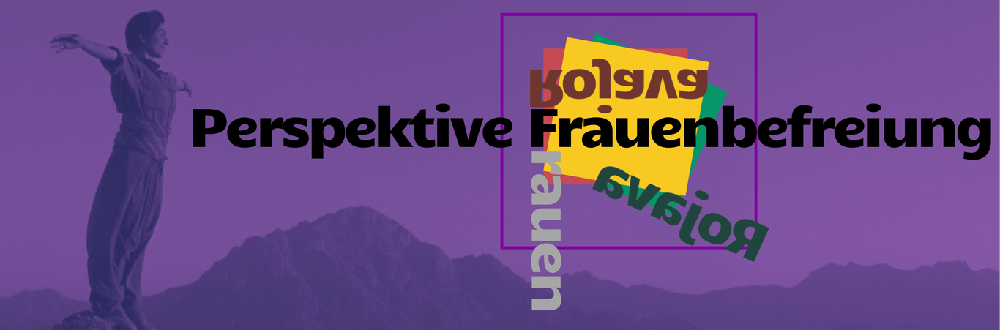

<figure>

</figure>

<h2>Demokratische Vision aus Nordost Syrien</h2>
 

In einer Zeit, in der Populismus und Rechtsextremismus weltweit auf dem Vormarsch sind, unsere Demokratie an ihre Grenzen stößt, die Kriege in der Welt und auch in der Region Rojavas immer weiter eskalieren und die Zeit zur Bekämpfung des Klimawandels drängt, braucht es mehr denn je neue Ideen, Impulse und Visionen. 

Im Nordosten Syriens entwickelt sich seit über 12 Jahren ein inspirierendes Experiment auf der Basis von Selbstbestimmung, Frauenbefreiung, Rätedemokratie sowie multiethnischem und multireligiösem Zusammenleben. Feminismus, Solidarität und Gerechtigkeit werden hier auf einzigartige Weise gelebt. 

Dieses gelebte Experiment, samt seine Chancen und Herausforderungen, wollen wir im Rahmen einer eineinhalbtägigen Konferenz näher betrachten und diskutieren. 

<!--<blockquote>-->
<cite>Lasst uns also gemeinsam demokratische Zukunftsvisionen und Perspektiven für Frieden und Gerechtigkeit entwickeln!</cite>
<!--</blockquote>-->

Die Tagung findet <b>vom 25. zum 26. Januar</b> statt! Ein voller Samstag und ein Sonntagvormittag also. 
Es wird <b>Vorträge, Workshops & Diskussionen</b> geben. Außerdem am Samstag einen gemeinsamen <b>Bar-Abend mit Livemusik</b> zum Austauschen und Tanzen. Wir werden außerdem für diejenigen, die weiter anreisen, eine <b>Bettenbörse</b> organisieren. Zum <b>Essen</b> gibt es eine KüFa – es ist also für alles gesorgt!  

 
<a class="button is-rojava is-mobile-fullwidth" href="https://cloud.collegiumacademicum.de/apps/forms/s/BDm8f99ebi8yLKFptBsqXNzy">Hier geht es zum Anmeldebogen!
</a>

 

<h2>Das Programm</h2>

Samstag, 25.01.2025

 
 
 

<b>09:30 Uhr</b>: Auftakt & Begrüßung
 

<b>10:00 Uhr</b>: Einstieg: Politischer Lagebericht

- Ein Rückblick auf 12 Jahre Selbstverwaltung sowie eine Einordnung der aktuellen politischen Geschehnisse im Nordosten Syriens aus erster Hand.

<figure>

</figure>

<b>11:00 Uhr</b>: Perspektive Frauenbefreiung

- Eine spannende Gästin führt uns durch die Errungenschaften der kurdischen Frauenbewegung. Warum es sich in Rojava um eine Frauenrevolution handelt, wie Jahrzehnte lange Aufbauarbeit heute Ausdruck in Nordostsyrien findet und welche Unterschiede sich hier mit westlichen Ausprägungen von Feminismus festhalten lassen: Außerordentliche Einblicke und Impulse für Reflexion erwarten uns gleich zu Beginn der Tagung.

<b>13:00 Uhr</b>: Mittagspause
- Beim selbstgekochten Mittagsessen können erste Gedanken geteilt und diskutiert werden.

<figure>

</figure>

<b>14:30 Uhr</b>: Perspektive Demokratie
- Was kann Demokratie bedeuten? Ein Impulsvortrag über die demokratischen Strukturen in Rojava und den Schattierungen und der Vielfalt demokratischer Lebensweisen anhand dieses Beispiels. Im Zentrum steht die Idee des demokratischen Konföderalismus.

<b>15:30 Uhr</b>: Workshops
- Eine Vielzahl an Denkwerkstätten erwartet uns: ob Alltagserfahrungen & Geschichten aus Rojava, Ökologie und Klimawandel, Jineoloji ("Wissenschaft der Frauen"), das transnationale Mediennetzwerk der kurdischen Freiheitsbewegung, Dekolonialismus, Repression von Kurd*innen in Deutschland, Femizide als Kriegsführung - Perspektiven aus der Region Rojava und darüber hinaus werden selbstkritisch und lebhaft diskutiert, erfahren, reflektiert. 

<b>17:00 Uhr</b>: Pause
- Kleine Pause mit Kaffee und Kuchen.

<figure>

</figure>

<b>17:30 Uhr</b>: Perspektive Frieden
- Mit prominenten Gäst\*innen aus Deutschland und Kurdistan wollen wir über Krieg und Frieden reden. Wie steht es heute mit dem Kampf gegen den IS? Was ist die Rolle der Türkei, des Assad-Regimes, der Syrischen Demokratischen Kräfte sowie der Regional- und Großmächte in den aktuellen Auseinandersetzungen? Führt die Türkei einen Drohnenkrieg und einen Wasserkrieg gegen Zivilist\*innen in Nordost-Syrien? Was ist die Rolle und Verantwortung Deutschlands in der Region? Wie kann Solidarität mit der Zivilbevölkerung gelingen? Was braucht es für den Frieden in Rojava? Viele Fragen, eine spannende Podiumsbesetzung und hoffentlich auch ein paar Antworten, um den ersten Tag inhaltlich abzuschließen. 

<b>19:30 Uhr</b>: gemeinsames Abendessen und Kulturprogramm
- Wir lassen den Tag gemeinsam in einem lockeren Rahmen ausklingeln. Es erwarten uns ein selbstgekochtes Abendessen, ein kurdisch-anatolisches Kulturprogramm und natürlich Einblicke in das selbstorganisierte Wohnen und Feiern im CA!

Sonntag, 26.01.2025

  

<b>ab 9:00 Uhr</b>: gemeinsames Frühstück
- Mit Çay und Kaffee möchten wir einen gemütlichen Rahmen für Austausch am frühen Morgen schaffen.  

<figure>

</figure>

<b>11 Uhr</b>: Perspektive Sicherheit
- Mit einem Vortrag über die Idee des Abolitionismus, also die Abschaffung der Polizei, nähern wir uns dem Thema Sicherheit zunächst aus theoretischer Perspektive. Inwiefern es beim Abolitionismus nicht nur um das Abschaffen einer Institution, sondern das Schaffen von neuen, demokratischeren Strukturen geht, erklärt uns unser Gast von der Universität Heidelberg.

<b>12 Uhr</b>: Sicherheit ohne Polizei
- Wir erhalten einen Einblick in die Wirklichkeit in Rojava. Wie wird in einer von Krieg zerrütteten Region Sicherheit organisiert? Und welche Strukturen gibt es, um dies selbstverwaltet und möglichst ohne Gewaltstrukturen zu erreichen? Über neue Wege um Frieden, Gerechtigkeit und Sicherheit zu denken.

<b>12:30 Uhr</b>: Abschluss
- In einem gemeinsamen Abschluss wollen wir noch einmal zentrale Erkenntnisse und Diskussionspunkte der Tagung hervorheben.

<h3>Anmeldung</h3>

Für eine bessere Planung sind wir auf Ihre Anmeldung angewiesen. Bitte melden Sie sich <a href="https://cloud.collegiumacademicum.de/apps/forms/s/BDm8f99ebi8yLKFptBsqXNzy">unter diesem Link</a> an. Die Teilnahme ist kostenlos.

<h3>Anfahrt</h3>

Die Tagung findet in den Räumlichkeiten des selbstverwalteten Wohnheims Collegium Academicum (CA), Marie-Clauss Straße 3, 69126 Heidelberg statt (<a href="https://collegiumacademicum.de/anfahrt/">Anfahrt</a>). Das CA befindet sich in einem autofreien Quartier. Wir können vor Ort somit keine Parkplätze bereitstellen und empfehlen daher eine Anfahrt mit den öffentlichen Verkehrsmitteln. Neben unserer Fläche hält auch die Straßenbahn der Linie 24, die direkt mit dem Heidelberger Hauptbahnhof verbunden ist.

<h3>Veranstalter und Förderung</h3>

"Perspektive Rojava" ist eine Veranstaltung des Fördervereins Collegium Academicum Heidelberg e.V.