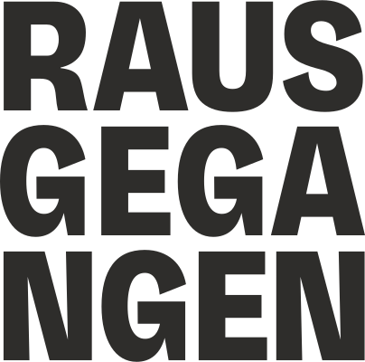

Eine aktuelle Übersicht über kommende Veranstaltungen bei uns findest du auf:

    <a href="https://rausgegangen.de/locations/aula-des-collegium-academicum/">
    &nbsp;&nbsp;&nbsp;
    <a href="https://rausgegangen.de/organizations/collegium-academicum/" class="button is-medium is-primary">
        
            <i class="icon-link"></i>
        
        rausgegangen.de
    </a>

Datum | Veranstaltung 
-------- | -------- 
So, 05.01. 9 Uhr | Aktionstreffen Studis gegen Rechts
Sa, 18.01. 22 - 05 Uhr | Im Tunnel Party Vol. 2. Mit DJ faey, DJ Schleusenputzer und DJ Mantarochen. Tickets unter [rausgegangen.de](https://rausgegangen.de/organizations/collegium-academicum/).
Do, 30.01., 19 Uhr | Nächster Online-Infoabend für das falt*r-Orientierungsjahr. Anmeldung per Mail an team@faltr.de.
Sa, 25.01. und So, 26.01.2025  |  <a href="https://collegiumacademicum.de/rojava/">Tagung: Perspektive Rojava</a>
