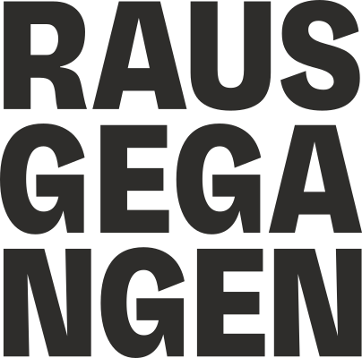

Eine aktuelle Übersicht über kommende Veranstaltungen bei uns findest du in der Tabelle unten und zum Teil auf:

    <a href="https://rausgegangen.de/locations/aula-des-collegium-academicum/">
    &nbsp;&nbsp;&nbsp;
    <a href="https://rausgegangen.de/organizations/collegium-academicum/" class="button is-medium is-primary">
        
            <i class="icon-link"></i>
        
        rausgegangen.de
    </a>

Datum | Veranstaltung 
-------- | -------- 
**September 2026** |
Sa, 19.9., 14-19 Uhr | <a href="https://stadt-land-spielt.de/">Stadt-Land-Spielt</a> in unserer Aula, s.a. <a href="">Aktuelles</a> |
So, 20.9., 14-19 Uhr | <a href="https://stadt-land-spielt.de/">Stadt-Land-Spielt</a> in unserer Aula |
**November 2026** |
Sa, 28.11. | <a href="https://www.instagram.com/p/DWgb3mQCIfc/">Zine Fair Heidelberg</a> (Solarpunk Heidelberg & Queerfeministisches Kollektiv Heidelberg)
