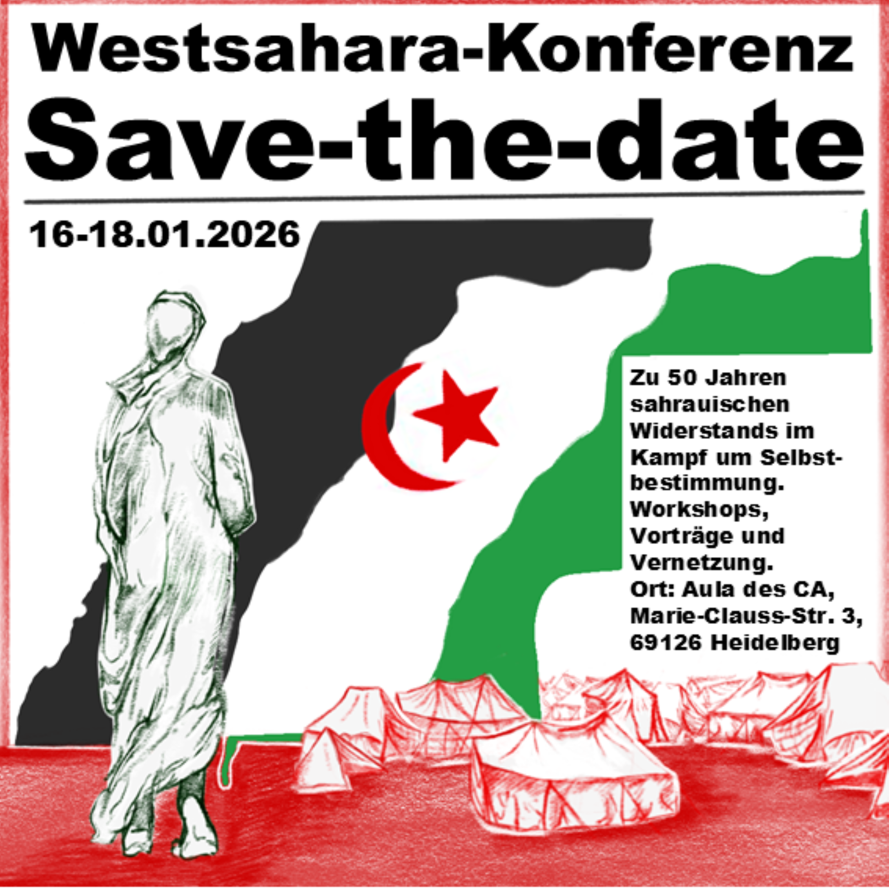

<h2>50 Jahre sahrauischer Widerstand und der Kampf um Selbstbestimmung</h2>

<b>Konferenz vom 16.-18. Januar 2026 im Collegium Academicum</b>
 
<a href="https://www.instagram.com/perspektive_widerstand/">
        
            <i class="icon-instagram"></i>
        
        Instagram: @perspektive_widerstand
   </a>
 
 

<a class="button is-primary"
href="https://cloud.collegiumacademicum.de/apps/forms/s/eyzMtpp73mcx8Z6dGSzCsLp7" style="font-weight:bold; width:20em">

    <i class="icon-link"></i>

Hier geht's zur Anmeldung!</a>

    

     
    Mit der Konferenz möchten wir einen Lern-, Begegnungs- und Aktionsraum öffnen, um auf die Besatzung der Westsahara, den sahrauischen Widerstand und den Kampf um Unabhängigkeit und Selbstbestimmung aufmerksam zu machen und den Diskurs anzuregen. Wir möchten mit- und voneinander lernen und gemeinsam einen Ort schaffen, an dem sich Menschen aus verschiedenen linken Kontexten, der sahrauischen Community und Diaspora, Aktivist*innen, Wissenschaftler*innen und  institutionelle Akteur*innen vernetzen können. Wir wollen gemeinsame Perspektiven entwickeln und Impulse zur Frage setzen, was wir hier und jetzt tun können, um solidarische Netzwerke aufzubauen und zu stärken. Wir möchten laut werden - für Menschenrechte, Selbstbestimmung und ein Leben in Freiheit – ohne Besatzung und Ausbeutung, für ein Leben in Würde und für eine befreite unabhängige Westsahara.

<h2>Inhalt und Formate der Konferenz</h2>

Die Konferenz lädt dazu ein, sich mit der Geschichte und Gegenwart der Sahrauis auseinanderzusetzen – mit ihren Kämpfen, Hoffnungen und Stimmen. An drei Tagen entsteht ein Raum des Zuhörens, des Austauschs und der Solidarität, in dem Wissen, Kultur und gelebte Erfahrung miteinander in Dialog treten.
Inhaltlich führt das Programm von den historischen Wurzeln des Konflikts um die Westsahara bis zu aktuellen politischen, gesellschaftlichen und menschlichen Fragen: Wie leben die Menschen in den Lagern? Welche Formen des Widerstands und der Selbstbestimmung entstehen unter Besatzung? Welche Verantwortung trägt Europa – politisch, wirtschaftlich, moralisch? Und welche Wege eröffnen sich für gemeinsames Handeln? 
Es wird verschiedene Formate und Zugänge geben:

- Panels, Lesungen und Gespräche eröffnen Perspektiven von Aktivist\*innen, Jurist\*innen, Künstler\*innen und Journalist\*innen – aus den Lagern, den besetzten Gebieten und der Diaspora.     
- Workshops schaffen Raum für eigenes Engagement und konkrete Solidarität.
- Kulturprogramm am Abend: Film und Musik bringen Stimmen und Geschichten auf andere Weise zum Klingen – berührend, eindrücklich und verbindend.     
- Gemeinsame Mahlzeiten und offene Runden laden ein, Beziehungen zu knüpfen und den Austausch fortzusetzen.     
- Der gemeinsame Abschluss mit Kundgebung, Musik und Redebeiträgen setzt ein Zeichen für Sichtbarkeit, für Zusammenhalt, für Hoffnung.

<i class="icon-right-big"></i>
 Der konkrete Ablauf des Programms folg in Kürze!

Mit den verschiedenen Formaten möchten wir eine lebendige, offene Konferenz schaffen, die nicht nur informiert, sondern bewegt – und die zeigt, dass Solidarität über Grenzen hinweg möglich ist.

 
<a href="https://www.instagram.com/perspektive_widerstand/">
        
            <i class="icon-instagram"></i>
        
        Instagram: @perspektive_widerstand
   </a>

