<h2>50 Jahre sahrauischer Widerstand und der Kampf um Selbstbestimmung</h2>

<b>Konferenz vom 16.-18. Januar 2026 im Collegium Academicum</b>
 
<a href="https://www.instagram.com/perspektive_widerstand/">
        
            <i class="icon-instagram"></i>
        
        Instagram: @perspektive_widerstand
   </a>
 
 

Der Eintritt ist auf solidarischer Spendenbasis. Empfohlen wird ein Betrag zwischen 0 und 30&nbsp;€.
 
 

<a class="button is-primary"
href="https://cloud.collegiumacademicum.de/apps/forms/s/eyzMtpp73mcx8Z6dGSzCsLp7" style="font-weight:bold; width:20em">

    <i class="icon-link"></i>

Hier geht's zur Anmeldung!</a>

    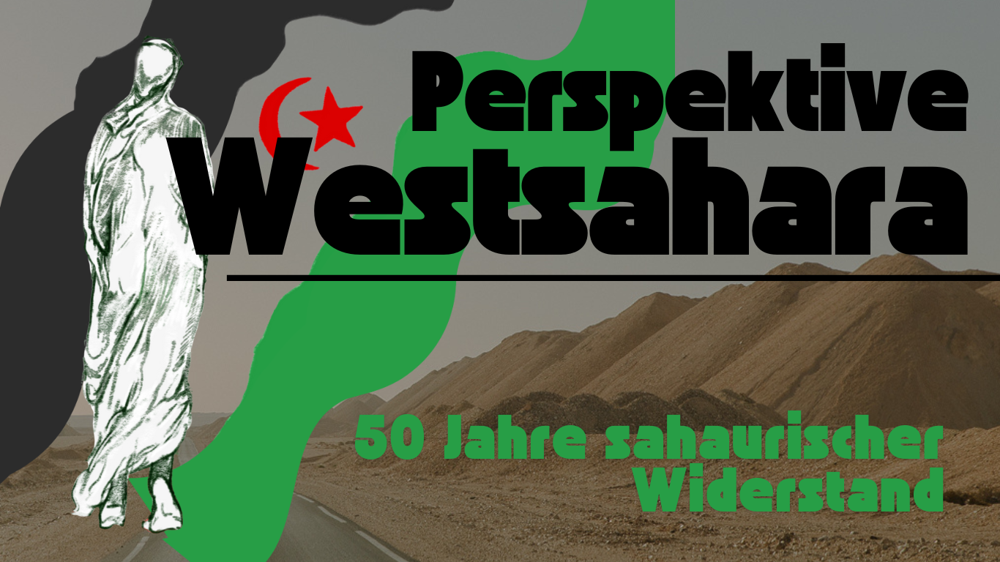

     
    Mit der Konferenz möchten wir einen Lern-, Begegnungs- und Aktionsraum öffnen, um auf die Besatzung der Westsahara, den sahrauischen Widerstand und den Kampf um Unabhängigkeit und Selbstbestimmung aufmerksam zu machen und den Diskurs anzuregen. Wir möchten mit- und voneinander lernen und gemeinsam einen Ort schaffen, an dem sich Menschen aus verschiedenen linken Kontexten, der sahrauischen Community und Diaspora, Aktivist*innen, Wissenschaftler*innen und  institutionelle Akteur*innen vernetzen können. Wir wollen gemeinsame Perspektiven entwickeln und Impulse zur Frage setzen, was wir hier und jetzt tun können, um solidarische Netzwerke aufzubauen und zu stärken. Wir möchten laut werden - für Menschenrechte, Selbstbestimmung und ein Leben in Freiheit – ohne Besatzung und Ausbeutung, für ein Leben in Würde und für eine befreite unabhängige Westsahara.

<h2>Inhalt und Formate der Konferenz</h2>

Die Konferenz lädt dazu ein, sich mit der Geschichte und Gegenwart der Sahrauis auseinanderzusetzen – mit ihren Kämpfen, Hoffnungen und Stimmen. An drei Tagen entsteht ein Raum des Zuhörens, des Austauschs und der Solidarität, in dem Wissen, Kultur und gelebte Erfahrung miteinander in Dialog treten.
Inhaltlich führt das Programm von den historischen Wurzeln des Konflikts um die Westsahara bis zu aktuellen politischen, gesellschaftlichen und menschlichen Fragen: Wie leben die Menschen in den Lagern? Welche Formen des Widerstands und der Selbstbestimmung entstehen unter Besatzung? Welche Verantwortung trägt Europa – politisch, wirtschaftlich, moralisch? Und welche Wege eröffnen sich für gemeinsames Handeln? 
Es wird verschiedene Formate und Zugänge geben:

- Panels, Lesungen und Gespräche eröffnen Perspektiven von Aktivist\*innen, Jurist\*innen, Künstler\*innen und Journalist\*innen – aus den Lagern, den besetzten Gebieten und der Diaspora.     
- Workshops schaffen Raum für eigenes Engagement und konkrete Solidarität.
- Kulturprogramm am Abend: Film und Musik bringen Stimmen und Geschichten auf andere Weise zum Klingen – berührend, eindrücklich und verbindend.     
- Gemeinsame Mahlzeiten und offene Runden laden ein, Beziehungen zu knüpfen und den Austausch fortzusetzen. 
- Der gemeinsame Abschluss mit Kundgebung, Musik und Redebeiträgen setzt ein Zeichen für Sichtbarkeit, für Zusammenhalt, für Hoffnung.

Mit den verschiedenen Formaten möchten wir eine lebendige, offene Konferenz schaffen, die nicht nur informiert, sondern bewegt – und die zeigt, dass Solidarität über Grenzen hinweg möglich ist.
 
 

<h2>Das Programm</h2>

Freitag, 16.01.

 
 
 

<b>19:00 Uhr</b>: Kurzfilm-Premiere und Ankommen
 
- Für ein gemeinsames An- und Zusammenkommen leiten wir das Wochenende mit der Premiere der Kurzdoku „Land Of The Three Teas“ der Fotografin Maria Klenner ein, die sich dokumentarisch mit der Westsahara und den Camps in Algerien befasst. Beim anschließenden Essen gibt es die Möglichkeit, mit **Dokumentarfotografin Maria Klenner** ins Gespräch zu kommen.

Samstag, 17.01.

 
 
 

<b>08:00 - 09:00 Uhr</b>: Frühstück
- Gemeinsames Frühstück in der Aula

 
<b>09:30 - 11:00 Uhr</b>: Lesung mit Tee Zeremonie

- Mit dem Comic "Genug gewartet" nimmt **Fine (Autor\*in und Zeichner\*in)** euch mit auf die Reise in die Westsahara und beleuchtet die  geschichtlichen und politischen Hintergründe der letzten Kolonie Afrikas. Die Lesung ist begleitet von einer Tee Zeremonie und bietet einen inhaltlichen Einstieg in die Themen des Wochenendes.
Anschließend gibt es die Möglichkeit zum Austausch mit **Buhari Lehbib**, einem Vertreter der saharauischen Diaspora.

<b>11:30 – 13:00 Uhr</b>: Perspektive Widerstand: Panel Gespräch

- Der Widerstand der Sahrauis ist vielfältig, andauernd und überall: Ob in den
besetzten Gebieten, den Camps, oder in der Diaspora. In einem Panel Gespräch teilen **Saleh Sidmustafa, Fatou Yahya Iaazza und Emma Lehbib** ihre Perspektiven aus den verschiedenen Geografien des Sahrauischen Widerstands.

<b>13:00 – 14:00 Uhr</b>: Mittagspause

- Gemeinsames Mittagessen

<b>14:30 – 15:30 Uhr</b>: Ressourcen und Handel

- Warum ist die Westsahara so wichtig für Marokko? Wie profitieren Europa und
Deutschland von der Besatzung? In diesem Input beleuchtet **Western Sahara Resource Watch (WSRW)** die illegale Ressourcenausbeutung in der besetzten Westsahara,
und die internationalen Handelsbeziehungen, sowie die Verstrickungen Deutscher
Unternehmen in die Besatzung.

<b>15:30 – 16:00 Uhr</b>: Kaffeepause

<b>16:00 – 17:00 Uhr</b>: Workshop Phase

- In der Workshop Phase soll es verschiedene Angebote geben, um ganz konkret aktiv
zu werden, Vernetzungsräume aufzubauen oder die Verbindung zu anderen
Freiheitskämpfen auszuleuchten. Mehr Informationen zu den geplanten Workshops folgen.

<b>17:30 – 18:30 Uhr</b>: Zine Lesung

- Nach der Workshop Phase geht es wieder in einen gemeinsamen Raum. Im Zine
WIDERWORTE verweben sich sahrauische Stimmen aus den besetzten Gebieten, den Flüchtlingscamps und der
europäischen Diaspora zu einer gemeinsamen Gegenerzählung.
Mit einer kurzen Lesung und anschließendem Austausch mit einer der Autorinnen
runden wir den Tag inhaltlich ab.

<b>18:30 – 20:00 Uhr</b>: Gemeinsames Abendessen

<b>20:00 – 21:30 Uhr</b>: Podiumsdiskussion – Internationale Verantwortung

- Was ist die Rolle Deutschlands, der EU und der UN im Bezug auf die Westsahara? Wo liegt die Verantwortung? Gemeinsam wollen wir uns vor allem auch fragen: Was muss sich ändern in der Politik, um eine befreite Westsahara zu erreichen? Es diskutieren: **Buhari Lehbib, Judith Tavakoli und Khadja Bedati**. 

<b>21:30 Uhr – open end</b>: Ausklang mit Musik

- Wir beenden den Abend mit einem gemeinsamen Ausklang mit Musik.

Sonntag, 18.01.

 
 
 

<b>08:00 – 10:00 Uhr</b>: gemeinsames Frühstück

<b>10:00 – 11:30 Uhr</b>: Austausch Panel zum Leben in den Camps

- Seit 50 Jahren lebt ein großer Teil der Saharauis in den Camps in der Wüste Algeriens.
Wie gestaltet sich die Lebensrealität vor Ort? Was ist die Rolle der Frauen im Aufbau
und der Verwaltung? Warum ist Klimagerechtigkeit ein zentraler Begriff im
Saharauischen Widerstand?
Im gemeinsamen Austausch werden **Najla Mohamedlamin Salma, Asria Mohamed und Taleb Brahim Sidimohamed** über Widerstand in den Camps berichten und diese Fragen erörtern.

<b>11:30 – 13:00 Uhr</b>: Rolle der Medien – Ein Einblick

- Von der marokkanischen Medienblockade, über die mangelhafte internationale und
deutsche Berichterstattung bis zur Selbstermächtigung Saharauischer Medien aus
den besetzten Gebieten, den Camps und der Diaspora, zieht sich die Rolle der
Medien durch alle Ebenen des Widerstands und der Besatzung. Wir werden
zu verschiedenen Aspekten Einblicke und Inputs bekommen mit der Möglichkeit, sich
anschließend über die Rolle der deutschen Medien auszutauschen (**mit Videobeiträgen und Teilnahme von u.a. Sahrawi Voice, Equipe Media, Nanna Maarouf, Jörg Tidien**).

<b>Ab 13:00 Uhr</b>: Gemeinsames Mittagessen und offizielles Ende

- Nach einem vollen und dichten Wochenende schließen wir mit einem gemeinsamen
Essen. Hier gibt es nochmal Raum für offenen Austausch.

<b>Ab 14:30 Uhr</b>: Gemeinsamer Protest

- Wir tragen das Gelernte auf die Straße! Gemeinsam wollen wir in Heidelberg
protestieren und sichtbar machen, dass auch ein Heidelberger Unternehmen von der
Besatzung der Westsahara profitiert. Beginn des Protests um 14:30 Uhr am Hauptbahnhof.

<h2>Unsere Gäst*innen</h2>



<figure>
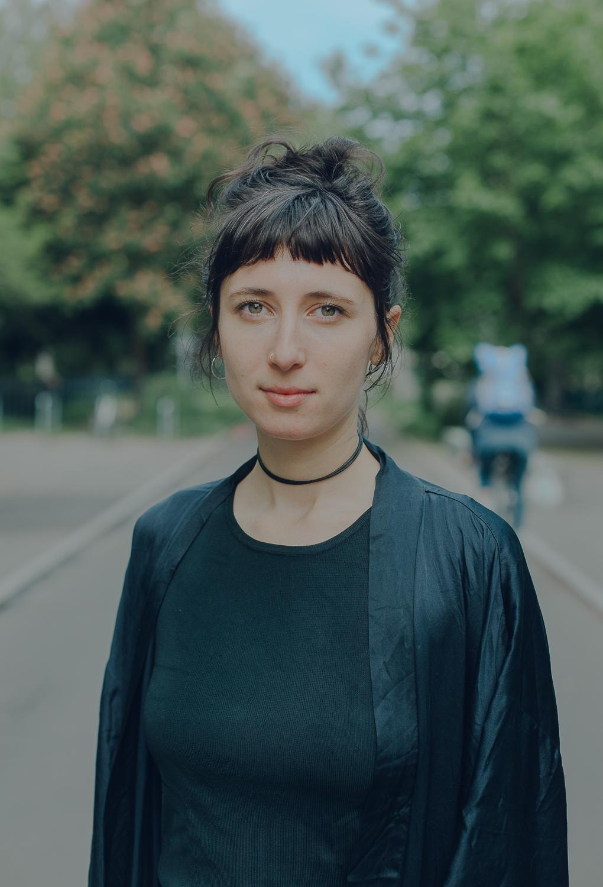
<figcaption>
        <cite>Foto: © Maria Klenner</cite>
    </figcaption>
</figure>

Alida Koos ist bei Western Sahara Resource Watch (WSRW) Germany und International aktiv und engagiert sich gegen die Ressourcenausbeutung der besetzten Westsahara durch internationale Unternehmen und staatliche Akteure an der Seite Marokkos. Sie ist Mitherausgeberin von WIDERWORTE, einem Zine mit sahrauischen Perspektiven auf über 50 Jahre Widerstand gegen Kolonialismus in der Westsahara, das im Herbst 2025 erschien.





<figure>
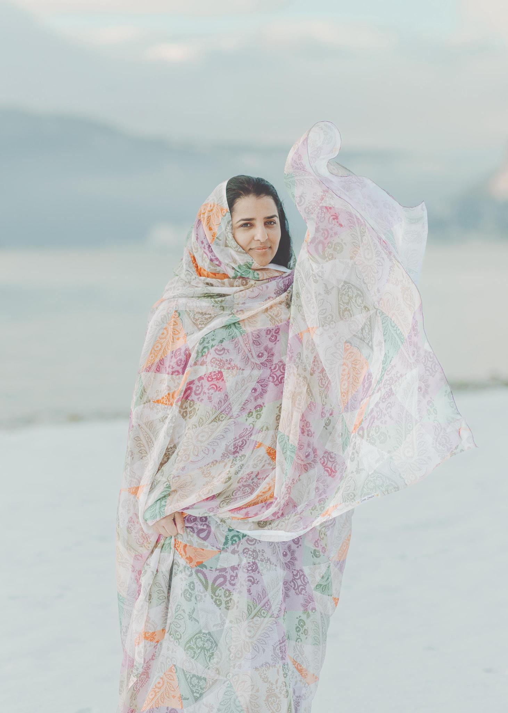
<figcaption>
        <cite>Foto: © Maria Klenner</cite>
    </figcaption>
</figure>

Asria Mohamed ist eine Künstlerin, Kuratorin und multidisziplinäre Kreative, deren Arbeit sich mit Themen wie Identität, Widerstand und Vertreibung auseinandersetzt. Geboren und aufgewachsen in den sahrauischen Flüchtlingslagern, nutzt sie Kunst als Mittel zur kulturellen Bewahrung und zum politischen Ausdruck. Sie ist die Kuratorin von Jaimetna, einem kollaborativen Kunstprojekt, das sahrauische Stimmen und Narrative verstärkt. Asria ist zudem Menschenrechtsverteidigerin und Journalistin und setzt sich seit dem vergangenen Jahrzehnt in Norwegen für die Sache der Sahrauis ein. Sie hat über 1.000 öffentliche Informations- und Outreach-Veranstaltungen organisiert und Delegationen von Aktivist:innen, Politiker:innen und Journalist:innen in die Flüchtlingslager von Tindouf geführt. Asria ist außerdem Moderatorin und Produzentin von Sandfast, dem ersten Podcast zur Westsahara-Frage, der sowohl auf Norwegisch als auch auf Englisch verfügbar ist. Neben ihrem politischen und künstlerischen Engagement tritt sie seit drei Jahren auch als Stand-up-Comedian auf.





<figure>
    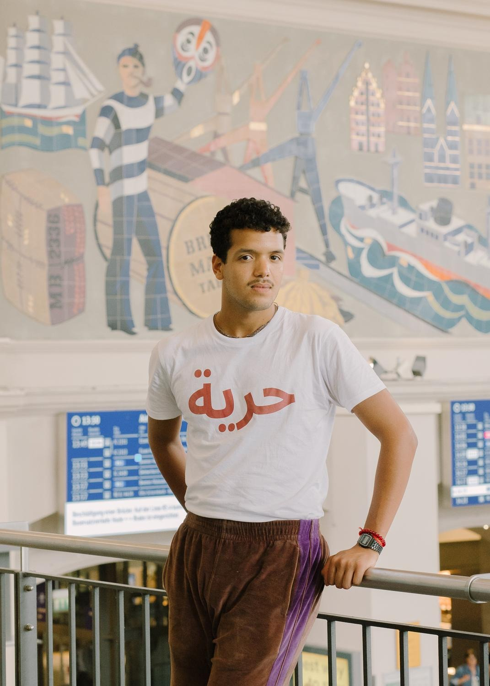
    <figcaption>
        <cite>Foto: © Maria Klenner</cite>
    </figcaption>
</figure>
    

        Buhari Lehbib ist ein junger sahrauischer Aktivist der Saharauischen Diaspora in Deutschland. Inspiriert von der Widerstandsfähigkeit und Disziplin seiner Eltern und anderen Sahrauis in Deutschland, setzt er sich für eine Zusammenarbeit mit anderen Verbündeten, einen kontinuierlichen Erfahrungsaustausch und das Einnehmen neuer Perspektiven ein. Um gewappnet zu sein für die bevorstehenden Herausforderungen, studiert er Politikwissenschaft und Jura.
    




Emma Lehbib ist die Tochter sahrauischer Eltern, in Deutschland geboren und aufgewachsen. Sie wurde tief geprägt von den Erzählungen ihrer Familie über Krieg und Vertreibung sowie deren Aktivismus. Sie beschäftigt sich im Rahmen von akademischer Forschung sowie von zivilgesellschafltichem Engagement und NGO-Arbeit mit der Westsahara.
Ihre Schwerpunkte liegen auf der Ausbeutung der natürlichen Ressourcen und auf Infrastrukturprojekten in der Westsahara, den Flüchtlingscamps, internationalen Rechtsfragen, dem Exil und Identitätsfragen sowie den Themen Solidarität und Antikolonialismus. Emma ist Sprecherin der Saharauischen Diaspora in Deutschland und verbrachte vor Kurzem knapp fünf Monate in den Camps.




<figure>
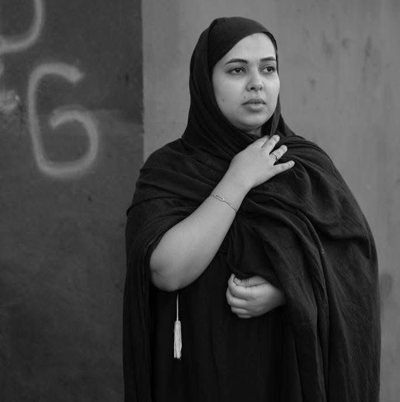
</figure>

Fatou Yahya Iaazza, geboren 1998 in Tan-Tan (Südmarokko), ist eine sahrauische Menschenrechtsverteidigerin und politische Aktivistin. Als Tochter eines ehemaligen politischen Gefangenen engagierte sie sich während ihres Studiums an marokkanischen Universitäten aktiv in Studenten- und Menschenrechtsbewegungen. Sie hat einen Bachelor-Abschluss in Rechtswissenschaften. Seit 2020 lebt Fatou in Frankreich, wo sie einen Ort der Freiheit sucht, an dem sie sich ohne Angst vor Verfolgung oder Verhaftung gegen das Leid ihres Volkes aussprechen und für die Rechte der Sahrauis eintreten kann.





<figure>
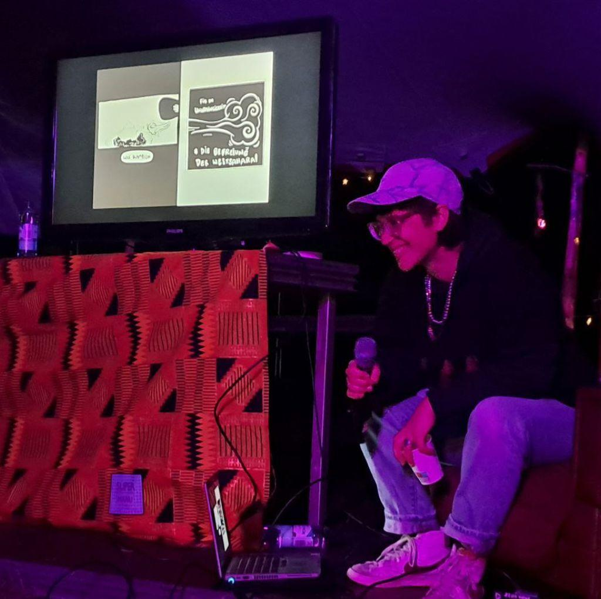
</figure>
    

    Fine setzt sich künstlerisch-aktivistisch mit dem Westsaharakonflikt auseinander, u.a. in “Genug gewartet. Ein Comic zum Westsaharakonflikt”. Das Comic führt über eine Reise in die Flüchtlingscamps zur Geschichte und Gegenwart des sahrauischen Kampfes für Unabhängigkeit. Regelmäßige Comic-Lesungen mit Vertreter:innen der sahrauischen Diaspora laden bei Tee zum Lernen und zum Gespräch ein. Fine lebt und arbeitet in Berlin.
    





<figure>
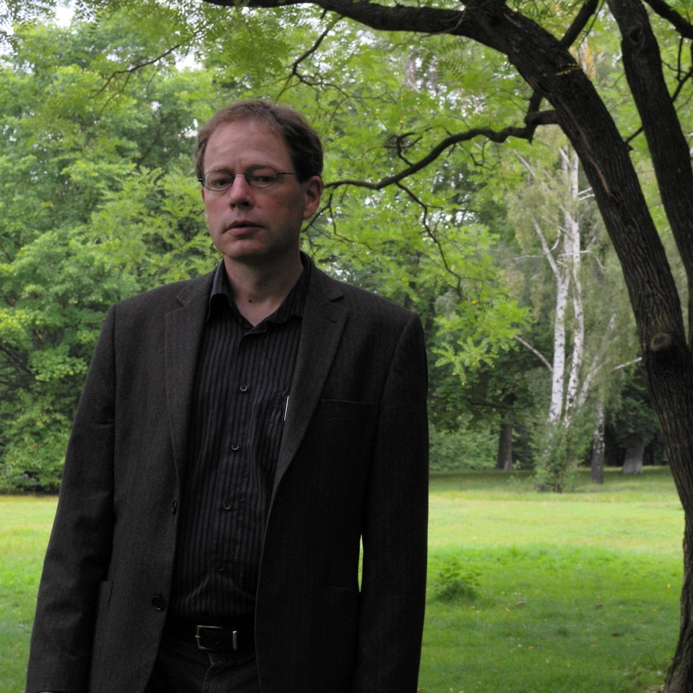
</figure>

Jörg Tiedjen (geb. 1964 in Homberg/Duisburg) ist Redakteur der Tageszeitung "junge Welt" im Ressort Außenpolitik und war bei der Nahostzeitschrift "inamo" für Marokko zuständig. Er schreibt regelmäßig über die Westsahara und verwandte Themen.





<figure>
    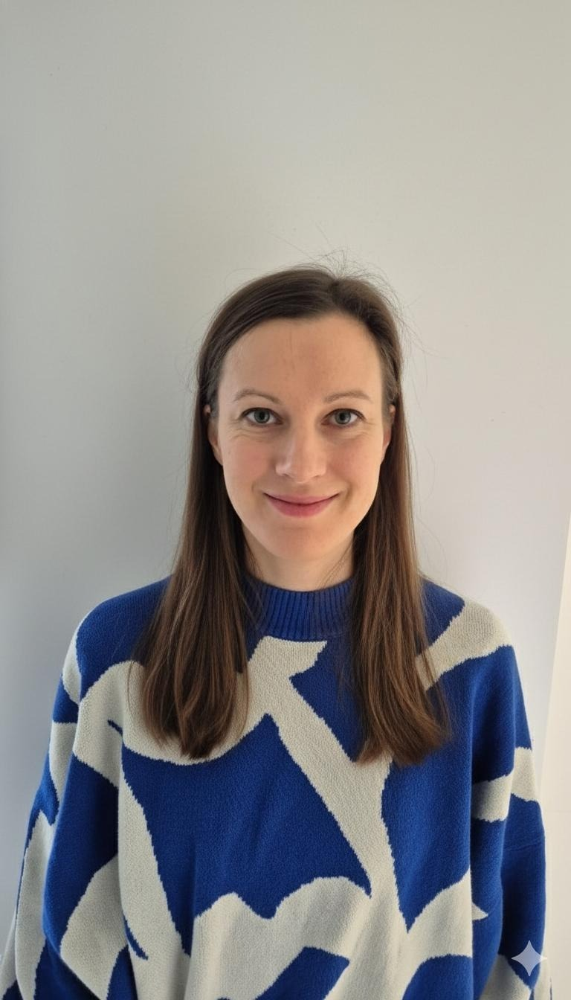
</figure>
    

        Judit Tavakoli ist Sozialanthropologin an der Goethe-Universität Frankfurt. Ihre Arbeiten befassen sich mit dem Westsaharakonflikt, der sahrauischen Gesellschaft sowie mit Fragen von Nationalismus, Kulturpolitik und Aktivismus.
    





<figure>
    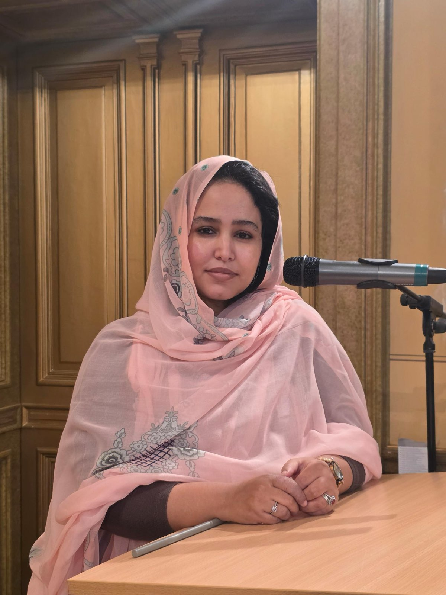
</figure>
    

    Khadja Bedati ist eine saharauische Aktivistin, die in den saharauischen Flüchtlingslagern geboren wurde. In ihrer politischen Arbeit und ihrem ehrenamtlichen Engagement setzt sie sich kritisch mit fortbestehenden kolonialen Strukturen und dominanten Narrativen auseinander, dabei bildet der Konflikt um die Westsahara einen zentralen Fokus.
    Der Schwerpunkt ihrer inhaltlichen Arbeit liegt auf neokolonialen Machtverhältnissen, völkerrechtlichen und rechtlichen Grundlagen sowie politischen und menschenrechtlichen Fragestellungen. Khadja studiert Politikwissenschaft und Wirtschaftsrecht und verknüpft ihre wissenschaftliche Ausbildung eng mit ihrer politischen und zivilgesellschaftlichen Tätigkeit.
    Darüber hinaus ist sie in der entwicklungspolitischen Arbeit aktiv und wirkt in Zusammenarbeit mit ZEOK e. V. an Projekten in den saharauischen Flüchtlingslagern mit.In Deutschland vertritt sie die saharauische Jugendorganisation UJSARIO.
    Neben ihrem zivilgesellschaftlichen Engagement ist sie politisch in der SPD und bei den Jusos aktiv und bringt sich dort in verschiedene Gremien ein. Seit 2022 ist sie Trägerin des (Post)-Migrantischen Jugendpreis.
    





<figure>
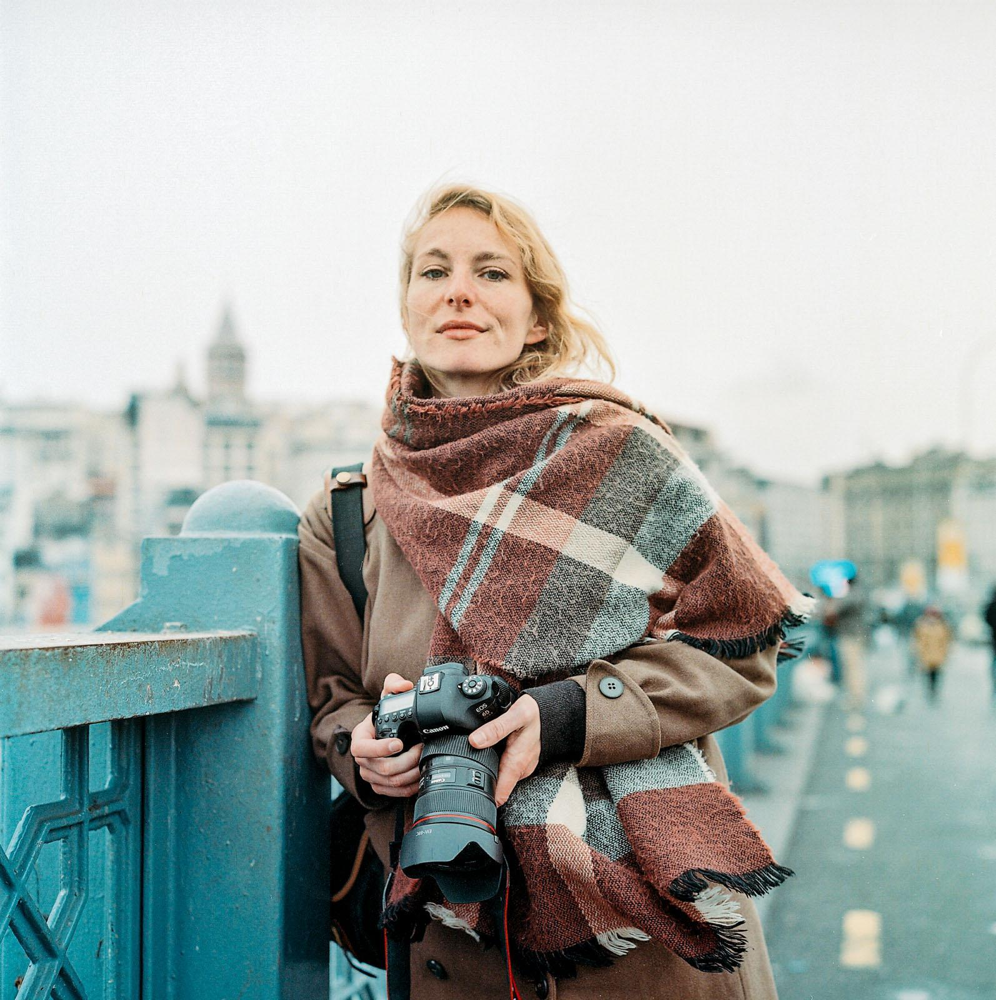
<figcaption>
        <cite>Foto: © Rena Effendi</cite>
    </figcaption>
</figure>

Maria Klenner (sie/ihr) ist eine Dokumentar- und Portraitfotografin, die derzeit zwischen Beirut und Berlin lebt. Neben Aufträgen für internationale Medien arbeitet sie an persönlichen Langzeitprojekten zu den Themen Identität, Gerechtigkeit und Migration. Nach Abschluss eines MA in Geschichte und Soziologie veröffentlichte Maria 2023 ihr erstes Fotobuch “Die Kinder von Bergen-Belsen”, das mit dem Deutschen Fotobuchpreis ausgezeichnet wurde. Sie ist Mitherausgeberin des Magazins “Widerworte”, das im Herbst 2025 erschien.





<figure>
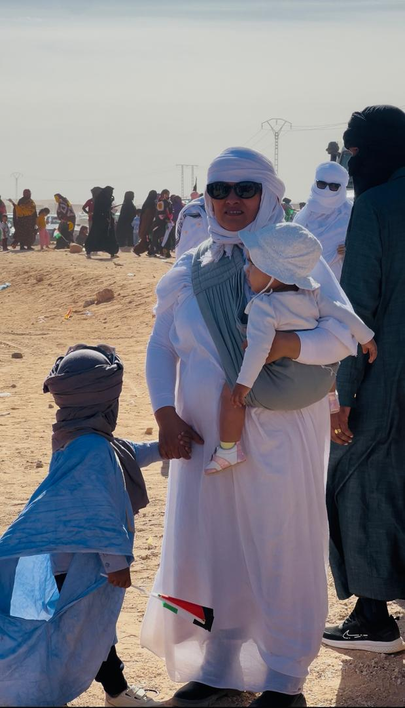
</figure>

Najla Mohamedlamin Salma ist eine sahrauische Menschenrechts- und Klimaaktivistin. Als Gründerin und Leiterin des Almasar Centers, das Zugang zu alternativen Bildungsangeboten für Kinder und Frauen schafft, insbesondere in Bezug auf Frauengesundheit und die Auswirkungen der Klimakrise in den Flüchtlingscamps, kämpft für Frauenrechte und Umweltfragen. Najla wurde slebst in den Flüchtlingscamps geboren und ist Mutter zweier Kinder. Im Jahr 2023 wurde sie von der BBC als eine der hundert einflussreichsten Frauen weltweit ernannt.





<figure>
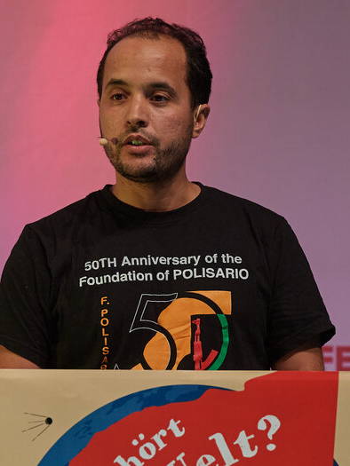
</figure>

Saleh Mustafa ist in den sahrauischen Flüchtlingslagern in Algerien geboren, wo seine Familie nach der Vertreibung aus der Westsahara Zuflucht fand. Er war bis 2014 Vorsitzender des Ausschusses für Außenbeziehungen der sahrauischen Studierendenunion UESARIO. 
2017 trat er zur Vertretung der Frente Polisario bei der Europäischen Union ein. Seit 2023 ist er stellvertretender Leiter der Vertretung in Deutschland.





<figure>
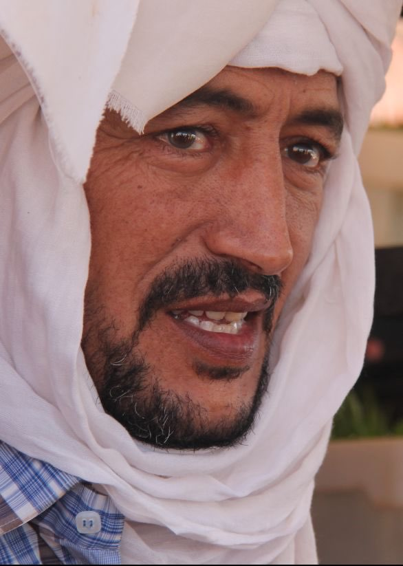
</figure>

Taleb Brahim Sidimohamed ist ein sahrauischer Agraringenieur, Innovator und Flüchtling. Derzeit ist er Direktor der Abteilung für Landwirtschaft im Ministerium für wirtschaftliche Entwicklung der Demokratischen Arabischen Republik Sahara (DARS). Er war an zahlreichen Projekten im Bereich Landwirtschaft und Lebensunterhalt in den sahrauischen Flüchtlingslagern beteiligt und arbeitete dabei mit Organisationen wie UNICEF, Oxfam, Terre des Hommes Schweiz und verschiedenen Ministerien der DARS zusammen. Er wurde in Al Aaiún in der Westsahara geboren und floh nach der marokkanischen Invasion. Seit seinem sechsten Lebensjahr lebt er in den sahrauischen Flüchtlingslagern im Südwesten Algeriens. Er studierte Agraringenieurwesen und Permakultur in mehreren Ländern, darunter Syrien und die Türkei.



<h2>Organisationen</h2>





Western Sahara Resource Watch (WSRW) recherchiert und dokumentiert die Aktivitäten internationaler Unternehmen und staatlicher Institutionen, die an der Seite Marokkos in der besetzen Westsahara tätig sind. Das internationale Netzwerk zieht Unternehmen und Regierungen für ihre Unterstützung der Besatzung zur Verantwortung und setzt sich für das Selbstbestimmungsrecht der Sahrauis ein.
    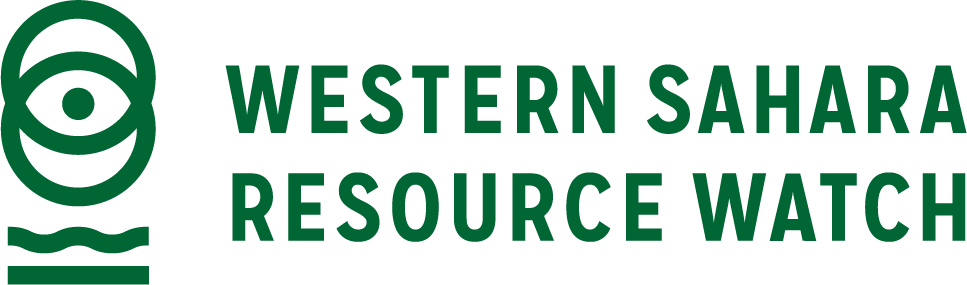



End Cement ist ein Bündnis von Organisationen aus der Klima- und den Sozialen Bewegungen und arbeitet lokal, bundesweit und international an einer klimagerechten und menschenrechtsfreundlichen Bauwende. End Cement arbeitet insbesondere kritisch zu dem in Heidelberg ansässigen Zementkonzern "Heidelberg Materials", dem zahlreiche Völkerrechtsbrüche insbesondere auch in der Westsahara vorgeworfen werden.





<h3>Veranstalter und Förderung</h3>

Die Westsahara-Konferenz ist eine Veranstaltung des Fördervereins Collegium Academicum Heidelberg e.V. und wurde unter anderem von Mitgliedern des Wohnprojekts Collegium Academicum organisiert. Die Veranstaltung wurde ermöglicht durch Förderungen der Rosa Luxemburg Stiftung Baden-Württemberg, der Syndikatstiftung und der Organisation medico international.

<figure>
<table>
 <tr>
  <td>
  <td>
  <td>
  <td></td>
 </tr>
</table>
</figure>

 
<a href="https://www.instagram.com/perspektive_widerstand/">
        
            <i class="icon-instagram"></i>
        
        Instagram: @perspektive_widerstand
   </a>
