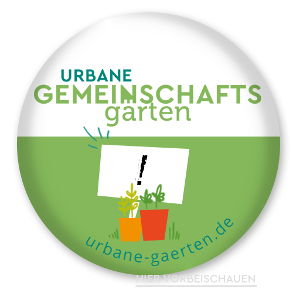

Ein innovativer, mehrstöckiger Holzneubau, eine flächensparende Architektur,
ein materialsparend sanierter Altbau mit höchster Energieeffizienz,
ein Raum- und Bildungskonzept mit Fokus auf Suffizienz (Genügsamkeit) und
ein bewusster Umgang mit Ressourcen während und nach der Bauphase:
diese und viele weitere Aspekte machen das CA zu einem Leuchtturmprojekt im Bereich Ökologie und Nachhaltigkeit.

Bei der Konstruktion des Neubaus wurde überwiegend Holz als nachwachsender Rohstoff verwendet.
Holz-Holz-Verbindungen ermöglichen es, weitestgehend auf metallische Verbindungen zu verzichten.
Im Gegensatz zu „konventionellen“ Baumaterialien wie Stahl, Zement und Beton verursacht die Holzproduktion nicht nur sehr wenige  CO2-Emissionen, sondern bindet sogar Kohlenstoff.
Zudem wird auf eine sortenreine Trennfähigkeit der Baustoffe geachtet, um ein späteres Recycling zu ermöglichen.
Auch bei der Sanierung unseres Altbaus haben so viel CO2 wie möglich eingespart.
Wir haben so viel Bausubstanz wie möglich erhalten und den größten Teil unseres Trockenbaus mit
<a href="https://stramentec.com/">nachhaltigen Strohpresswänden</a> gestaltet anstelle des Kohlekraftnebenproduktes Gips.
 
 Durch sparsame Technik und gute Dämmung wurde eine hohe Energieeffizienz erreicht.
Der Neubau wurde für seine <a href="https://www.heidelberg.de/hd,Lde/HD/Leben/Foerderprogramm+Rationelle+Energieverwendung.htmlPassivhausbauweise">Passivhausbauweise von der Stadt Heidelberg gefördert</a> und erreicht den <a href="https://www.kfw.de/inlandsfoerderung/Privatpersonen/Neubau/Das-KfW-Effizienzhaus/">KfW 40+ Standard</a>.
Die in der Größe maximierte Photovoltaikanlage liefert bilanziell mehr Strom, als im Gebäude verbraucht wird, der überschüssige Strom wird in das Netz eingespeist.
Der Altbau wurde auf den Energieeffizienzstandard 55 saniert und hat ebenfalls eine PV-Anlage auf den Gebäudedächern. Insbesondere die Dämmung vermeidet deutlich mehr Energie und Treibhausgase, als sie durch ihre Herstellung erfordert
  
Aufgrund des kreativen Wohnkonzepts mit dem Anspruch, Genügsamkeit in den Mittelpunkt zu stellen
<a href="https://www.ifeu.de/service/nachrichtenarchiv/gutes-leben-fuer-alle-aber-wie/">(Suffizienz)</a>,
dient das Projekt dem IFEU (Institut für Energie- und Umweltforschung) als Praxismodell für die
<a href="https://www.ifeu.de/projekt/suprastadt/">Erforschung flächensparenden Wohnens bei gleichzeitig hoher Lebensqualität</a>. 

    

    Die beweglichen Wandelemente im Neubau lassen Individualität zu und bieten zugleich eine Anpassungsfähigkeit an sich ändernde Nutzungsanforderungen. Multifunktionale Räume erhöhen die Auslastung der Flächen.
    So können Räumen vielfältige Bedürfnisse direkt im Haus erfüllen und gleichzeitig den Flächenverbrauch reduzieren.
    

    

        
    

Einen großen Beitrag zur effizienten, flächensparenden Raumnutzung leisten aber vor allem unsere zahlreichen
Gemeinschaftsflächen in Alt- und Neubau: eine Aula mit Dachgarten für Veranstaltungen, Multifunktions- und Seminarrräume, Werkstätten und ein als Gemeinschaftsgarten gestalteter Außenbereich stehen nicht nur den
Bewohner*innen sondern auch der restlichen Zivilgesellschaft offen.
Insbesondere können diese Räume z. B. von Umwelt- und sozialen Initiativen für größere Veranstaltungen und Netzwerktreffen genutzt werden. 
Direkt am Karlsruher Platz ist im ehemaligen Pförtnerhaus ein offener Treffpunkt für das Quartier geplant.

    

    
    

    

    Für nachhaltige Mobilität wird in unserem Wohnprojekt der Radverkehr gestärkt.
    Dafür stehen ausreichend viele Fahrradstellplätze sowie eine Werkstatt zur Reparatur kaputter Räder zur Verfügung.
    Diese offene Fahrradwerkstatt soll insbesondere auch von anderen Quartiers-bewohner*innen genutzt werden.
    Für motorisierten Individualverkehr sind nur sehr begrenzt Stellplätze vorgesehen, die teilweise für Carsharing-Angebote reserviert sind.
    Nicht  zuletzt trägt  eine  sehr  gut  frequentierte  Straßenbahnhaltestelle sowie eine Buslinie in unmittelbarer
    Nähe zur nachhaltigen Mobilität bei, mit der das CA gut erreicht werden kann (<a href="/neubau">Anfahrt</a>).
    

Unser Außenbereich erfüllt hohe ökologische Ansprüche. Die Neupflanzungen heimischer und nutzbarer Baumarten, die Regenwassernutzung zur Bewässerung mittels einer Zisterne, versickerungsoffene Flächen, sowie die Kompostanlage zeichnen die ökologische Freiraumgestaltung aus. Zudem bieten wir vielfältige Lebensräume für Flora und Fauna: eine naturnahe Teichanlage, Trockenmauern, Magerwiesen, Nistkästen an den Außenwänden und eine offene Sandfläche für Insekten stellen diverse Lebensräume dar und fördern die Artenvielfalt.

    

 
    Unser entstehender Gemeinschaftsgarten ist Teil des Netzwerks "Urbane Gemeinschaftsgärten" der <a href="https://anstiftung.de/">anstiftung</a>.
    

    

    
    

 

 

Neben den baulichen Konzepten entwickeln wir ein Bildungskonzept und Organisationsstrukturen für ein nachhaltiges Zusammenleben:
Suffizienz schafft Raum für kreative Ideen – Genügsamkeit wird zum Luxus.
Foodsharing und gemeinschaftliches Kochen z. B. im Rahmen von <a href="/aktionen">Workcamps</a> sowie Urban Gardening
beleben das Gemeinschaftsgefühl und fördern zugleich einen nachhaltigen Umgang mit Lebensmitteln.
Gemeinsames Reparieren in der Werkstatt spart Geld und Ressourcen – und bringt Freude durch Erfolgserlebnisse.
Tauschen, leihen und gemeinsam nutzen, reparieren und selbst produzieren verringern Abhängigkeiten, stärken regionale Kreisläufe und münden in Kompetenz und Selbstbestimmung.

