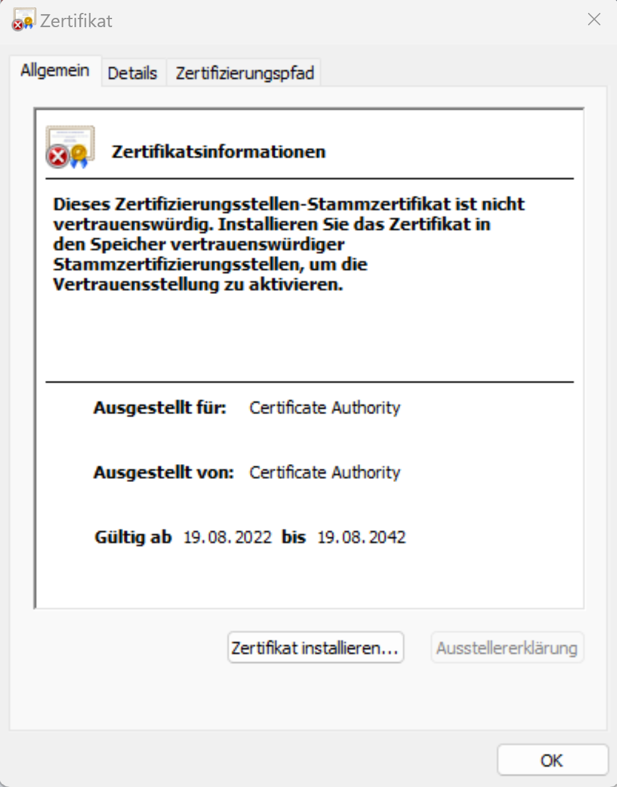
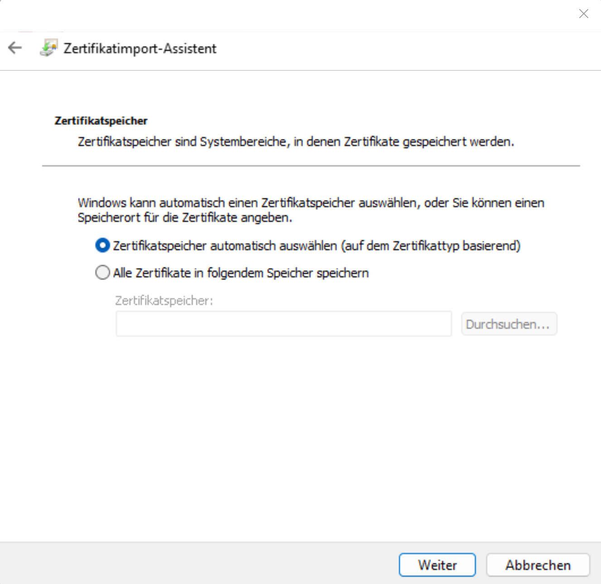
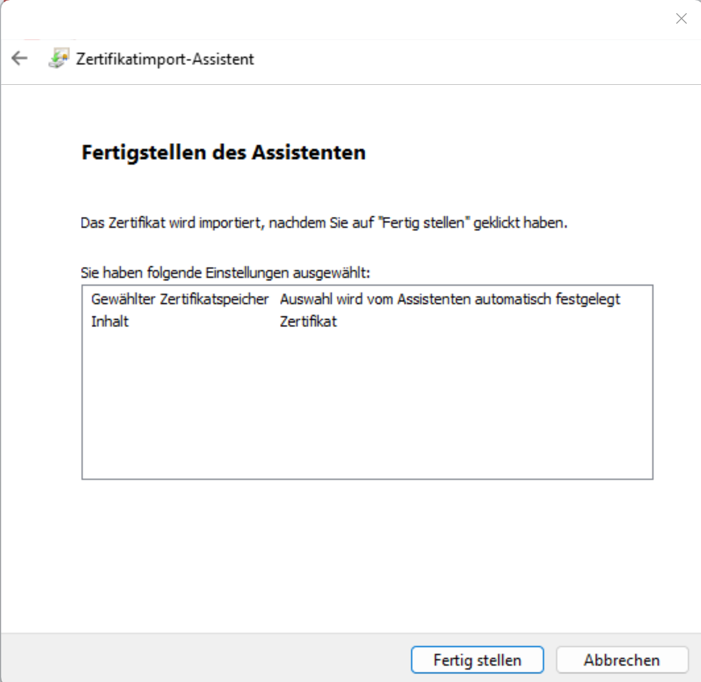

# Setup of the WLAN

On this page we explain how to log in to the WLAN.   
First you need your personal access data. You get them at the AG-Mietverwaltung. It is recommended to change the default password. To do this:

1. go to the [Intranet](https://intranet.ca-hd.de/) and log in.
2. click on your name in the upper right corner
3. enter your old and twice your new password and click on "change".

## Android

1. download the [certificate](ca.crt).
2. open it with the certificate manager
3. (Optional) Assign a name and specify WLAN as use of the access data
4. connect to WLAN "CA" and go to advanced options:
    - EAP method: TTLS
    - Phase2 authentication: PAP
    - CA certificate: select the certificate from step 2
    - Identity: (you get it from AG IT or with collection documents)
    - Password: (you can get it from AG IT or with the collection documents)
    - Click to connect

## iOS

1. download the [profile](ca_wifi.mobileconfig).
2. open settings
3. click on profile downloaded
4. click install
5. enter username and password and click on finish
6. Select and connect the Wifi CA.

## Windows

1. download the [certificate](ca.crt).
2. double click on the certificate
    - Install certificate
    - install only for current user
    - select location automatically
    - Finish
3. Connect with CA Wifi

Pictures

   
   

   
   

## MacOS

1. download the [profile](ca_wifi.mobileconfig)
2. double click to install
3. agree to the instructions
4. enter username and PW
5. select CA WLAN and connect

## Linux

1. download the [certificate](ca.crt).
2. copy the certificate to `/etc/ca-certificates/trust-source/anchors`.
3. connect to the WLAN "CA" and go to advanced options:
    - EAP method: TTLS
    - Phase2 authentication: PAP
    - CA certificate: Select the certificate from step 2
    - Identity: (you get it from AG IT or with the collection documents)
    - Password: (you will receive it from AG IT or with the collection documents)
    - Click Connect

