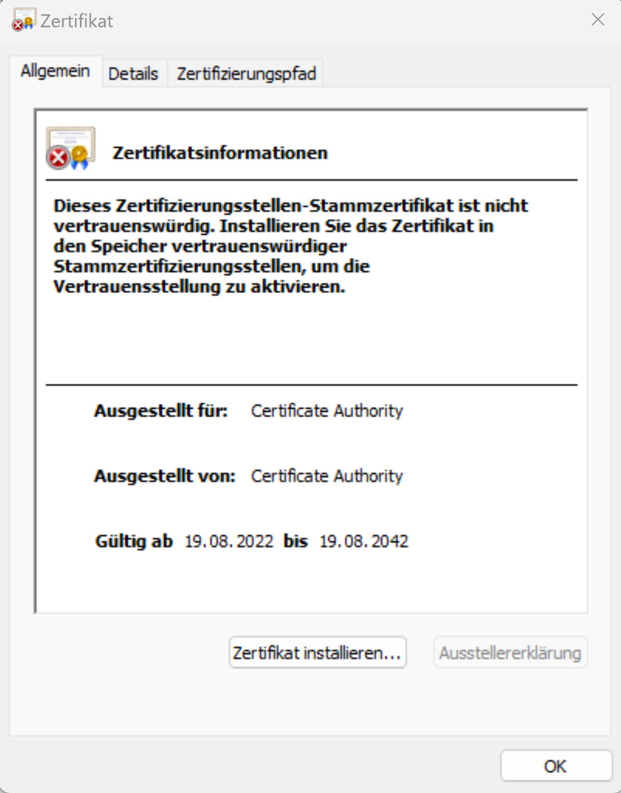
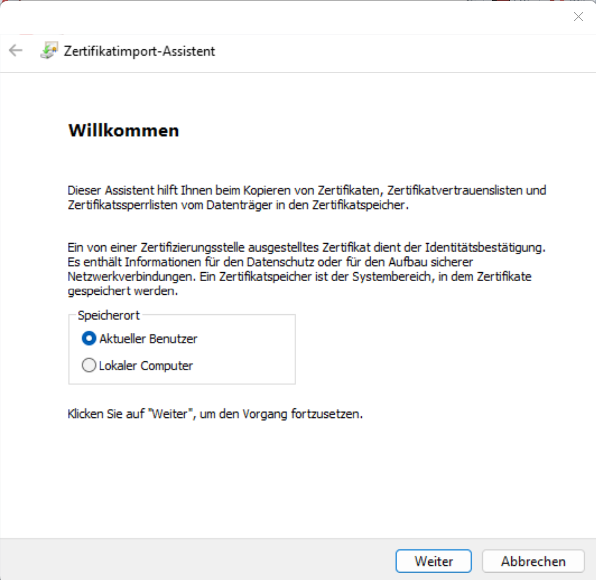

# Einrichtung der WLANS

Auf dieser Seite erklären wir dir, wie du dich im WLAN einloggen kannst.   
Zunächst benötigst du deine persönlichen Zugangsdaten. Diese kannst du bei der AG-IT erhalten.

## Android

1. Lade das [Zertifikat](ca.crt) herunter.
2. Öffne es mit dem Zertifkatsmanager
3. (Optional) Namen vergeben und als Nutzung der Zugangsdaten WLAN angeben
4. Mit dem WLAN "CA" verbinden und auf erweiterte Optionen gehen:
    - EAP-Methode: TTLS
    - Phase2-Authentifizierung: PAP
    - CA-Zertifikat: das Zertifikat aus Schritt 2 auswählen
    - Identität: (erhälst du bei der AG IT oder mit Einzugsunterlagen)
    - Passwort: (erhälst du bei der AG IT oder mit Einzugunterlagen)
    - Verbinden klicken

## iOS

1. Lade das [Profil](ca_wifi.mobileconfig) herunter.
2. Einstellungen öffnen
3. Auf Profil heruntergeladen klicken
4. Installieren klicken
5. Benutzername und Passwort eingeben und auf fertig klicken
6. Das Wifi CA auswählen und verbinden.

## Windows

1. Lade das [Zertifikat](ca.crt) herunter.
2. Doppelklick auf das Zertifikat
    - Installiere Zertifikat
    - nur für Benutzer installieren
    - Speicherort automatisch wählen
    - Fertig stellen
3. mit dem CA WLAN verbinden und Benutzername und Passwort eingeben

Anleitung in Bildern

   
   

   
   

## MacOS

1. Lade das [Profil](ca_wifi.mobileconfig) herunter
2. Mit Doppelklick installieren
3. Den Hinweisen zustimmen
4. Nutzername und PW eingeben
5. CA WLAN auswählen und verbinden

## Linux

1. Lade das [Zertifikat](ca.crt) herunter.
2. Kopiere das Zertifkat nach `/etc/ca-certificates/trust-source/anchors`
3. Mit dem WLAN "CA" verbinden und auf erweiterte Optionen gehen:
    - EAP-Methode: TTLS
    - Phase2-Authentifizierung: PAP
    - CA-Zertifikat: das Zertifikat aus Schritt 2 auswählen
    - Identität: (erhälst du bei der AG IT oder mit Einzugsunterlagen)
    - Passwort: (erhälst du bei der AG IT oder mit Einzugunterlagen)
    - Verbinden klicken

