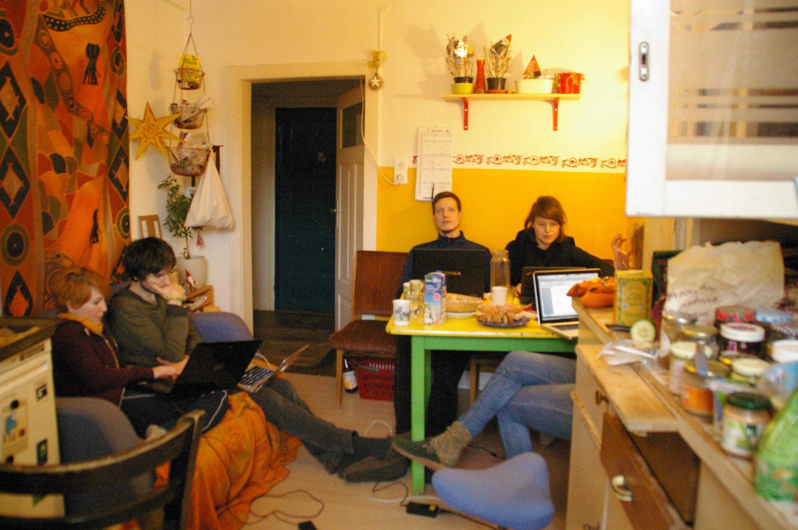

<h2>Wie wird man eine Gruppe?</h2>
 

Ein Text von Franziska Meier
  
Dieser Text handelt von dem, was nicht schon vielfach in der Presse zu lesen war: Der Aufbau der Projektgruppe und ihre gelebte Kultur. Und wie aus einer Idee ein nicht auf Gewinn ausgerichtetes Unternehmen wurde. Es geht um das Selbsverständnis von Projektgruppe, von innen und außen, und über die Gruppenidentität, die es irgendwie gibt und die doch nirgends festgeschrieben und klar umrissen ist.
  
Unser Anspruch war es - zunächst unausgesprochen und unreflektiert - eine offene, undogmatische und visionäre Gemeinschaft zu gestalten. 

<h3>Zusammen leben und zusammen arbeiten</h3>

Räume und Strukturen prägen die Menschen, die in ihnen interagieren. Daher halte ich es für wichtig, einen kurzen Einblick zu geben, wie und wo wir bis heute in der Projektgruppe miteinander interagiert und kommuniziert haben. Mein Eindruck ist, dass wir Hürden und Exklusion immer wieder reflektiert haben, immer wieder ein Stück näher an ein Ideal eines räumlich und kommunikativ offenen Projekts herangekommen sind, es aber natürlich nie erreicht haben.
  
Mit dem Haus in der Plöck 93 verbinden viele von uns große Erinnerungen an gemeinsame Abendessen oder Diskussionsrunden. In dem kleinen Innenhof haben wir beispielsweise einen Vortrag zu ökologischem Weinbau gehört oder mit Frauen, die in den 70er Jahren studiert hatten, ein feministisches Frühstück veranstaltet. Jede Generation, jede Person, beschreibt ihre Zeit sicher ein kleines bisschen anders. Meine Zeit in der Plöck reichte von 2012 bis 2019.

<figure>

<figcaption style="text-align:center;">

 Arbeiten am Finanzplan - 2015 (&#169; CA)

</figcaption>
</figure>

 

2012 hab es einige Wechsel der Bewohner*innen in den drei WGs im Haus Plöck 93 in der Heidelberger Altstadt. Die WGs wurdem vom gemeinnützigen Förderverein Collegium Academicum Heidelberg e.V. (damals Vereinigung Collegium Academicum Heidelberg e.V.) angemietet, um sie an gesellschaftlich, sozial und politisch engagierte Studierende weiter zu vermieten. Unter den 2012 neu eingezogenen Menschen waren Nicolai Ferchel, Henrik Eckhardt, Hella Dilling un dich, die wir teilweise bis heute in der Projektgruppe aktiv sind und das Projekt maßgeblich mitgestaltet haben. Nicht alle Bewohner*innen der drei WGs, die immer mehr zu einer einzigen Haus-WG verschmolzen, waren gleichermaßen beteiligt. 
Über die Jahre zogen einige aus der Plöck aus, andere kamen nach: so auch weitere tragende Säulen des Projekts wie Margarete Over, Klara Müller, Jost Burhop und Félix Girault. 
  
2017 bezogen drei der Plöck-Bewohner*innen eine weitere Wohngemeinschaft im befreundeten Wohnprojekt HageButze (8 Personen). 
Intern nannten wir diese WG, wo wir viele Arbeitstreffen abhielten, die „CAtze“ – eine Wortkreuzung. So war bereits durch das Zusammenleben die Gruppe der potenziellen Mitstreiter*innen gewachsen. Und auch Menschen, die nicht in einer der „CA-WGs“ lebten, beteiligten sich an der Projektarbeit. Der Zusammenhalt der Gruppe war v.a. durch die gemeinsam verbrachte Zeit gewachsen: Es wurde viel diskutiert, gemeinsam gekocht, getanzt, gefeiert und aktiv am Projekt und für eine ein klein wenig bessere Welt gearbeitet. 
  
Zwar wurden die Jahre zunehmend arbeitsamer, doch die gemeinsame, gelebt vertrauensvolle und zugewandte Kultur haben wir uns stets erhalten – natürlich mussten wir uns selbst manches Mal für unseren unachtsamen Umgang rügen und uns an gegenseitiges Wohlwollen erinnern. 2020 stand eine Renovierung der Plöck an und der Verein bekam im Anschluss nur noch eine der drei Wohnungen. So zogen manche in ein Haus in Wieblingen im Taubenfeld – „die Taube“. 
  
Das gemeinsame Leben, Lernen und Arbeiten war eines der zentralen Elemente, das das Projekt ausmache und das uns als Gruppe zusammenhielt. Als 2022 bereits viele der in den Neubau Einziehenden engagiert waren und es kaum abwarten konnten, zogen auch sie schon gemeinsam in ein Haus, das ob seiner Größe und Lage direkt am Neckar „CAstle“ genannt wurde.
  
Projektgruppentreffen fanden zunächst in den WG-Küchen statt, später in Räumen des Studierendenrats der Universität Heidelberg in der Sandgasse 7, während Corona online und sobald es möglich war, auf unserer eigenen Fläche in Rohrbach. Drum herum entstand eine sich ausweitende IT-Infrastruktur mit Chatprogrammen und Daten-Cloud.

<h3>Motivation und Arbeitsstrukturen</h3>

Zu Beginn der Projektzeit waren die Aufgaben noch nicht so weit ausdifferenziert, sodass wir alle von allem etwas wussten und die Aufgaben auch die Kapazitäten der Einzelnen nicht überstiegen. Wir trafen uns zunächst in Abständen von zwei bis vier Wochen für unser Plenum, später wöchentlich, auch wenn es nur kurz etwas zu besprechen oder nur Kleinigkeiten zu entscheiden gab. Auch fertigten wir Protokolle an, aus denen heute der zeitliche Ablauf und die Diskussionen und Themen rekonstruiert werden können. Bereits Ende 2015 führten wir in jedem Projektgruppenplenum die Rubrik „Erfolge der Woche“ ein, um uns Erreichtes vor Augen zu führen und uns selbst zu motivieren.
  
Bis Frühjahr 2017 waren die Themen so zahlreich geworden, dass wir ohne strukturierte Kategorisierung nicht mehr effizient arbeiten konnten und so passten wir unsere Arbeitsweise an. Wir definierten – orientiert an den organisch gewachsenen Strukturen – Aufgabenbereiche, die von einzelnen AGs übernommen wurden. Die Zustimmung des Plenums zu Entscheidungen war dennoch jederzeit notwendig, AGs bereiteten dafür sowohl Argumente als auch Lösungsvorschläge vor. Konkrete Konsensregeln wurden in diesem Zuge festgelegt. Bei diesem Umbau waren wir besonders sensibel für mögliche ungewollte Hierarchien und suchten transparente Kommunikationswege. Wir vereinbarten daher auch rotierende Plenumsaufgaben: Jede Person sollte hin und wieder Protokollieren und Moderieren. Auch Redeanteile sollten einigermaßen ausgeglichen sein. Mitte 2017 führten wir eine Aufteilung und Kategorisierung der Themen in drei AGs ein: AG Planung (alle baubezogenen Themen, Ausschreibungen, Kontakt zu städtischen Ämtern usw.), AG Finanzierung (Finanzplan, Förderungen, Direktkredite, usw.) und AG Öffentlichkeit (Presse, PR, Werbemittel, usw.). Die Schnittpunktthemen wurden dann jeweils von den betreffenden AGs zusammen bearbeitet. Beispielsweise kamen Informationen für den Direktkreditflyer von der AG Finanzierung, die Gestaltung, die Texte und die Bestellung übernahm die AG Öffentlichkeit – manchmal in Personalunion.
  
Erst 2018 begann eine weitere Ausdifferenzierung, da die Rubrik „Sonstiges“ bei den Projektgruppenplena immer größer wurde: Ab Ende 2018 entstand eine AG Verwaltung (DK-Verwaltung, Vereinsbuchhaltung, usw.), ab Mitte 2019 entstand die AG Eigenleistung (zur Koordination von Arbeitseinsätzen und die Möbelplanung, die wir selbst bauen wollten) und die AG Finanzierung bekam den Zusatz „+ Buchhaltung“. Bedarfe - insbesondere auch zukünftige - wurden reflektiert und 2021 ein Prozess zur Metamorphose von der Projektgruppe zum Wohnheim gestartet. Es entstanden: AG IT, AG Gemeinschaft (um Care-Arbeit sichtbar zu machen und wertzuschätzen), AG Altbau Planung und Finanzierung, AG Mietverwaltung, AG Bildung, AG Raum (Aula Mietverträge und Veranstaltungsbetreuung), AG WAS (Wartung, Archiv, Struktur), AG Werkstatt (Ablösung der AG Eigenleistung). Umgekehrt wurde die AG Planung Neubau mit Einzug unnötig und besteht nicht weiter. 
  
Seit dem Einzug haben sich zu bestimmten Themen, die teilweise auch vorher bereits besprochen und bearbeitet wurden, eigene „Initiativen“ gebildet: Dazu gehören Awareness, Foodsharing, Garten, Internationales oder Fahrrad/Mobilität. Die regelmäßige Reflexion über eine sinnvolle und effiziente Arbeitsstruktur, die dennoch mit geringen Hierarchien verbunden ist, und mögliche Änderungen in der Organisationsstruktur, sind in meinen Augen elementar, um kleine Lösungen im CA zu finden – und dadurch vielleicht auch für größere gesellschaftliche Herausforderungen.
  
Die 2016 gegründete GmbH ging mit den Jahren immer mehr Verbindlichkeiten ein: Die aufgenommenen Kredite wurden mehr, es wurden Verträge mit Planungsbüros abgeschlossen und die Ausschreibungen standen an und würden die Verbindlichkeiten noch einmal deutlich erhöhen. So entwickelte sich neben dem Plenum und den AGs ein Absprachetreffen der GmbH-Geschäftsführung. Zunächst war es dazu gedacht, die wichtigsten rechtlich relevanten Themen auf kurzen Weg zu besprechen und diese auch zu bearbeiten. 2019 wurde es zu „Koordinierungstreffen“ umbenannt, da hier sprachlich die Hierarchien abgebaut werden sollten. Mit der Zeit ging der Absprachebedarf über die Geschäftsführung hinaus und mehr Menschen trugen rechtlich relevante Verantwortung und nahmen daher am Koordinierungstreffen teil. Seit Frühjahr 2024 ist eine erneute Strukturänderung in einer Testphase, die den Umbau von Projekt-/Bauphase zu Regelbetrieb abbilden soll. Wir sind gespannt, wie es sich entwickelt.
  
Abseits der regelmäßigen Treffen und der immer größer werdenden Arbeitsbelastung, begannen wir 2018 damit, Teambuilding-Wochenenden zu veranstalten. Zwar widmeten wir uns dabei auch einigen inhaltlichen Themen, doch ging es vor allem darum, uns um unser Miteinander zu kümmern und gute gemeinsame Erinnerungen zu schaffen. Jeweils im Frühjahr und im Herbst der Jahre 2018 bis 2020 trafen wir uns. Im Corona-Frühjahr musste der Plan nochmal angepasst wurden, denn es durften dann jeweils nur 2 WGs (Haushalte) zusammenkommen. Wichtigstes Element dieser Wochenenden war unsere „Emo-Runde“, in der jede Person ohne Unterbrechung und ohne Rückfragen über sich und ihre Situation im Projekt sprechen konnte: Wie geht es mir? Wo stehe ich im Projekt? Wie sieht meine zeitliche Perspektive aus? Mit den Jahren wurde die Schere zu groß zwischen denjenigen, die neu in die Gruppe kamen und nicht verschreckt werden sollten und denjenigen, die seit Jahren viel Belastung und Verantwortung erlebt hatten und darüber hätten sprechen wollen. Leider ist es uns nicht gelungen, hierfür passende Formate zu finden und so fand ab 2021 kein Teambuilding in diesem Format mehr statt.
Gewissermaßen abgelöst wurden die Teambuilding-Wochenenden durch Klausurtagungen aka Zukunftstage, an welchen wir drängende und rechtlich wichtige Themen durchsprachen und einen Zeitstrahl für die Planung der kommenden Monate (und Jahre) und die kommenden Meilensteine machten. Eine sehr effektive und motivierende Methode, die sich, wie ich mittlerweile weiß, auch in New Work Kreisen bewährt hat.

### Leitbild und Strukturdiskurse

Wir fanden die Idee bestechend, ohne unmittelbare Zeitnot und persönliche Agenda, Strukturen zu diskutieren und die bestmöglichen Lösungen zu finden. Ein Beispiel hierfür war die Auswahl der Mitbewohner*innen: Weder wollten wir eine zentrale Auswahlkommission, die rein objektiv auf Kriterien achtet, noch eine absolut dezentrale WG-Lösung, die die persönliche Sympathie sicherstellt. An langen Abenden diskutierten wir alle Pro- und Kontraargumente und fanden so einen Auswahlprozess, der die Vorteile beider Extreme vereint und ihre Nachteile heilt. 
  
Ähnlich verfuhren wir auch mit der Frage, wie zukünftig Entscheidungen getroffen werden sollten und welche Personen und Gruppen unsere entstehenden Gemeinschaftsräume nutzen und mieten können sollten.
  
Hieraus entstand unser Format der Strukturtreffen: Vorbereitete Fragen inklusive aufbereiteten Argumenten, auf deren Basis in gemeinsam geführten Diskussionen zu wegweisenden theoretischen Fragen Antworten gefunden und Entscheidungen herbeigeführt wurden.
  
So lief es auch mit unserem Leitbild: 2016 stellten wir fest, dass wir gemeinsame Werte fixieren sollten, um uns im Zweifelsfall darauf berufen zu können. Mitte des Jahres trafen wir uns daher zu einem moderierten Workshop in einem Schrebergarten nahe der Speyerer Straße und diskutierten darüber, was unsere Visionen des Zusammenlebens und unseres Miteinanders sind. Auch die Begriffe „Leitbild“, „Leitlinien“, „Werte“, usw. standen auf dem Prüfstand. Auch heute noch muss sich jede Person, die sich um ein Zimmer bewirbt, mit dem Leitbild auseinandersetzen.
<figure>

<figcaption style="text-align:center;">

 Leitbildworkshop 2016 (&#169; Margarete Over)

</figcaption>
</figure>

