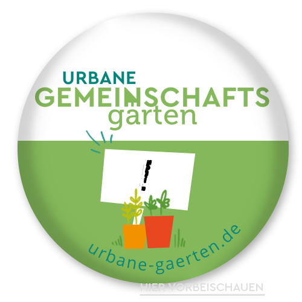

<h2>Das CA<h2>

Allgemeines über das CA
(wichtigste Punkte, Verweis auf Geschichte des alten CA und Leitbild)

<h2>Unsere Gebäude</h2>

Selbstverwaltetes Wohnheim, Bildungsinstitution und kulturelles Zentrum: Das
neue Collegium Academicum, auf dem Gelände des ehemaligen US-Hospitals in
Heidelberg-Rohrbach, setzt sich aus folgenden Gebäuden zusammen:

- Der innovative Holz-Neubau, mit 46 Wohneinheiten des Wohnheims, einer Aula mit Dachterrasse und einem
Gemeinschaftsraum
- Der große Altbau mit dem Orientierungsjahr und Mietwohnungen
- Das Pförtnerhaus für das zukünftige Café und Büroräume


    
    <!-- 
    
    to do: update-->


 

Die Errichtung des Neubaus und die Sanierung des Bestandsgebäudes wurden von der Internationale Bauausstellung (<a href='https://iba.heidelberg.de/de'>IBA</a>) Heidelberg
begleitet, die als Exzellenzinitiative für Stadtplanung arbeitet. Die IBA förderte und begleitete bis 2022 zukunftsweisende
Lösungen angesichts städtebaulicher und gesellschaftlicher Herausforderungen und kürte unser Vorhaben 2015 zum
<a href="https://iba.heidelberg.de/de/projekte/collegium-academicum">IBA-PROJEKT</a> unter dem Motto „Wissen | schafft | Stadt“.
  
Zudem dient das Projekt als Praxismodell für die Erforschung flächensparenden Wohnens bei gleichzeitig hoher Lebensqualität,
was vom Institut für Energie- und Umweltforschung (<a href="https://www.ifeu.de/projekt/suprastadt/">ifeu</a>) begleitet wird.
Der Anspruch, sich auf das Wesentliche zu reduzieren (Suffizienz), drückt sich in experimentellem Wohnen,
Gemeinschaftsflächen und Räumen für Kreativnutzung aus.

## Wohnheim im Holz-Neubau

    

    
        
        
        
        
    
    

    

      Der Neubau, entworfen von Dipl. Arch. ETH Hans Drexler, erfüllt sowohl hohe ökologische als auch ästhetische Ansprüche.
      Das Architektenbüro Drexler Guinand Jauslin hat sich auf energieeffizientes Bauen spezialisiert und wurde dafür
      vielfach in internationalen Wettbewerben ausgezeichnet. <a href="http://dgj.eu/portfolio/dgj223-iba-collegium-academicum/">Die Planung</a> berücksichtigt den Ressourcenverbrauch nicht nur im Hinblick auf den künftigen Betrieb, sondern bereits in der Baukonstruktion. Daher wird in der Konstruktion beinahe ausschließlich Holz als nachwachsender Rohstoff verwendet.
    

    

      Der innovative Holzbau bietet Platz für Individualität und Gemeinschaft: 46 Wohngemeinschaften für drei oder vier Personen sind auf die vier Etagen des Neubaus verteilt. Ein Dachgarten als Begegnungsstätte verbindet die oberen Wohnungen auf dem Dach der Aula. Alle Wohnungen und Wege sind auf Standards barrierearmen Wohnens ausgelegt, insbesondere im Erdgeschoss. Dort befinden sich auch die Gemeinschaftsflächen: eine Werkstatt, die Aula und ein Multifunktionsraum mit Küche.
          
        

            <a href="" class="button is-medium is-primary">
                
                    <i class="icon-home"></i>
                
                Wohnheim
            </a>

    

    

        
    

    

        <figure>
            
            <figcaption><cite>© DGJ Architekten 2018</cite></figcaption>
        </figure>
    

    

      Ein flexibles Zusammenspiel von Individual- und Gemeinschaftsfläche innerhalb der Wohngemeinschaften wird durch bewegliche Wandelemente ermöglicht.
      In der ca. 80 m2 großen Wohnung sind die Zimmer im ausgebauten Zustand 14 m2 groß.
      Durch Verkleinerung der Individualfläche ist es möglich, sich als Wohngemeinschaft für eine Gemeinschaftsfläche von bis zu 49 m2 zu entscheiden.
      Vielfältige Zwischenformen, wie ein privater Kernbereich mit einem vorgelagertem Wohn- und Arbeitszimmer, das durch Regalwände, Vorhänge oder Ähnliches durchlässig von der Gemeinschaftsfläche abgegrenzt ist, bieten Raum für individuelle Gestaltung.
    

Die <a href="/zimmermodell">Ausstellung eines solchen Einzelzimmers</a> fand in der Vergangenheit an verschiedenen Orten in Heidelberg statt, beispielsweise auf dem Universitätsplatz.
Zur Zeit befindet sich das Modell auf <a href="/anfahrt">unserem Gelände</a>.
  
Für den innovativen Charakter im Bereich flexiblen Wohnens und das nachhaltige Baukonzept, welches einen Fokus auf Gemeinschaftsflächen legt wird das Projekt mit 2,2 Millionen Euro aus dem Zukunftsinvestitionsprogramm „Variowohnen“  des Bundesbauministerium gefördert.

## Orientierungsjahr und sozialer Mietwohnraum im Altbau

Wir finden: Wo immer sinnvoll, sollte energetische Sanierung Vorrang gegenüber dem Neubau haben.
Die Sanierung des alten Verwaltungsgebäude des Krankenhauses orientiert sich an zwei wesentlichen
Zielen: Wir wollen Bildungsfreiräume und zugleich Wohnraum schaffen - beides dauerhaft bezahlbaren und gemeinschaftlich.
  
Im Altbau sollen ab Herbst 2023 etwa 80 Personen wohnen.
Von diesen werden rund 50 Personen zwischen Schule und weiterem Lebensweg ein <a href="https://faltr.de/">Orientierungsjahr</a>
absolvieren, mit dem Ziel, verschiedene Studien- und Ausbildungsgänge kennenzulernen, die eigene Persönlichkeit weiterzuentwickeln
und Verantwortung in der Gesellschaft zu übernehmen.
Das Orientierungsjahr ist ein wichtiger Bestandteil unseres <a href="/bildung/">Bildungskonzepts</a> und wird voraussichtlich im
Winter 2023/2024 starten.
  
Die übrigen Wohnungen umfassen eine 2-Zimmer-Wohnung und eine 6-Zimmer-Wohngemeinschaft in Form einer Maisonette-Wohnung
sowie sechs 3- bis 4-Zimmer-Wohnungen, mit denen wir <a href="https://www.bmwsb.bund.de/Webs/BMWSB/DE/themen/stadt-wohnen/wohnraumfoerderung/soziale-wohnraumfoerderung/soziale-wohnraumfoerderung-node.html">sozialen Mietwohnraum</a> schaffen wollen.
Damit soll eine Anlaufstelle für Menschen mit geringem Einkommen geboten werden, die ihren Wohnungsbedarf nicht auf dem
normalen Wohnungsmarkt decken können. Wenn Sie sich für eine dieser Wohnungen interessieren, können Sie sich postalisch über die Kontaktdaten
am Ende der Seite oder per <a href="mailto:einziehen.altbau@collegiumacademicum.de">E-Mail</a> bewerben.

<a href="" class="button is-medium is-primary">
                
                    <i class="icon-home"></i>
                
                Sozialer Mietwohnraum
            </a>

Im Erdgeschoss werden neben Wohnflächen des sozialen Wohnungsbaus mehrere multifunktionale Seminar- und Gemeinschaftsräume
entstehen, die <a href="/barrierefreiheit">barrierefrei</a> zu erreichen sind.
Auch in den Obergeschossen werden Gemeinschaftsflächen eingerichtet.
Zudem sind eine Fahrrad- und eine Metallwerkstatt sowie Lagerräume im Keller geplant, die unsere Holzwerkstatt im Neubau ergänzen.


    
    


 

Bei der Sanierung geht es im Wesentlichen um drei Aspekte: eine Umnutzung von Büroräumen in Wohnräume, eine
energetisch anspruchsvolle Sanierung sowie die Schaffung zusätzlicher Wohnfläche aus der bestehenden Gebäudesubstanz.
Daher werden Grundrisse geändert und das Gebäude statisch sowie schall- und brandschutztechnisch ertüchtigt.
Derzeit findet eine Außenwand-, Kellerdecken- und Dachdämmung statt. Die Fenster wurden bereits ausgetauscht, um den
bestmöglichen energetischen Standard im Bestand zu erreichen (KfW55).
Das ausgebaute Dach, eingebaute Schleppgauben und der Holzerker bieten zusätzliche Wohnfläche mit hohem Lichteintrag,
der für weiteren Komfort in den Wohnungen und Gemeinschaftsflächen sorgt.

<object data="altbau_fassade_nord.pdf" type="application/pdf" width="100%" height="100%">
    This browser does not support PDFs. Please download the PDF to view it: <a href="altbau_fassade_nord.pdf">Download PDF</a>
</object>

Planungsdokument, das die Nord-Ansicht der Fassade des großen Altbaus zeigt

Dabei achten wir bei jedem Schritt darauf, Bauteile und Baustoffe wieder- und weiterzuverwenden sowie möglichst
ökologische Baustoffe zu nutzen. Beispielsweise werden Zelluloseflocken als Dämmstoff im Dach genutzt werden und
<a href="https://stramentec.com/">gepresstes Stroh</a> für unseren Trockenwandbau. Auch sollen Türen, Bodenbeläge,
Treppenhausgeländer, Schieferplatten und vieles mehr weiter und wieder genutzt werden.
Zudem retten wir einige Materialien für eine spätere Kreativnutzung. Auf den neuen Gauben sollen
Photovoltaik-Module die Anlage auf dem Neubau ergänzen, während die hohe Belegungsdichte den Heizwärmebedarf
reduziert. Einen ausführlicheren Einblick in unser Nachhaltigkeitskonzept finden Sie <a href="/nachhaltigkeit">hier</a>.
  
Zusammen mit dem Heidelberger Architekturbüro <a href="https://gerstner-hofmeister.de/">Gerstner + Hofmeister</a> sind wir derzeit
dabei, die Sanierung des Altbaus zu planen und durchzuführen. Da der Altbau bereits in den 1930er Jahren entstanden
sind und zuletzt als Verwaltungsgebäude genutzt wurde, sind einige bauliche Veränderungen notwendig.
Um bezahlbares Wohnen möglich zu machen, ist es unser Ziel, die Renovierungs- und Umbauarbeiten möglichst gering zu
halten und somit die vorhandene Bausubstanz zu erhalten.
Eine bezahlbare Sanierung ermöglichen wir zusammen mit den vielen <a href="https://collegiumacademicum.de/direktkredite/">Direktkrediten von unseren Unterstützer*innen</a>
und unserer <a href="https://collegiumacademicum.de/aktionen/">Eigenleistung</a>, aber auch durch KfW-Zuschüsse für energetische
Maßnahmen sowie eine Landesförderung für den sozialen Wohnungsbau. Mit dieser Förderung verpflichten wir uns, sozial
gebundenen Mietwohnraum zu schaffen.

## Café und Büroräume im Pförtnerhaus

In dem ehemaligen Pförtnerhäuschen soll im Erdgeschoss ein selbstverwaltetes Café Möglichkeit für Begegnung und
Austausch bieten- vor allem als Anlaufpunkt für die Nachbarschaft.
Außerdem entsteht hier Raum für weitere Ideen: Zum Beispiel für ein "Repair-Café", bei dem Elektronikgeräte gemeinsam
repariert werden können. Die Räume im oberen Geschoss sind für Büros der Selbstverwaltung
sowie für eine Beratungsstelle für das <a href="https://www.syndikat.org/de/unternehmensverbund/">Mietshäuser-Syndikat</a>
vorgesehen.
  
Auch wenn wir das genaue Konzept noch erarbeiten, freut es uns, dass wir schon jetzt mit anderen Initiativen aus
Heidelberg eine gemeinsame Nutzung betreiben, zum Beispiel mit der solidarischen Landwirtschaft
<a href="https://gemuesekultur-heidelberg.de/">Gemüsekultur Heidelberg</a>.


    
    


<h2>Nachhaltigkeit</h2>

Ein innovativer, mehrstöckiger Holzneubau, eine flächensparende Architektur,
ein materialsparend sanierter Altbau mit höchster Energieeffizienz,
ein Raum- und Bildungskonzept mit Fokus auf Suffizienz (Genügsamkeit) und
ein bewusster Umgang mit Ressourcen während und nach der Bauphase:
diese und viele weitere Aspekte machen das CA zu einem Leuchtturmprojekt im Bereich Ökologie und Nachhaltigkeit.

Bei der Konstruktion des Neubaus wird überwiegend Holz als nachwachsender Rohstoff verwendet.
Holz-Holz-Verbindungen ermöglichen es, weitestgehend auf metallische Verbindungen zu verzichten.
Im Gegensatz zu „konventionellen“ Baumaterialien wie Stahl, Zement und Beton verursacht die Holzproduktion nicht nur sehr wenige  CO2-Emissionen, sondern bindet sogar Kohlenstoff.
Zudem wird auf eine sortenreine Trennfähigkeit der Baustoffen geachtet, um ein späteres Recycling zu ermöglichen.
Auch bei der Sanierung unseres Altbaus versuchen wir, so viel CO2 wie möglich einzusparen.
Wir erhalten so viel Bausubstanz wie möglich und gestalten den größten Teil unseres Trockenbaus mit
<a href="https://stramentec.com/">nachhaltigen Strohpresswänden</a> anstelle des Kohlekraftnebenproduktes Gips.
 
 Durch sparsame Technik und gute Dämmung wird eine hohe Energieeffizienz erreicht.
Der Neubau wird für seine <a href="https://www.heidelberg.de/hd,Lde/HD/Leben/Foerderprogramm+Rationelle+Energieverwendung.htmlPassivhausbauweise">Passivhausbauweise von der Stadt Heidelberg gefördert</a> und erreicht den <a href="https://www.kfw.de/inlandsfoerderung/Privatpersonen/Neubau/Das-KfW-Effizienzhaus/">KfW 40+ Standard</a>.
Die in der Größe maximierte Photovoltaikanlage liefert bilanziell mehr Strom, als im Gebäude verbraucht wird, der überschüssige Strom wird in das Netz eingespeist.
Der Altbau wird auf den Energieeffizienzstandard 55 saniert und erhält ebenfalls eine PV-Anlage auf den Gebäudedächern.
  
Aufgrund des kreativen Wohnkonzepts mit dem Anspruch, Genügsamkeit in den Mittelpunkt zu stellen
<a href="https://www.ifeu.de/service/nachrichtenarchiv/gutes-leben-fuer-alle-aber-wie/">(Suffizienz)</a>,
dient das Projekt dem IFEU (Institut für Energie- und Umweltforschung) als Praxismodell für die
<a href="https://www.ifeu.de/projekt/suprastadt/">Erforschung flächensparenden Wohnens bei gleichzeitig hoher Lebensqualität</a>. 

    

    Die beweglichen Wandelemente lassen Individualität zu und bieten zugleich eine Anpassungsfähigkeit an sich ändernde Nutzungsanforderungen. Multifunktionale Räume erhöhen die Auslastung der Flächen.
    So können Räumen vielfältige Bedürfnisse direkt im Haus erfüllen und gleichzeitig den Flächenverbrauch reduzieren.
    

    

        
    

Einen großen Beitrag zur effizienten, flächensparenden Raumnutzung leisten aber vor allem unsere zahlreichen
Gemeinschaftsflächen in Alt- und Neubau: eine Aula mit Dachgarten für Veranstaltungen, Multifunktionsräume,
einen stillen Arbeitsraum und ein als Gemeinschaftsgarten gestalteter Außenbereich stehen nicht nur den
Bewohner*innen sondern auch der restlichen Zivilgesellschaft offen.
Zudem können diese Räume z. B. von Umwelt- und sozialen Initiativen für größere Veranstaltungen und Netzwerktreffen
genutzt werden. Direkt am Karlsruher Platz ist ein Laden-Café als Treffpunkt für das Quartier geplant.

    

    
    

    

    Für nachhaltige Mobilität wird der Radverkehr gestärkt.
    Dafür stehen ausreichend viele Fahrradstellplätze sowie eine Werkstatt zur Reparatur kaputter Räder zur Verfügung.
    Diese offene Fahrradwerkstatt soll insbesondere auch von anderen Quartiers-bewohner*innen genutzt werden.
    Für motorisierten Individualverkehr sind nur sehr begrenzt Stellplätze vorgesehen, die zudem teilweise für Carsharing-Angebote reserviert sind.
    Nicht  zuletzt trägt  eine  sehr  gut  frequentierte  Straßenbahnhaltestelle sowie eine Buslinie in unmittelbarer
    Nähe zur nachhaltigen Mobilität bei, mit der das CA gut erreicht werden kann (<a href="/neubau">Anfahrt</a>).
    

Auch der Außenbereich erfüllt hohe ökologische Ansprüche. Die Neupflanzungen heimischer und nutzbarer Baumarten, die Regenwassernutzung zur Bewässerung mittels einer Zisterne, versickerungsoffene Flächen, sowie die Kompostanlage zeichnen die ökologische Freiraumgestaltung aus. Zudem sollen vielfältige Lebensräume für Flora und Fauna geschaffen werden: eine naturnahe Teichanlage, Trockenmauern, Magerwiesen, Nistkästen an den Außenwänden und eine offene Sandfläche für Insekten stellen diverse Lebensräume dar und fördern die Artenvielfalt.

    

 
    Unser entstehender Gemeinschaftsgarten ist Teil des Netzwerks "Urbane Gemeinschaftsgärten" der <a href="https://anstiftung.de/">anstiftung</a>.
    

    

    
    

 

 

Neben den baulichen Konzepten entwickeln wir ein Bildungskonzept und Organisationsstrukturen für ein nachhaltiges Zusammenleben:
Suffizienz schafft Raum für kreative Ideen – Genügsamkeit wird zum Luxus.
Foodsharing und gemeinschaftliches Kochen z. B. im Rahmen von <a href="/aktionen">Workcamps</a> sowie Urban Gardening
beleben das Gemeinschaftsgefühl und fördern zugleich einen nachhaltigen Umgang mit Lebensmitteln.
Gemeinsames Reparieren in der Werkstatt spart Geld und Ressourcen – und bringt Freude durch Erfolgserlebnisse.
Tauschen, leihen und gemeinsam nutzen, reparieren und selbst produzieren verringern Abhängigkeiten, stärken regionale Kreisläufe und münden in Kompetenz und Selbstbestimmung.

<h2>Timeline</h2>


