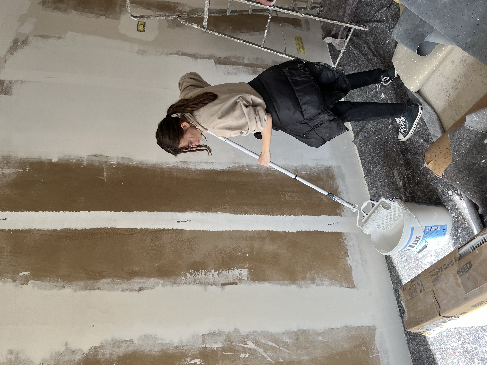

## Letzte Arbeitseinsätze vor Ostern 🐣

Endspurt vor Ostern und vor dem nächsten Einzug! 
Hier findet ihr die nächsten Eigenleistungstermine in unserem Altbau:

- Di, &emsp;&nbsp;&nbsp; 19.03. &emsp; 18 Uhr️ - open end
- Do, &emsp;&nbsp; 21.03. &emsp; 9-14 Uhr und 16 Uhr - open end
- Fr, &emsp;&nbsp;&nbsp; 22.03. &emsp; 10-15 Uhr und 16 Uhr - open end

Daraufhin machen wir von <strong>Sa, 23.03. bis Fr, 29.03.2024</strong> nochmal eine <strong>Workcamp-Woche</strong>. Gearbeitet wird täglich von <strong>10 bis 18 Uhr</strong>, wie immer gibt es ein super leckeres gemeinsames Mittagessen.

Schwerpunkt liegt auf den letzten Streicharbeiten, dem Anbringen von Fußleisten und der Endreinigung der fertigen Wohnungen. 
  
Wir treffen uns am Mendelejewplatz 1 (zwischen Neu- und Altbau), 69126 Heidelberg-Rohrbach. Um dich anzumelden, schicke uns einfach eine formlose Mail an <a href="mailto:kontakt@collegiumacademicum.de">kontakt@collegiumacademicum.de</a> oder ruf kurz an unter +49 (0)6221 652236.
  
Du kannst mal für ein paar Stunden, an einzelnen Tage oder für ganze Woche lang mithelfen. Wir können auch Schlafplätze organisieren.

<figure>

<figcaption style="text-align:left;">

 Grundieren und Streichen im Altbau (&#169; CA)

</figcaption>
</figure>

## Altbau-Workcamps im Februar und März 🛠️

Die ersten tollen Menschen konnten Ende Januar schon in unseren sanierten Altbau einziehen.
Damit bald die nächsten Mitbewohnenden nachziehen können, müssen wir mal wieder mit anpacken und letzte wichtige Arbeiten fertigstellen.

Dazu wird es im Februar und März wieder zwei Workcamp-Wochen geben.

Das erste Workcamp findet von 24.02. bis 01.03.2024 statt, täglich von 10 bis 18 Uhr.
- Sa, &emsp;&nbsp; 24.02. &emsp; 10-18 Uhr
- So, &emsp;&nbsp; 25.02. &emsp; 10-18 Uhr
- Mo, &emsp; 26.02. &emsp; 10-18 Uhr
- Di, &emsp;&nbsp;&nbsp; 27.02. &emsp; 10-18 Uhr️
- Mi, &emsp;&nbsp; 28.02. &emsp; 10-18 Uhr️
- Do, &emsp; 29.02. &emsp; 10-18 Uhr
- Fr, &emsp;&nbsp;&nbsp; 01.03. &emsp; 10-18 Uhr

Nach einer guten Woche Pause geht es dann am 11.03. weiter:
- Mo, &emsp; 11.03. &emsp; 10-18 Uhr
- Di, &emsp;&nbsp;&nbsp; 12.03. &emsp; 10-18 Uhr️
- Mi, &emsp;&nbsp; 13.03. &emsp; 10-18 Uhr️
- Do, &emsp; 14.03. &emsp; 10-18 Uhr
- Fr, &emsp;&nbsp;&nbsp; 15.03. &emsp; 10-18 Uhr
- Sa, &emsp;&nbsp; 16.03. &emsp; 10-18 Uhr
- So, &emsp;&nbsp; 17.03. &emsp; 10-18 Uhr

<figure>

<figcaption style="text-align:center;">

 Voller Einsatz bei Streichen (&#169; CA)

</figcaption>
</figure>

Freu dich auf gute Gespräche, viel Spaß und etwas Blödsinn 😇 🎵 🥳

Helfende sind natürlich zum Mittagessen eingeladen (auf freiwilliger Spendenbasis), das von uns täglich frisch zubereitet wird.

Wir werden vor allem Wände streichen und, sofern unsere Kapazitäten ausreichen, Holz fräsen und daraus Möbel bauen.
Zudem stehen immer kleinere Baureinigungsarbeiten an.

Treffpunkt ist Mendelejewplatz 1 (zwischen Neu- und Altbau), 69126 Heidelberg-Rohrbach

Um dich anzumelden, schicke uns einfach eine formlose Mail an kontakt@collegiumacademicum.de oder ruf kurz an unter +49 (0)6221 652236.

Du kannst mal für ein paar Stunden, an einzelnen Tage oder für ganze Woche lang mithelfen.

## Willkommen 2024 - Eigenleistung zum Jahresstart

Wir wollen die Weihnachtsferien voll ausnutzen und starten gleich mit einer guten Portion Eigenleistung in das neue Jahr 2024. ✨
  
In der ersten Januarwoche findet zu folgenden Zeiten Eigenleistung statt:
- Dienstag, &emsp;&emsp;&nbsp; 2.1.2024 ☀️ 11-19 Uhr️
- Mittwoch, &emsp;&emsp; 3.1.2024 ☀️ 11-19 Uhr️
- Donnerstag, &emsp; 4.1.2024 🌙 14-21 Uhr
- Freitag, &emsp;&emsp;&emsp; 5.1.2024 🌙 14-21 Uhr
- Samstag, &emsp;&emsp;&nbsp; 6.1.2024 ☀️ 11-19 Uhr und 🌑 19-2 Uhr

Wie gewohnt mit leckerem Essen, Musik und guter Laune 🍕 🎵 🥳

Treffpunkt ist <b>Mendelejewplatz 1</b> (zwischen Neu- und Altbau), 69126 Heidelberg-Rohrbach

Um dich anzumelden, schicke uns einfach eine formlose Mail an kontakt@collegiumacademicum.de oder ruf kurz an unter +49 (0)6221 652236.

## Wochenendeinsätze 2023 - Gemeinsam für günstigen Wohnraum!

        <figure>
    
    <figcaption style="text-align:center">
     
Holzplatten tragen beim HammerCAmp (&#169; CA)

    </figcaption>
        </figure>

  Der nächste Meilenstein unsere Projekts, die Fertigstellung unseres Altbaus, steht bevor und wie gewohnt packen wir dabei selbst mit an.
    
  Wir laden herzlich ein, an unseren Wochenendeinsätzen im Collegium Academicum teilzunehmen und gemeinsam unseren Altbau in ein lebendiges Wohnprojekt für sozialen Wohnungsbau, freie Wohnungen und das Orientierungsjahr <a href="https://faltr.de/home">falt*r</a> zu verwandeln?
    
  Es ist keine besondere Erfahrung erforderlich! Jeder ist willkommen, unabhängig von Alter oder Fähigkeiten.
  Komm einfach vorbei, wir stellen alle Materialien und Werkzeuge bereit.
    
  <b>Wann?</b> Jeden Samstag und Sonntag von 9:30 Uhr bis 18:00 Uhr.  
  <b>Wo?</b> Mendelejewplatz 1 (zwischen Neu- und Altbau), 69126 Heidelberg

  

  

<h3>Was erwartet dich?</h3>

- Streichen des Altbaus
- Fußboden entfernen
- Baureinigung (Aufräumen und Putzen)
- sowie kleinere bzw. spontanere Aufgaben
- Gemeinsames Mittag- und Abendessen

  

<h3>Was solltest du mitbringen?</h3>

- Bequeme Arbeitskleidung und Schuhe, die schmutzig werden können.
- Spaß und Motivation
- und natürlich gegenseitigen Respekt
  

### Warum solltest du mitmachen?

- **Gemeinschaft erleben**: Lerne Menschen mit ähnlichen Interessen kennen und baue dauerhafte Freundschaften auf.
- **Sinnvolle Arbeit**: Dein Einsatz trägt dazu bei, bezahlbaren Wohnraum zu schaffen und Menschen in Not zu unterstützen.
- **Spaß und Belohnung**: Eine entspannte Atmosphäre, leckeres Essen und coole Gemeinschaftsaktionen nach der Arbeit!

### Anmeldung

Kontaktiere uns per Mail oder Telefon, um dich anzumelden oder weitere Informationen zu erhalten.
- +49 (0)6221 652236
- kontakt@collegiumacademicum.de

## HammerCAmps 2023

Im Sommer haben wir bereits zu fünf spektakulären "HammerCAmps" eingeladen:
* **HammerCAmp** 1: 03.07. bis 09.07.2023
* **HammerCAmp** 2: 17.07. bis 23.07.2023
* **HammerCAmp** 3: 31.07. bis 06.08.2023
* **HammerCAmp** 4: 14.08. bis 20.08.2023
* **HammerCAmp** 5: 04.09. bis 10.09.2023

Schwerpunkt waren Arbeiten im Innenraum und die Ausstattung des Altbaus. Das Ganze wurde ergänzt durch gemeinsames
veganes Frühstück, Mittagessen und Abendessen (auf Spendenbasis).
Daneben gab es auch Raum und Zeit für Workshops, Exkursionen, Filmabende, die ein oder andere Party
und generell gemeinsame Freizeit.

  

    
  

  

    
  

## Partizipative Baustellen 2022

Von Juni bis August 2022, in der heißen Phase der Fertigstellung unseres Holz-Neubaus und des Beginns der Altbau-Sanierung,
fanden unsere partizipativen Baustellen statt.
  
Unser vierstöckiger <a href="/neubau">Neubau</a> zeichnet sich neben dem nachhaltigen Baustoff Holz durch den Passivhausstandard, die hohe
Rezyklierbarkeit, platzsparendes Wohnen und viel geteilte Gemeinschaftsfläche aus.
  
In unserem großen <a href="/altbau/">Altbau</a> soll ab Herbst 2023 ein Orientierungsjahr für junge Menschen zwischen Schule und weiterem
Ausbildungsschritt stattfinden <a href="/bildung">Bildung</a>.
  
Im Sinne der Selbstverwaltung und um die Baukosten niedrig zu halten, machen wir einen Teil der Arbeit in Eigenleistung.
Konkret bauen wir zwei Drittel der Möbel selbst. Dazu haben wir eine CNC-Fräse angeschafft, mit der Bauteile vorgefertigt werden können.
  
Bei den partizipativen Baustellen haben wir im Neubau z.B. Schiebewände und Zwischenwände aufgebaut, Wände gestrichen 
und Möbel transportiert. Im Altbau haben wir wiederum Wände eingerissen, Kabel abgebaut, Schutt abtransportiert und vieles mehr.
Außerdem haben wir den Platz vor unserem Altbau neu gepflastert.
  
Der geschätzte Gesamtaufwand für die Eigenleistung liegt bei 15.000 Arbeitsstunden.
Deshalb sind wir dankbar für die Teamarbeit und Mithilfe von allen Seiten, auch von Menschen außerhalb des CA.
Die Teilnahme an unseren Aktionen beinhaltet Verpflegung (Frühstück, Mittagessen und Abendessen) sowie ein umfangreiches Rahmenprogramm und ist natürlich komplett kostenlos.

### Rahmenprogramm
- Mehrere Fahrrad-Reparatur-Workshops (Valentin Hanft, [URRmEL](http://www.urrmel.uni-hd.de/))
- [Vortrag zu Lebensmittelverschwendung und Foodsharing](https://collegiumacademicum.de/presse/2022_08_08_ValentinThurn_CA.pdf) von [Valentin Thurn](https://www.thurnfilm.de/valentin-thurn/)
- Ökologische Freiraumgestaltung (inkl. Bau von Insektenhotels)
- Heimatkundliche Führung durch Heidelberg „Entstehung der Landschaft und der Stadt Heidelberg“
- Bauwende-Workshop ([Architects for Future](https://www.architects4future.de/) Heidelberg)
- Konsens-Workshop (Irina, [HageButze](https://hagebutze.de/))
- Zeitwohlstand-Workshop
- Interner Workshop "Meine Erfahrungen im CA"
- „Über Geld sprechen“ – Direktkredit-Skillshare

### Förderung

Wir nahmen mit unseren vier partizipativen Baustellen an dem Programm <a href="https://www.auf-leben.org/">AUF!leben</a> teil.
AUF!leben – Zukunft ist jetzt. ist ein Programm der Deutschen Kinder- und Jugendstiftung, gefördert vom Bundesministerium für Familie, Senioren, Frauen und Jugend. Das Programm ist Teil des Aktionsprogramms Aufholen nach Corona der Bundesregierung.

 

### Eindrücke Social Media

- [Schiebewände-Produktion](https://www.instagram.com/p/CfKNIkJjYJ9/)
- [Insektenhotel-Bau und Foodsharing-Vortrag](https://www.instagram.com/p/Cgiztm5Dwsg/)
- [Abbruch des Estrichs im Dachboden](https://www.instagram.com/p/Chuh9iSDyXl/)
- [Fahrrad-Reparatur-Workshop](https://www.instagram.com/p/CiFL_R7jk-e/)

Hier unsere Ankündigung für die partizipativen Baustellen im Juni, Juli und August 2022:

<object data="Ankuendigung_partizipative_Baustellen_2022.pdf" type="application/pdf" width="100%" height="100%"> This browser does not support PDFs. Please download the PDF to view it: <a href="Ankuendigung_partizipative_Baustellen_2022.pdf">Download PDF</a></object>

## Neujahrs-Workcamp 2021/2022

Unser härtestes Workcamp fand wohl um den Jahreswechsel 2021/2022 statt.
Vom 29. Dezember 2021 bis zum 5. Januar 2022 trotzten wir Kälte und Regen und bauten fleißig Betten, führten 
Streicharbeiten durch und nahmen die riesige Lieferung an Bodenbelägen entgegen.
Dutzende 40-Kilo schwere Rollen mussten in Teamarbeit in den Neubau gewuchtet werden.
Bei diesem Workcamp hatten wir auch ein
<a href="https://dmax.de/sendungen/helden-der-baustelle/immer-arger-mit-den-denkmalern/">Filmteam von DMAX zu Gast</a>.

Das Highlight war natürlich die Silvester-Party!

### Eindrücke Social Media

[Zusammenfassung Silvester-Workcamp](https://www.instagram.com/p/CYja_gGN9W2/)

## Sommer-Workcamps 2021

Auch im Juni, August und September 2021 haben wir mehrtägige Workcamps veranstaltet, um größere Arbeitsschritte im CA zu erledigen und gleichzeitig eine tolle Zeit miteinander zu verbringen.
Insgesamt vier Wochen verbrachten wir im Sommer auf der Baustelle.
  
Und hier unser Poster der beiden Summerschools Anfang September 2021: 

### Rahmenprogramm

Gerahmt wurden die Tage auf dem Gelände von einem vielfältigen Bildungsangebot mit Seminaren, Workshops und Exkursionen zu den Themen:

- Natur und Ökologie der Stadt
- Nachhaltiges und soziales Bauen und Wohnen
- Antidiskriminierung
- Achtsamkeit und Resilienz

Hier unser ausführliches Programm:

  

    
  

  

    
  

### Förderung

Unsere Workcamps 2021 wurden von der [Sto-Stiftung](https://www.sto-stiftung.de/) begleitet und unterstützt.

### Eindrücke Social Media

- [Permakultur-Workshop](https://www.instagram.com/p/CT2v1r5ouqj/)
- [Rückblick Workshops Schreinerei, nachhaltiges Reisen und Antidiskriminierung](https://www.instagram.com/p/CTePE3bt2V9/)
- [Konsens-Workshop](https://www.instagram.com/p/CSr2BumtIjM/)
- [Transport von Holzplatten aus dem Neubau](https://www.instagram.com/p/CSbR5nwtCly/)
