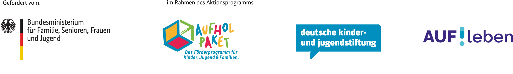
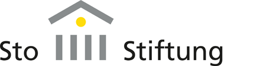

## Partizipative Baustellen 2022

Von Juni bis August 2022, in der heißen Phase der Fertigstellung unseres Holz-Neubaus und des Beginns der Altbau-Sanierung,
fanden unsere partizipativen Baustellen statt.

Unser vierstöckiger [Neubau](/neubau) zeichnet sich neben dem nachhaltigen Baustoff Holz durch den Passivhausstandard, die hohe 
Rezyklierbarkeit, platzsparendes Wohnen und viel geteilte Gemeinschaftsfläche aus.

In unserem großen [Altbau](/altbau/) soll ab Herbst 2023 ein Orientierungsjahr für junge Menschen zwischen Schule und weiterem 
Ausbildungsschritt stattfinden ([Bildung](/bildung)).

Im Sinne der Selbstverwaltung und um die Baukosten niedrig zu halten, machen wir einen Teil der Arbeit in Eigenleistung.
Konkret bauen wir zwei Drittel der Möbel selbst. Dazu haben wir eine CNC-Fräse angeschafft, mit der Bauteile vorgefertigt werden können.

Bei den partizipativen Baustellen haben wir im Neubau z.B. Schiebewände und Zwischenwände aufgebaut, Wände gestrichen 
und Möbel transportiert. Im Altbau haben wir wiederum Wände eingerissen, Kabel abgebaut, Schutt abtransportiert und vieles mehr.
Außerdem haben wir den Platz vor unserem Altbau neu gepflastert.

Der geschätzte Gesamtaufwand für die Eigenleistung liegt bei 15.000 Arbeitsstunden.
Deshalb sind wir dankbar für die Teamarbeit und Mithilfe von allen Seiten, auch von Menschen außerhalb des CA.
Die Teilnahme an unseren Aktionen beinhaltet Verpflegung (Frühstück, Mittagessen und Abendessen) sowie ein umfangreiches Rahmenprogramm und ist natürlich komplett kostenlos.

### Rahmenprogramm
- Mehrere Fahrrad-Reparatur-Workshops (Valentin Hanft, [URRmEL](http://www.urrmel.uni-hd.de/))
- [Vortrag zu Lebensmittelverschwendung und Foodsharing](https://collegiumacademicum.de/presse/2022_08_08_ValentinThurn_CA.pdf) von [Valentin Thurn](https://www.thurnfilm.de/valentin-thurn/)
- Ökologische Freiraumgestaltung (inkl. Bau von Insektenhotels)
- Heimatkundliche Führung durch Heidelberg „Entstehung der Landschaft und der Stadt Heidelberg“
- Bauwende-Workshop ([Architects for Future](https://www.architects4future.de/) Heidelberg)
- Konsens-Workshop (Irina, [HageButze](https://hagebutze.de/))
- Zeitwohlstand-Workshop
- Interner Workshop "Meine Erfahrungen im CA"
- „Über Geld sprechen“ – Direktkredit-Skillshare

### Förderung

Wir nahmen mit unseren vier partizipativen Baustellen an dem Programm [AUF!leben](https://www.auf-leben.org/) teil.
AUF!leben – Zukunft ist jetzt. ist ein Programm der Deutschen Kinder- und Jugendstiftung, gefördert vom Bundesministerium für Familie, Senioren, Frauen und Jugend. Das Programm ist Teil des Aktionsprogramms Aufholen nach Corona der Bundesregierung.

 

### Eindrücke Social Media

- [Schiebewände-Produktion](https://www.instagram.com/p/CfKNIkJjYJ9/)
- [Insektenhotel-Bau und Foodsharing-Vortrag](https://www.instagram.com/p/Cgiztm5Dwsg/)
- [Abbruch des Estrichs im Dachboden](https://www.instagram.com/p/Chuh9iSDyXl/)
- [Fahrrad-Reparatur-Workshop](https://www.instagram.com/p/CiFL_R7jk-e/)

Hier unsere Ankündigung für die partizipativen Baustellen im Juni, Juli und August 2022:

<object data="Ankuendigung_partizipative_Baustellen_2022.pdf" type="application/pdf" width="100%" height="100%"> This browser does not support PDFs. Please download the PDF to view it: <a href="Ankuendigung_partizipative_Baustellen_2022.pdf">Download PDF</a></object>

## Neujahrs-Workcamp 2021/2022

Unser härtestes Workcamp fand wohl um den Jahreswechsel 2021/2022 statt.
Vom 29. Dezember 2021 bis zum 5. Januar 2022 trotzten wir Kälte und Regen und bauten fleißig Betten, führten 
Streicharbeiten durch und nahmen die riesige Lieferung an Bodenbelägen entgegen.
Dutzende 40-Kilo schwere Rollen mussten in Teamarbeit in den Neubau gewuchtet werden.
Bei diesem Workcamp hatten wir auch ein [Filmteam von DMAX zu Gast](https://dmax.de/sendungen/helden-der-baustelle/immer-arger-mit-den-denkmalern/).

Das Highlight war natürlich die Silvester-Party!

### Eindrücke Social Media

[Zusammenfassung Silvester-Workcamp](https://www.instagram.com/p/CYja_gGN9W2/)

## Sommer-Workcamps 2021

Auch im Juni, August und September 2021 haben wir mehrtägige Workcamps veranstaltet, um größere Arbeitsschritte im CA zu erledigen und gleichzeitig eine tolle Zeit miteinander zu verbringen.
Insgesamt vier Wochen verbrachten wir im Sommer auf der Baustelle.

Und hier unser Poster der beiden Summerschools Anfang September 2021: 

### Rahmenprogramm

Gerahmt wurden die Tage auf dem Gelände von einem vielfältigen Bildungsangebot mit Seminaren, Workshops und Exkursionen zu den Themen:

- Natur und Ökologie der Stadt
- Nachhaltiges und soziales Bauen und Wohnen
- Antidiskriminierung
- Achtsamkeit und Resilienz

Hier unser ausführliches Programm:

  

    
  

  

    
  

### Förderung

Unsere Workcamps 2021 wurden von der [Sto-Stiftung](https://www.sto-stiftung.de/) begleitet und unterstützt.

### Eindrücke Social Media

- [Permakultur-Workshop](https://www.instagram.com/p/CT2v1r5ouqj/)
- [Rückblick Workshops Schreinerei, nachhaltiges Reisen und Antidiskriminierung](https://www.instagram.com/p/CTePE3bt2V9/)
- [Konsens-Workshop](https://www.instagram.com/p/CSr2BumtIjM/)
- [Transport von Holzplatten aus dem Neubau](https://www.instagram.com/p/CSbR5nwtCly/)
